# HTML/HTML5 常用标签和属性 最佳实践

> 

从零基础入门 HTML/HTML5 企业项目必学的标签及属性

## 一、标题标签

> 
>
> h 系列标签表示 “标题” 含义，h 是 `headline` 的意思

### 1、h1~h6 标签

| 标签 | 语义     |
| :--- | :------- |
| h1   | 一级标题 |
| h2   | 二级标题 |
| h3   | 三级标题 |
| h4   | 四级标题 |
| h5   | 五级标题 |
| h6   | 六级标题 |

关于 h 标签详细解读

* `<h1></h1>`标签的内容对于搜索引擎来说非常重要，相当于一篇文章的标题（主题）
* 应该将当前页面重要的内容放到 `<h1></h1>`标签中
* 关于`h1 ~ h6` 标签的使用 以[百度百科 (opens new window)](https://baike.baidu.com/item/前端开发/10009024)为标准
* `<h1></h1>`标签在一个网页中只能放置一个，否则会被搜索引擎视为作弊

```html
<h1>我是h1标题标签</h1>
<h2>我是h2标题标签</h2>
<h3>我是h3标题标签</h3>
<h4>我是h4标题标签</h4>
<h5>我是h5标题标签</h5>
<h6>我是h6标题标签</h6>
```

### 2、h 标签在 SEO 优化中的设置技巧 及 最佳实践

① 不同类型页面的设置

* **首页**：网站首页的 H1 通常是网站 logo，强调 alt 的内容，而 alt 属性是网站首页标题，包含核心关键词，H2 标注分类页面，H3 标注内容页面标题链接。
* **列表页（栏目页）**：H1 设置为分类名称，H2 是子分类名称，H3 设置为内容页面标题链接。
* **内容页（产品详情页、文章页）**：H1 设置文章标题名称，H2 标注列表名称，H3 标注相关文章。

> 如：京东首页 logo 处 h1 标签，小米首页栏目 h2 标签，百度百科内容详情页等 关于 h 标签的最佳实践

**② H 标签包含关键词**

* H 标签是一个强调性的标签，因此，H1 标签中，必须包含核心关键词，H2、H3 标签可以适当的包含长尾关键词

**③ 页面 H 标签的数量。**

* 一个页面上只能有 1 个 H1 标签，可以包含不等的 H2-H6 标签。从结构化的角度看，有 H3 就要有 H1、H2。

[详细解读，h 标签的 SEO 优化 👆](https://www.arryblog.com/guide/standard/seo.html#_3、语义化内容标签的使用)

## 二、段落标签

关于 p 标签详细解读

* `<p></p>`标签表示`段落标签`，p 是英语 `Paragraph`的意思
* 任何段落都要放到 p 标签中，因为 HTML 代码中即使代码换行了，页面显示效果也不会换行，必须写在 `<p></p>`中
* `<p></p>`标签中`不能嵌套` h 标签、其他 p 标签和其他块级元素

### 1、p 标签中可可嵌套的标签

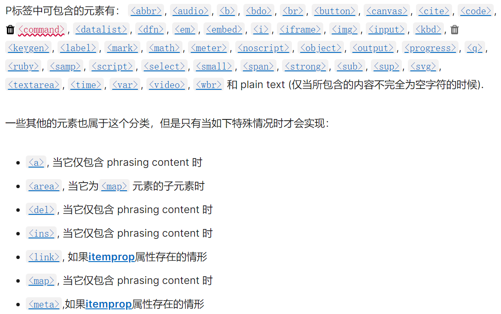

模仿百度百科，写一个 h 标签和 p 标签的综合案例 ，以 "[前端开发 (opens new window)](https://baike.baidu.com/item/前端开发/10009024?fr=aladdin)" 为例。效果如下：

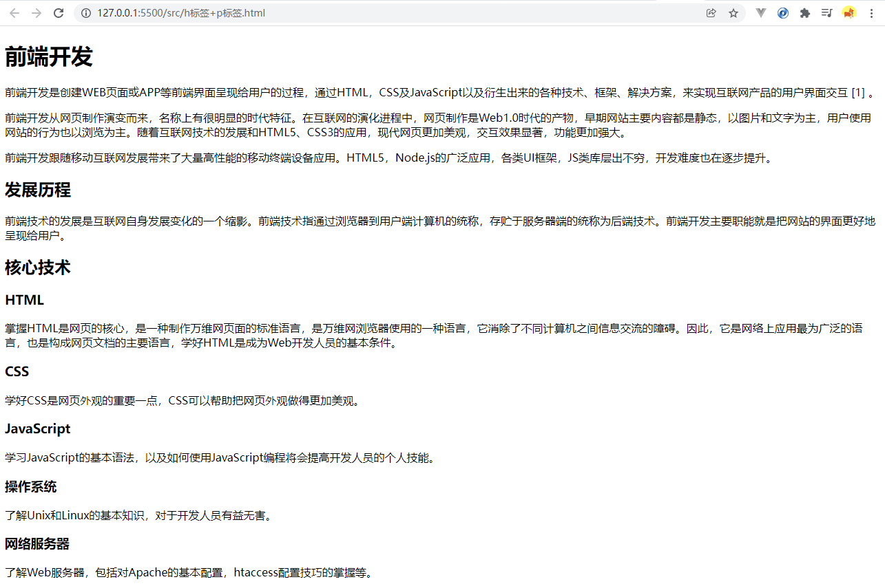

### 2、最佳实践


* 不要用 `<br>` 模拟段落间距
* 避免在 `<p>` 中嵌套块级元素

## 三、div 标签

关于 div 标签详细解读

* `<div></div>`标签 是英语 `division` “分隔” 的缩写
* div 标签对是用来将相关内容组合到一起，以和其他内容分隔，使文档结构更清晰

**比如：一般网页布局 头部，内容区，底部 都会通过 div 进行分隔**

* `<div></div>` 是最常见的 HTML 标签，因为它会结合 CSS 来使用，实现网页的布局，这种布局形式叫做 `DIV+CSS`
* `<div></div>` 像一个容器，什么都可以容纳，因此工程师们习惯称呼 div 为 `盒子`

**事例如下：通过 Google 开发者工具查看网页的 DIV 布局**

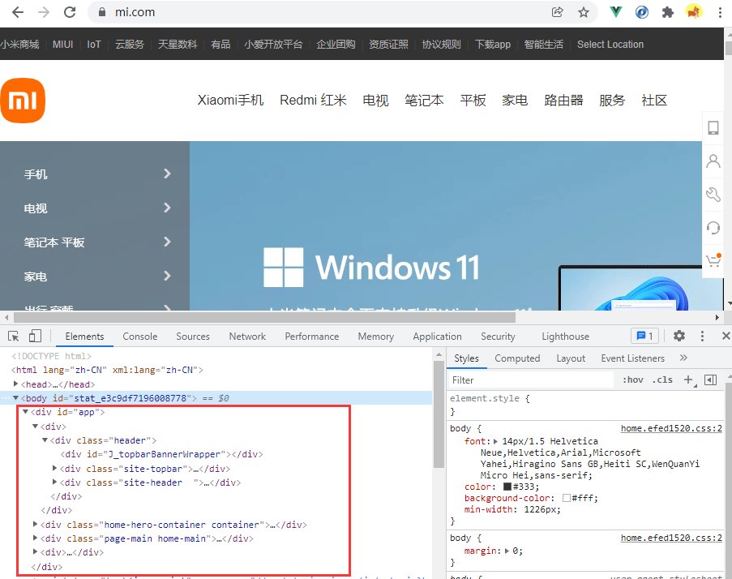

**编写练习案例效果（百度百科文章详情页为例）：**

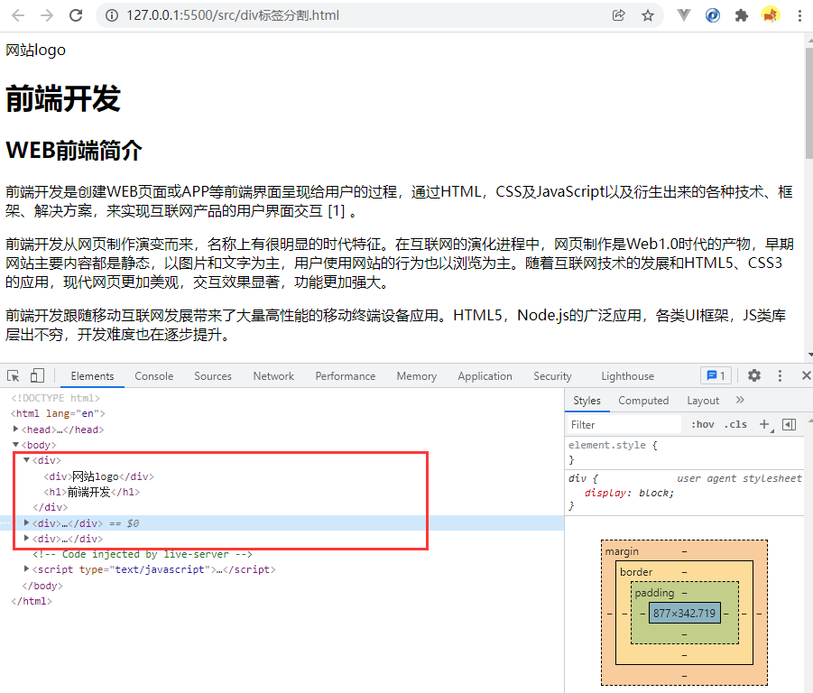

### 1、div 标签的应用场景


`<div>` 标签是 HTML 中最基础且通用的容器元素，由于其没有特定的语义含义，因此可以灵活应用于多种场景。

> 以下是 `<div>` 标签的常见应用场景：

### 1.1、布局容器

* **页面结构划分**：用于划分页面的不同区域，如页眉、主体、侧边栏、页脚等。

```html
<div class="header">页眉内容</div>
<div class="main-content">主体内容</div>
<div class="sidebar">侧边栏内容</div>
<div class="footer">页脚内容</div>
```

* **响应式布局**：结合 CSS Flex 或 Grid 创建响应式布局。

```html
<div class="container">
    <div class="item">Item 1</div>
    <div class="item">Item 2</div>
    <div class="item">Item 3</div>
</div>
```

### 1.2、**样式和视觉效果**

* **CSS 样式应用**：为特定区域添加样式（如背景色、边框、内边距等）。

```html
<div class="box" style="background: #f0f0f0; padding: 20px;">
    这是一个带样式的盒子
</div>
```

* **视觉分组**：将相关元素分组，便于统一控制样式。

```html
<div class="card">
    <h3>标题</h3>
    <p>内容</p>
</div>
```

### 1.3、JavaScript 操作

* **DOM 操作**：作为 JavaScript 操作的目标元素。

```html
<div id="target">点击我</div>
<script>
    document.getElementById("target").addEventListener("click", () => {
        alert("被点击了！");
    });
</script>
```

* **动态内容渲染**：用于动态加载或替换内容（如 AJAX 请求的结果）。

```html
<div id="dynamic-content"></div>
<script>
    fetch("/api/data")
        .then((response) => response.json())
        .then((data) => {
            document.getElementById("dynamic-content").innerHTML = data.content;
        });
</script>
```

### 1.4、表单分组


**表单元素的容器**：用于组织表单控件。

```html
<form>
    <div class="form-group">
        <label for="username">用户名</label>
        <input type="text" id="username" name="username" />
    </div>
    <div class="form-group">
        <label for="password">密码</label>
        <input type="password" id="password" name="password" />
    </div>
</form>
```

### 1.5、**多媒体和嵌入内容**


**视频、地图等内容的包装**：为需要额外样式或脚本的多媒体内容提供容器。

```html
<div class="video-container">
    <video controls>
        <source src="video.mp4" type="video/mp4" />
    </video>
</div>
```

### 1.6、**组件化开发**


**前端框架中的组件容器**：在 React、Vue 等框架中， `<div>` 常作为组件的根元素。

```jsx
// React 示例
function MyComponent() {
  return (
    <div className="my-component">
      <h2>组件标题</h2>
      <p>组件内容</p>
    </div>
  );
}
```

### 1.7、**条件渲染和隐藏内容**


**控制内容的显示和隐藏**：通过 CSS 或 JavaScript 控制 `<div>` 的显示状态。

```html
<div id="toggle-content" style="display: none;">这是隐藏的内容</div>
<button onclick="document.getElementById('toggle-content').style.display = 'block'">
    显示内容
</button>
```

### 1.8、模板 和 占位符


**页面加载时的占位符**：在内容加载前显示占位符。

```html
<div class="loading-placeholder">
    <!-- 加载动画或提示文本 -->
</div>
```

注：

div 容器的应用场景有很多，总的来说 div 是最基础且通用的容器元素，由于其没有特定的语义含义，因此可以灵活应用于多种场景。

### 2、div 标签的最佳实践


* **避免过度使用**：优先使用语义化标签（如 `<section>`、`<article>` 等），仅在必要时使用 `<div>`
* **合理命名**：通过 `class` 或 `id` 为 `<div>` 添加有意义的名称，便于维护和样式控制
* **性能优化**：避免嵌套过深的 `<div>` 结构，减少 DOM 操作开销

> 合理使用 `<div>` 可以提升代码的可维护性和灵活性，但需注意避免滥用，优先选择语义化标签。

## 四、HTML5 特性


深入浅出 HTML5 的特性

### 1、空白折叠现象


* 文字和文字之间的多个空格、换行会被折叠成一个空格
* 标签 `内壁` 和 文字之间的空格会被忽略

```html
<body>
    <h1>HTML5特性：空白折叠现象</h1>

    <h2>文字和文字之间的多个空格、换行会被折叠成一个空格</h2>
    <p>文本内容 文本内容</p>

    <h2>标签 内壁 和 文字之间的空格会被忽略</h2>
    <p>文本内容文本</p>
</body>
```

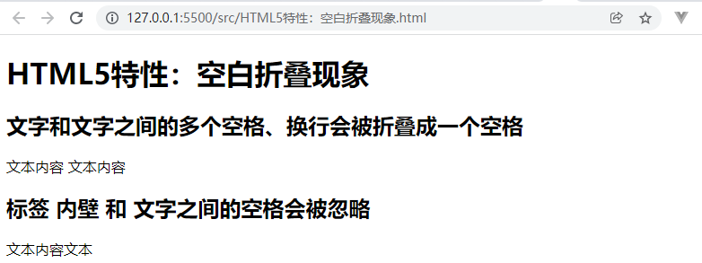

### 2、常用转义符

| 显示结果 |                             描述                             | 实体名称 | 实体编号 |
| :------: | :----------------------------------------------------------: | :------: | :------: |
|          |                             空格                             | ` ` | ` ` |
|          |                    全角空格，1 个中文字宽                    | ` ` |          |
|    <     |                            小于号                            | `<` | `<` |
|    >     |                            大于号                            | `>` | `>` |
|    &     |                             和号                             | `&` | `&` |
|    "     |                             引号                             | `"` | `"` |
|    '     |                             撇号                             | `'` | `'` |
|    ¥     |                          元（yen）                           | `¥` | `¥` |
|    €     |                         欧元（euro）                         | `€` | `€` |
|    ©     |                      版权（copyright）                       | `©` | `©` |
|    ®     |                         注册商标符号                         | `®` | `®` |
|    ™     | 商标符号 （**无强制法律要求**，任何企业或个人均可使用，表示该标识正在作为商标使用，但**未完成法律注册流程**） | `™` | `™` |

```html
<body>
    <h1>HTML常用转义符</h1>

    <p>空格：文本&nbsp;&nbsp;&nbsp;文本，文本中间是三个空格</p>
    <p>全角空格：文本&emsp;文本，文本中间是一个全角空格</p>
    <p>小于号：&lt;</p>
    <p>大于号：&gt;</p>
    <p>和号：&amp;</p>
    <p>双引号：&quot;</p>
    <p>撇号：&apos;</p>
    <p>元：&yen;</p>
    <p>欧元：&euro;</p>
    <p>版权符号：&copy;</p>
    <p>已注册商标符号：&reg;</p>
    <p>商标符号: &trade;</p>

    <p>在网页中直接显示原标签（标签原文输出，在浏览器中不被解析）:</p>

    显示p标签 &lt;p>&lt;/p> <br /><br />

    显示div标签：&lt;div&gt;&lt;/div&gt;
</body>
```

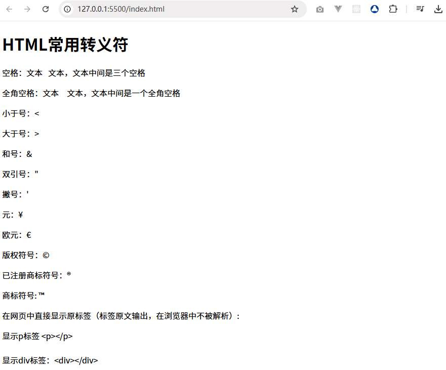

### 3、HTML 的注释

对于 程序开发人员最讨厌的两件事：

* 讨厌自己加注释
* 讨厌别人的代码不加注释

**添加注释的重要性：**

* 提高代码的可阅读性，方便自己阅读或他人阅读
* 增强代码的可维护性

**注：**

* 注释在网页中是不显示的，只有自己能看到

**HTML 注释的语法：**

```html
<!--注释内容-->
```

在 Vscode 中，可以使用快捷键 `Ctrl + /` 添

## 五、列表标签

HTML5 中提供了三种列表标签

| 标签        | 语义                        |
| :---------- | :-------------------------- |
| `<ul></ul>` | 无序列表 （没有刻意的顺序） |
| `<ol></ol>` | 有序列表                    |
| `<dl></dl>` | 定义列表                    |

### 1、无序列表 - 基础语法

语法

* 无序列表使用 `<ul></ul>`标签，是英文单词`unordered list（不排序列表）` 缩写
* 每个列表项都是 `<li></li>`标签，是英文单词 `list item（列表项目）`缩写
* 无序列表是一个父子组合标签，上阵父子兵，不能单独出现
* `<ul>` 父标签，`li` 子标签

```html
<h1>无序列表</h1>
<ul>
    <li>小炒肉</li>
    <li>小龙虾</li>
    <li>剁椒鱼头</li>
    <li>酸辣白菜</li>
    <li>7分熟牛排</li>
</ul>
```

注：

* ul ，li 标签是嵌套形式，li 标签必须要缩进（一个 Tab）
* li 标签不能单独使用
* ul 的子标签只能是 li
* li 标签中是可以放任何标签的

### 2、无序列表 - 列表嵌套

```html
<h1>无序列表-嵌套</h1>

<ul>
    <li>
        <h2>北京市</h2>
        <ul>
            <li>海淀区</li>
            <li>东城区</li>
            <li>朝阳区</li>
            <li>石景山区</li>
        </ul>
    </li>
    <li>
        <h2>上海市</h2>
        <ul>
            <li>黄浦区</li>
            <li>浦东新区</li>
            <li>徐汇区</li>
            <li>静安区</li>
        </ul>
    </li>
</ul>
```

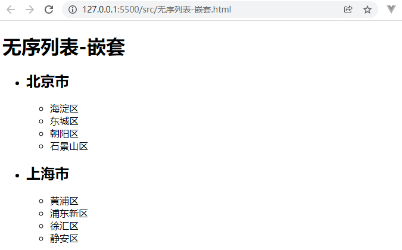

### 3、无序列表的 type 属性

type 属性

* 无序列表有 type 属性，可以定义前导符号的样式，但在 HTML5 中已经被废弃，建议使用 CSS 替代
* 只作为学习和了解即可

| 属性 | 值     | 描述           |
| :--- | :----- | :------------- |
| type | disc   | 默认值，实心圆 |
| type | square | 实心正方形     |
| type | circle | 空心圆         |

注意:

在 HTML 4 中的 ul 属性已废弃，HTML5 已不支持该属性，因此我们使用 CSS 代替来定义不同类型的无序列表如下：

```html
<h1>无序列表标签</h1>
<p>ul的type属性在HTML5中已经废弃</p>

<h2>type="square" 实心正方形</h2>
<ul type="square">
    <li>小炒肉</li>
    <li>小龙虾</li>
    <li>剁椒鱼头</li>
    <li>酸辣白菜</li>
    <li>7分熟牛排</li>
</ul>

<h2>type="circle" 空心圆</h2>
<ul type="circle">
    <li>小炒肉</li>
    <li>小龙虾</li>
    <li>剁椒鱼头</li>
    <li>酸辣白菜</li>
    <li>7分熟牛排</li>
</ul>
```

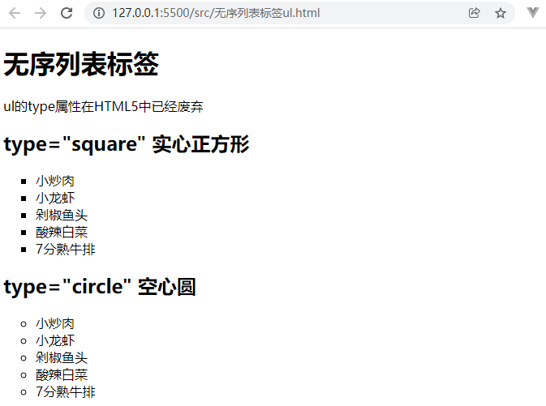

注：

在 HTML5 中使用 CSS 代替来定义不同类型的无序列表

```html
<h1>无序列表标签</h1>
<p>ul的type属性在HTML5中已经废弃，使用CSS替代</p>

<h2>style="list-style-type:disc" 实心圆</h2>
<ul style="list-style-type:disc">
    <li>小炒肉</li>
    <li>小龙虾</li>
    <li>剁椒鱼头</li>
    <li>酸辣白菜</li>
    <li>7分熟牛排</li>
</ul>

<h2>style="list-style-type:square" 实心正方形</h2>
<ul style="list-style-type:square">
    <li>小炒肉</li>
    <li>小龙虾</li>
    <li>剁椒鱼头</li>
    <li>酸辣白菜</li>
    <li>7分熟牛排</li>
</ul>

<h2>style="list-style-type:circle" 空心圆</h2>
<ul style="list-style-type:circle">
    <li>小炒肉</li>
    <li>小龙虾</li>
    <li>剁椒鱼头</li>
    <li>酸辣白菜</li>
    <li>7分熟牛排</li>
</ul>
```

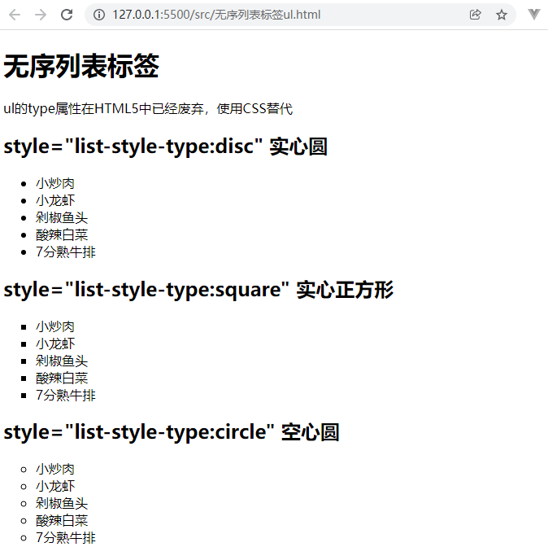

### 4、无序列表在开发中的使用


* 导航栏
* 各种页面 list 列表
* ..... 基本常见网站导航、列表页都会使用 ul li 无序列表标签

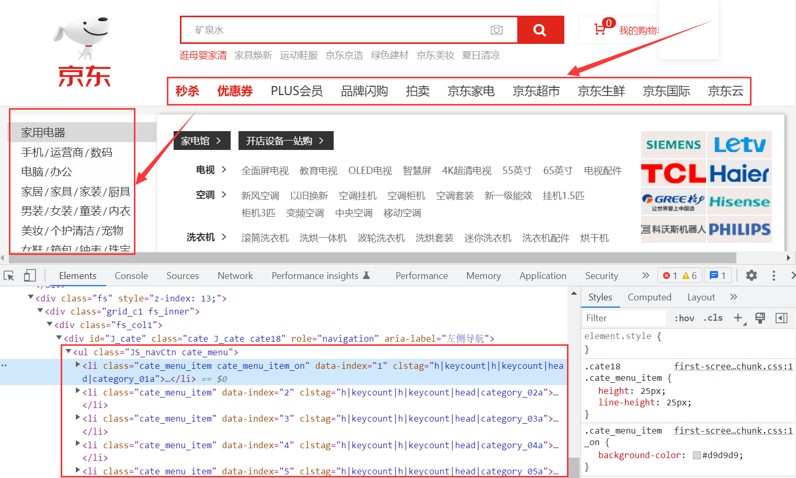

### 5、有序列表 - 基础语法

> 有刻意顺序的列表就叫做 有序列表

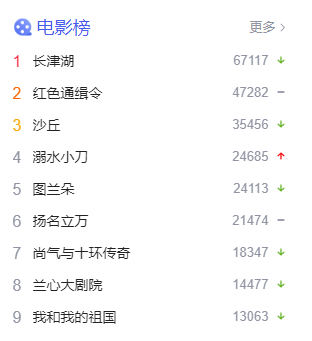

关于有序列表

* 有序列表使用 `<ol></ol>`标签，每个列表项都是`<li></li>`标签
* `<ol>`标签是英文 `ordered list（排序列表）` 缩写
* ol 的特性与 ul li 同理

```html
<h1>编程语言排行榜</h1>
<ol>
    <li>JavaScript</li>
    <li>Python</li>
    <li>C/C++</li>
    <li>Java</li>
</ol>
```

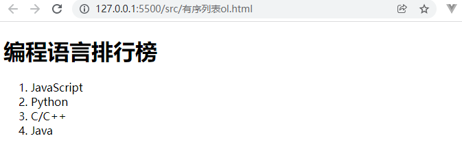

### 6、有序列表 ol 的 type 属性

> ol 标签可以设置 type 属性，用来设置编号的类型

| type 属性值 | 描述               |
| :---------- | :----------------- |
| 1           | 数字编号（默认值） |
| A           | 大写英文字母编号   |
| a           | 小写英文字母编号   |
| I           | 大写罗马数字编号   |
| i           | 小写罗马数字编号   |

```html
<h1>编程语言排行榜</h1>
<p>ol type属性值</p>

<ol type="1">
    <li>JavaScript</li>
    <li>Python</li>
    <li>C/C++</li>
    <li>Java</li>
</ol>

<ol type="A">
    <li>JavaScript</li>
    <li>Python</li>
    <li>C/C++</li>
    <li>Java</li>
</ol>

.......
```

### 7、有序列表 ol 的 start 属性

start 属性

* `start`属性值必须是一个整数，制定了列表编号的起始值
* 此属性的值`阿拉伯数字`，即使 ol 指定了 type 属性值

```html
<h1>编程语言排行榜</h1>
<p>ol type属性值 和 start属性值</p>

<ol type="1" start="3">
    <li>JavaScript</li>
    <li>Python</li>
    <li>C/C++</li>
    <li>Java</li>
</ol>

<ol type="A" start="2">
    <li>JavaScript</li>
    <li>Python</li>
    <li>C/C++</li>
    <li>Java</li>
</ol>

<ol type="a" start="6">
    <li>JavaScript</li>
    <li>Python</li>
    <li>C/C++</li>
    <li>Java</li>
</ol>
```

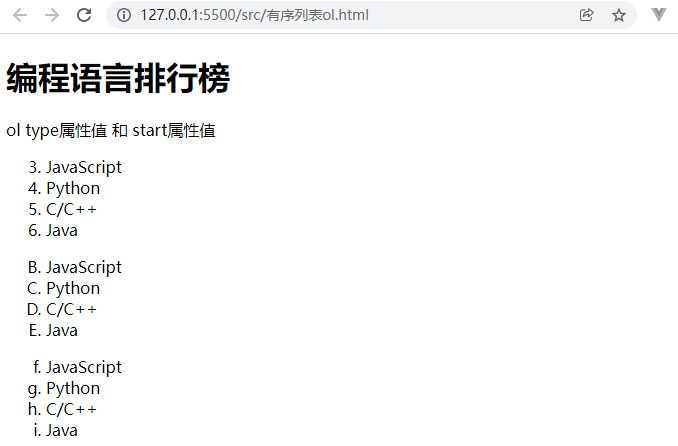

### 8、有序列表 ol 的 reversed 属性

reversed 属性

* reversed 属性是 HTML5 中的新属性
* reversed 属性是一个布尔属性
* reversed 属性指定列表中的条目是否是倒序排列的
* reversed 属性不需要值，只需要写 reversed 单词即可

```html
<h1>有序列表 ol的reversed属性（倒序排列）</h1>
<ol type="1" reversed>
    <li>JavaScript</li>
    <li>Python</li>
    <li>C/C++</li>
    <li>Java</li>
</ol>
```

### 9、定义列表

需要逐条给出定义描述的列表，就是定义列表

* 定义列表使用 `<dl></dl>`标签，是英文单词`definition list（定义列表）` 缩写
* `<dt></dt>`标签，是英文单词 `data term（数据项）`缩写
* `<dd></dd>`标签，是英文单词 `data definition (数据定义)`缩写
* `dd 标签`内容是对`dt 标签`的解释说明
* 案例以`小米官网`首页 底部

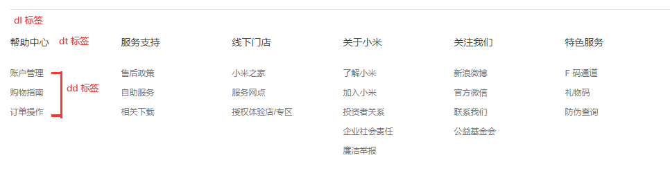

> `<dl>` 是定义列表标签，内容交替出现 `<dt>、<dd>` 标签

```html
<h1>定义列表 - dt dd标签交替出现</h1>
<dl>
    <dt>服务支持</dt>
    <dd>售后政策</dd>
    <dd>关注我们</dd>
    <dd>自助服务</dd>

    <dt>关注我们</dt>
    <dd>新浪微博</dd>
    <dd>官方微信</dd>
    <dd>关于我们</dd>
</dl>
```

> - 也允许 dt 和 dd `不交替出现` ，而是分别处于不同定义列表 dl 中
> - 这么写，可以有更多的 dl ，可以更好的服务 css 样式

```html
<h1>定义列表 dt dd 不交替出现</h1>

<dl>
    <dt>服务支持</dt>
    <dd>售后政策</dd>
    <dd>关注我们</dd>
    <dd>自助服务</dd>
</dl>

<dl>
    <dt>关注我们</dt>
    <dd>新浪微博</dd>
    <dd>官方微信</dd>
    <dd>关于我们</dd>
</dl>
```

### 10、最佳实践

| 标签   | 适用场景                            | 最佳实践           | 注意事项                      |
| :----- | :---------------------------------- | :----------------- | :---------------------------- |
| `<ul>` | 无序列表（顺序不重要）              | 菜单、导航链接     | 避免嵌套过深                  |
| `<ol>` | 有序列表（顺序重要）                | 步骤说明、排名     | 合理使用编号类型              |
| `<li>` | 列表项（ `<ul>` 或 `<ol>` 的子元素） | 购物车商品、步骤项 | 不能单独使用                  |
| `<dl>` | 术语和定义                          | 术语解释、产品规格 | 避免用于简单键值对            |
| `<dt>` | 定义术语（ `<dl>` 的子元素）         | 技术术语、名称     | 内容应简洁                    |
| `<dd>` | 定义描述（ `<dl>` 的子元素）         | 术语解释、详细说明 | 一个 `<dt>` 可对应多个 `<dd>` |

## 六、多媒体标签


深入浅出多媒体标签的定义 和 最佳实践

### 1、图片标签 img


图片标签是实际开发中常用的标签，标准和规范也尤其重要

### 1.1、语法和基础


标签用来在网页中插入图片

```html

```

* img 是 英语单词`image（图片）`的缩写
* src 是 英语单词`source（来源）`的缩写
* "" 中是 图片的 存储目录和完整的文件名

注：

* 图片必须存放在项目文件夹中，如：images 中
* 图片只是引入到网页中，本质上没有被插入到网页中

### 1.2、img 标签的 alt 属性


* alt 属性是英语 `alternate（代替者）`缩写，对图像的文本描述，不强制
* 若由于某种原因无法加载图像，浏览器会在页面上显示 alt 属性中的备用文本
* 供视力不方便的用户使用的网页朗读器，也会朗读 alt 中的文本
* 对于搜索引擎优化友好，告诉搜索引擎图片的含义，利于搜索引擎爬虫抓取

```html

```

### 1.3、img 标签的 width、height 属性

* width、height 属性设置图片宽度和高度，单位是 PX（像素），可不写
* 如果省略其中一个属性，则表示按原始比例缩放图片

```html

```

### 1.4、图片标签规范


* PC 端 img 图片必须填写 src、width、height、alt 属性，统称图片标签的四要素
* 移动端必须填写 alt 属性
* alt 不能为无意义字符，需要能表现出图片的含义，如图片为道具图，则应该为道具的名称

### 2、网页上支持的图片格式

| 支持格式        | 描述                                                    |
| :-------------- | :------------------------------------------------------ |
| `.bmp` | Windows 画图软件默认保存的格式，位图                    |
| `.jpeg（.jpg）` | 有损压缩图片，通常用于照片显示                          |
| `.png` | 便携式网络图像，用于 logo，背景图形等。支持透明和半透明 |
| `.gif` | 动画 ，如：表情包                                       |
| `.svg` | 矢量图片                                                |
| `.webp` | 最新的压缩算法，非常优秀的图片格式                      |

> 实战演练 ......

### 3、相对路径和绝对路径


深入相对路径 和 绝对路径本质

### 3.1、相对路径

* 从当前网页出发，要找到图片的路径就叫 相对路径

```html


.....
```

> - `../` 表示回退上一级目录
> - `./` 表示当前目录
> - 通过 `cmd` 命名行 `dir` 命令可查

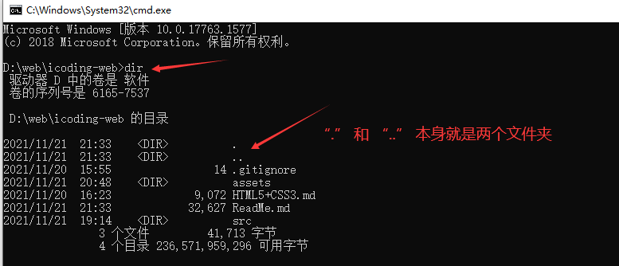

### 3.2、绝对路径

* 描述文件或文件夹的精准完整地址

```html


```

### 4、超级链接 - a 标签

### 4.1、语法和基础

超级链接是网页与网页之间链接跳转的方法

* `<a></a>`标签是英语 anchor 锚的首字母
* `href` 属性是英语 `hypertext reference （超文本引用）`缩写

```html
<a href="https://www.baidu.com">百度一下，你就知道</a>
```

### 4.2、a 标签的 href 属性


href 属性支持相对路径和绝对路径

```html
<a href="./index.html">进入首页</a>
<a href="../index.html">进入首页</a>
<a href="D:\web\icoding-web\index.html">进入首页</a>
<a href="https://www.icodingedu.com">艾编程</a>
```

### 4.3、a 标签的 title 属性


a 标签的 title 属性用户设置鼠标的悬停文本

```html
<a href="https://www.baidu.com" title="点击，进入百度官网">百度一下，你就知道</a>
```

### 4.4、a 标签的 target 属性

| target 属性值  | 描述               |
| :------------- | :----------------- |
| _blank / blank | 在新窗口中打开网页 |
| _self          | 默认，当前页面跳转 |

注：

HTML4 中 blank 之前有个下划线 `_blank` 都可使用

```html
<h1>超级链接 - a标签</h1>

<a href="https://www.baidu.com">百度一下，你就知道</a>

<h2>a 标签的 target 属性</h2>

<a href="https://www.baidu.com" target="blank">_blank：新窗口打开</a><br /><br />
<a href="https://www.baidu.com" target="_self">_self：默认，当前页面跳转</a>
```

给图片添加超级链接：点击图片标签跳转连接

```html
<a href="https://www.baidu.com" target="blank">
    
</a>
```

### 4.5、页面锚点


* 对于很长的页面，可以对应的标签添加 `id属性`，将它变成页面的 "锚点"
* 当点击锚点连接时，浏览器地址栏就会出现 `#id属性名称` 页面就会自动滚动到锚点处
* 从其他页面页面点击带#号的链接，就可以直接定位到锚点位置

```html
<h1>页面锚点链接</h1>

<p>
    <a href="#phone">小米手机</a> &nbsp;&nbsp;&nbsp;
    <a href="#zn">智能穿戴</a> &nbsp;&nbsp;&nbsp;
    <a href="#jd">家电</a> &nbsp;&nbsp;&nbsp;
    <a href="#sh">生活电器</a> &nbsp;&nbsp;&nbsp;
    <a href="#cf">厨房电器</a> &nbsp;&nbsp;&nbsp;
    <a href="#jj">智能家居</a> &nbsp;&nbsp;&nbsp;
    <a href="#cx">出行搭配</a> &nbsp;&nbsp;&nbsp;
    <a href="#bh">日用百货</a>
</p>

<h2 id="phone">小米手机</h2>


<h2 id="zn">智能穿戴</h2>


<h2 id="jd">家电</h2>


<h2 id="sh">生活电器</h2>


<h2 id="cf">厨房电器</h2>


<h2 id="jj">智能家居</h2>


<h2 id="cx">出行搭配</h2>


<h2 id="bh">日用百货</h2>


<p>
    <a href="#top">回到顶部</a>
</p>
```

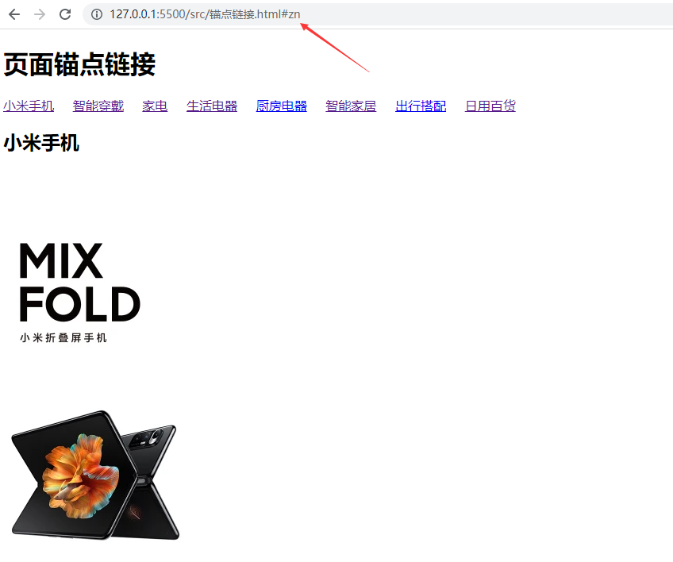

注：

在 HTML5 中 直接使用 `#top` 即可回到顶部，不用定义 `id="top"`

```html
<a href="#top">回到顶部</a>
```

### 5、特殊链接（下载、邮件、电话）


深入浅出 a 标签 实现文件下载， 发送邮件、打电话

### 5.1、普通下载


* 指向 exe、zip、rar、word、excel 等文件格式的链接，将自动成为下载链接
* PDF、图片、文档等，如何需要直接下载文件而非导航并预览文件，需要使用 download 属性

基本用法：

```html
<h1>特殊链接</h1>

<h2>下载链接</h2>

<a href="doc/1.zip">web前端学习资料zip下载地址</a>

<br /><br />

<a href="doc/1.doc">学习资料doc文档</a>
```

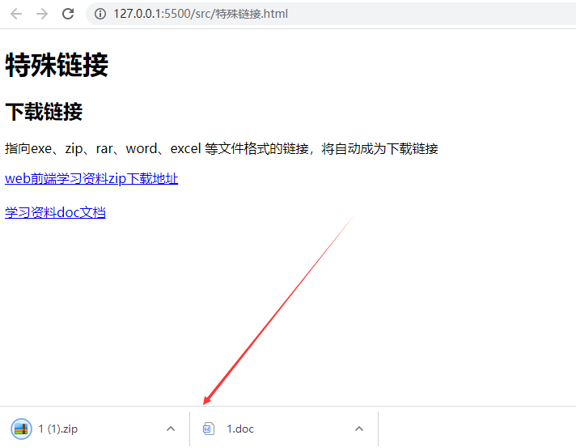

download 属性

* **作用**：点击链接时，浏览器会下载文件而非打开它。
* **默认行为**：如果未指定 `download` 属性，浏览器会尝试在标签页中打开文件（如 PDF、图片）或导航到文件地址。
* **自定义下载文件名**：可以通过 `download` 属性指定下载后的文件名，而非服务器上的原始文件名

> 注：某些浏览器可能忽略自定义文件名（出于安全策略），文件名需包含扩展名（如 `.pdf` 、 `.jpg` ）

```html
<body>
    <h1>特殊链接</h1>

    <h2>普通下载</h2>
    <a href="./internet.pdf">普通下载：互联网的基本原理学习笔记（PDF 格式）</a>

    <h2>强制下载文件</h2>

    <a href="./internet.pdf" download>强制下载：互联网的基本原理学习笔记（PDF 格式）</a>

    <h2>强制下载文件 + 自定义文件名</h2>
    <a href="./internet.pdf" download="认知互联网的基本原理">
        强制下载文件 + 自定义文件名：互联网的基本原理学习笔记（PDF 格式）
    </a>
</body>
```

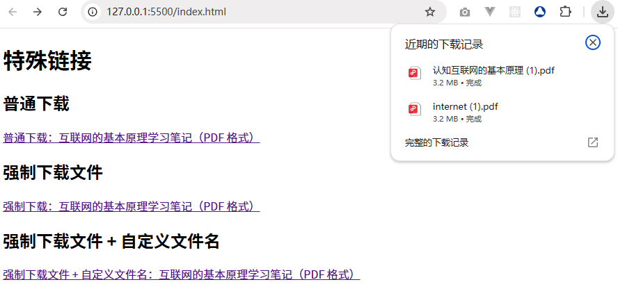

### 5.2、邮件链接


* `mailto:` 前缀的链接 即 邮件链接
* 系统将自动打开 email 相关软件，即可发送邮件

```html
<a href="mailto:arry@icodingedu.com">给arry老师发邮件</a>
```

### 5.3、**电话链接**


* `tel:`前缀的链接 即 电话链接
* 系统将自动打开手机拨号键

```html
<a href="tel:18966666666">给arry老师打电话</a>
```

### 6、a 标签的 妙用 和 最佳实践


* 在 HTML5 中，a 标签可以包裹 块级元素
* 关于 a 标签的 SEO 优化 最佳实践

### 6.1、a 标签包裹块级元素

```html
<a href="...">
    <div>
        <h2>文章标题</h2>
        <p>文章摘要...</p>
    </div>
</a>
```

> 具体实践案例：所有点击区块可以跳转的链接都是 类似的用法

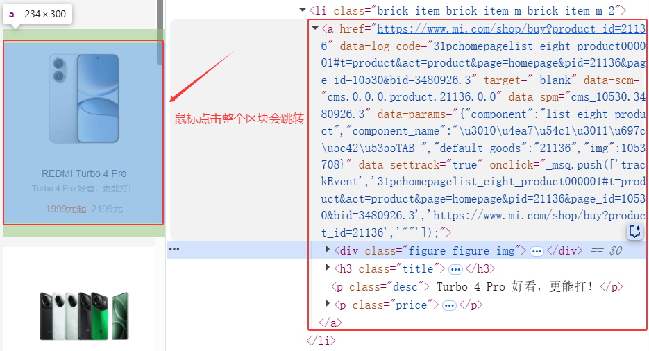

### 6.2、rel 属性用法


`rel` 属性是 HTML 中 `<a>` 、 `<link>` 、 `<area>` 等标签的一个重要属性，用于定义当前文档与被链接文档之间的关系。它为搜索引擎、浏览器和其他用户代理提供了有关链接用途和性质的额外信息。以下是关于 `rel` 属性 在 a 标签中的最佳实践：

> `rel` 属性通过描述链接的语义和上下文，帮助：

* **搜索引擎** 理解链接的性质，优化 SEO。
* **浏览器** 增强安全性和性能（如防止钓鱼攻击、优化预加载）。
* **开发者** 明确代码意图，提升可维护性。

| **属性值**   | **适用标签** | **用途说明**                                                 | **示例**                                                     |
| :----------- | :----------- | :----------------------------------------------------------- | :----------------------------------------------------------- |
| `nofollow` | `<a>` | 指示搜索引擎不要跟踪该链接，不传递权重。常用于用户生成内容或广告链接。 | `<a href="https://example.com" rel="nofollow">广告链接</a>` |
| `noopener` | `<a>` | 防止新打开的页面通过 `window.opener` 访问原页面的 `window` 对象，增强安全性。 | `<a href="https://example.com" target="_blank" rel="noopener">安全链接</a>` |
| `noreferrer` | `<a>` | 类似于 `noopener` ，但还会阻止浏览器发送 `Referer` 头信息，保护隐私。 | `<a href="https://example.com" target="_blank" rel="noopener noreferrer">隐私保护链接</a>` |
| `external` | `<a>` | 非标准但广泛使用的值，表示链接指向外部网站（无实际技术效果，仅用于标记）。 | `<a href="https://external.com" rel="external">外部链接</a>` |
| `ugc` | `<a>` | 表示链接来自用户生成内容（如论坛帖子），建议搜索引擎降低权重传递。 | `<a href="https://example.com" rel="ugc">用户评论链接</a>` |
| `sponsored` | `<a>` | 标记赞助或付费链接，帮助搜索引擎识别广告内容。               | `<a href="https://example.com" rel="sponsored">赞助链接</a>` |

注：

* `rel` 属性的值是大小写不敏感的（如 `nofollow` 和 `NOFOLLOW` 等效）
* 某些值（如 `ugc`、`sponsored`）是较新的标准，可能不被所有工具完全支持，但主流搜索引擎（如 Google）已支持
* 合理使用 `rel` 属性，可以显著提升网页的安全性、SEO 表现和用户体验

### 6.3、最佳实践


* **安全性**：使用 `target="_blank"` 时，务必添加 `rel="noopener noreferrer"`，防止 `window.opener` 攻击
* **SEO 优化**：合理使用 `nofollow`、`ugc` 和 `sponsored`，避免传递权重给不希望优化的链接
* **实践案例**：大厂网站（浏览器右键检查元素，搜索 rel 查看）、[Vue 官网(opens new window)](https://vuejs.org/)

### 7、音频和视频


* 早年在网页中插入音视频需要使用 Flash 技术，当下基本已经淘汰
* 可直接使用 HTML5 标签轻松在网页中像插入图片一样插入音频和视频即可

### 7.1、音频标签


* `<audio>`标签可直接在网页中插入音频，并自动生成默认的编辑器
* `controls` 属性 ，显示播放空间
* `src` 音频路径
* `标签对中`对不兼容 audio 标签的浏览器所显示的文字
* 浏览器中常用的音频格式：mp3 和 ogg 格式

```html
<audio controls src="mp3/不错哟.mp3">
    亲爱的，您的浏览器不支持audio标签，请升级您的浏览器哟 ^_^
</audio>
```

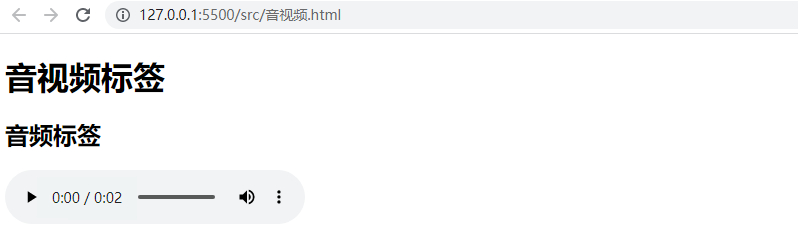

音频标签部分属性：

* `autoplay` 音频自动播放，不会等待整个音频文件下载完成
* `loop` 循环播放音频

```html
<audio controls src="mp3/不错哟.mp3" autoplay loop>
    抱歉，您的浏览器不支持audio标签，请升级您的浏览器哟 ^_^
</audio>
```

### 7.2、音频标签 `audio` 的子标签


source 标签为媒体元素定义媒体资源，该标签允许定义多个格式的音视频文件，供浏览器选择自己支持的媒体类型进行播放

| Format | MIME-type  | 描述                                                       |
| :----- | :--------- | :--------------------------------------------------------- |
| MP3    | audio/mpeg | 一种音频压缩技术，用来大幅度的降低音频数据量               |
| Ogg    | audio/ogg  | 一种新的音频压缩格式，是完全免费、开发和没有专利限制的     |
| Wav    | audio/wav  | 微软公司开发的一种声音文件格式，声音文件质量和 CD 相差无几 |

* 浏览器需要选择它支持格式的源文件进行播放，如果都支持则任选一个（默认选择第一个）

```html
<h2>audio 子标签 source</h2>

<audio controls>
    <source src="audio/不错哟.mp3" type="audio/mpeg" />
    <source src="audio/不错哟.ogg" type="audio/ogg" />
    <source src="audio/不错哟.wav" type="audio/wav" />
    亲爱的，您的浏览器不支持audio标签，请升级您的浏览器哟 ^_^
</audio>
```

![image-20211121235651466](data:image/png; base64, iVBORw0KGgoAAAANSUhEUgAAAscAAACICAYAAAALZ0a+AAAfW0lEQVR4nO3dXWxb550m8OdQsk03izWDeoasnbXYK2sQy2SB7UjeiVdUu4CoxLNUriTHzlpOXYjpIBF9sRYVLBbCXpSUB1jSnSai0bSSJ3apXFnZcUN6gSlpqDOimy5ESh5YvTK92MR0q0DM7mRE2xLfveAheUjxWyQl288PoCDyfL3kIalH5/zP+0pCCAEiIiIiIoJquxtARERERLRTMBwTEREREckYjomIiIiIZAzHREREREQyhmMiIiIiIhnDMRERERGRjOGYiIiIiEjGcExEREREJGM4JiIiIiKSMRwTEREREckYjomIiIiIZAzHREREREQyhmMiIiIiIhnDMRERERGRjOGYiIiIiEjGcExEREREJGM4JiIiIiKSMRwTEREREckYjomIiIiIZAzHRERERESypzIcJ+JxxNO3RME5UPDhp13YA5PJBJPJBJs/1pBNxP1W6CQJkiRB0tkRLPpChuE2yvNJXXCHG9IcIiIioqZq3e4GVC8E94vHMJa+65iHsHfJdxIIOc3oH7uFh2jDmetBTPfrm9OsqB/u2eW6ra693wZzftMTcdy6dQsAoLEqHo+HMD0dQry6LaDfZkbOJhJheMYv46F8t3d8EMZE/j8gamg0asT9Hjgj8kMDVpj1ccQ3NSA1LxEREdHT4ikMxyVEZ2AfuyWHu/u48roTg6semDVN2HYsjPPnx8rPVyFHV4FwXEwiitnz5/FJdVtAV144DnusGLudvX/z7e/gxbc3Lze/ZkZQEaLx8Vn82cdnC25jXtjRVWAKERER0U70VJZVFKVWIycHa/XQNCMYPwMSISes52+XnxFRBN25IZqIiIjoWfFsHTnWDWJ6PgabfRZRjRFWp615Ry3b+xEIVL+12Ow4Tl66lftgmwV6XfpOGB6TDTMAkIhmZgmND8LkAWC0Y8ZpwnggAFtVW9ahPf1rIgS3bQzpvGsY8cJt9MN6NgTTlAeDysPLiWVMWy/Ldzox6nXCrIti2noWV/QO+OxdUBfaBhEREdFTQBJCiO1uRHVCcErFao6fHvHlGYzb7Lh0877i0TZYXNPw2EzIZOP855vP4sWD2UHF/NVahsdswts35SKJTgfmZ7sw09WDS/cBaAfgDc1gELOwDrmxDACxZdz6PTDgDWFmUI3ZISNev5JavnM0AL/TBB6wJyIioqdRxUeOE/F4tgcItQbNuc4qgXjmarBGXNylXD+g1mjQ8KcVC8JjH8f4lVvZml0AbRYXpj02mGpPuTVqR5dZD9x8mArCM3Z06QDjjAOhY2O4jRjC4VlEna/jsrKU4vAorHJRtNlmR6//PG4+BG5PexC0mdBf8/PI3SeVvde2YT8WakU8jkSJ9uZ8hip4Pyvn367nRERE9NwRJTwITImRM52iDRDIu2m7z4iphdVNy8w7lPNZhPdB/kq9wqJcl2O+wJZXxV3viOjW5m6zzFlbnhaPo8nnTLF6Rv3khhFi9e104Bg4L7abnpRWHB1zCd2+t1MtSo1Ux77Jsfi3bLMIVKNTKrLXVVbG6uioCjsOZ5SxTd8Xq6qpYvesVw93doruW24hPfn3uCe9At3DM5z7vhckRMeXziuHOzfsfgEDnsPDdk9u44BK9h8+I6/dqfHkeBISr4D6BaOucFAuFXtFa9mMF779S7+EHXkvOthzzQqwtTApLW7H33AMRmBwWvW0FXj9tt5i8m7/1NXH3ukMMHNbmzd8meke84u7mjxwRERHVUYlwnBc0C946NwWqrYfje8I33Fl8mxZLieXLheM1cXdqoGAAy39ew75aU14xeW3Tdoszk4GC4b2wBeEyZJe3pF/Y/NezmluRfx7SHvhGc/5B0XY7xPyDeeHozH0eo77Kn0Uha/MO0VmyrQ6R+y7Zwn6sdzj2XhcD2iKv6T1f8X8sFOE6a1UERku89wGBti38A0JERERlle2tQnu4F8MuL3yBAAKBAHzeUfRq01NvY2x8BtFSK6hSbNaOoZzz923oHR6FyzWCgcNa4JNPquyyLCvut8F09mNFOUMbOs+MwOUaxXDvYWSeFm7jct8gnOEGDiVic2Laaqq8VjgcxHSk/Gx1EQ9jekiPb/VN4Jb8YrWdmULQb0eXrgt2/wJc6TfBw1uY6DPCZJvBcnUdLcuimBnPXgwIbS9GvT4EAgEEAj54XcPobctr3g7ajzPOcXz8sMCERAjOwb7cUhTtYfm97MLImU7kPS1EpwfRM5FeQIvukanU5+76JM50yg/fvwKr019ln9ZERERUqRI1xxp0+R4gatbl1Tqa0KWO4cXXr6Tu3pxFKDoEfV3G2ghjZlwZenrhWpiFzSi3wGZD/2AXThZMI+XXPW1X9M0LCybvzsDanl63E86QE+Zj6aB2G2NuP6zT/WUuLovC755F+eE/lhFU3g1Ow60OlVkmPVBHAsEZJ5TZ+BO7FU61E9b+fkyvrm5eNOTEi30T8p1R+FYL9Tec1/VdIoagx4qh858ge5lgGyyTs5i2GrPzaoyw+cNotw9iaOIWHuIhbl06iT+7ZIfF5YF7yAx9pVfkxZcRuqm4bxuHc1DRUpMZgzndcDRqP9YmEomhe9SHabsJeg0QiyWgARCdGc/p7k47MIWgZwjtmUbY4HYvYzmd2+N+OO3ZF6LTMQt/pucPE0z6BMLfOY8IgIeX3Zi1mzHUpPFtiIiInitVHWdeWxWrq/fEgnc05zS48tTwlsoqFlzCoJhmcBWoNC15WrxEWcWCI+c0fMF1i1Vx/Yyy/cPCV7bGs5Lyk1pvcjnB6nVxpsg82u4RkapqWBM5BS7zjhJlCflP+57wuQbEYW292t0meocnhe/uqihbvb0WECPKZbW9whF4UHy5re7HOpdVFC5NyS2BgXZEBMq8EKu+4dKfm7z32cD1rZWyEBERUWFlyipiCM24Ye03oV0nQdr7Il588dv4zskJNGIMiFg0lHN01Nxl3DyTTl9T38Wx5VBO7xAF1w0NjKZuxf1ZhOtZM1Kj8PQ4rhSZ9jChh04HRKfN2Cvp0TVkw0zBMoI4loMzcA62o8sdVjy+DI/52+g7/zF+n3mB2mBxOXCm4hZaMDzSrShnuI+bl99G36AHZSsa1EaYh7NL4uFNjPV8C3v1Zlg9/k2lGjttPw4MFSiNiUURUr6RB/vRVaariWh4VnEvDPegCSaT8maDRzFHooEVP0RERM+z4mUV0VkMmV7Hlfv5E9rQ2a1G9NbvUUtxQ0l5f/Eb2VdusXWr1copD4GyIUQHo8sFV9ktLsN//jIyJ857h+Eylxsiox26uB/O86mkZTAYEImkfreMuqAPuYFxK4yIYnomNZDI7StRwKnGpkLweBDOnpOpkB2cQdBqhEmd2oZ1Zgqz3z6Lm9Di8IAdHrcNJl0UfqiREz0TMSyHYlCbjMg9o58q/3BaZ+Gx2zD2yX0AWgw7rWVDIaCB2e3HZKwfb3+ieLPdv4nLb9/E5bfbcGbKD89Qe8GuzOq3H2tj1BWqGk/kbk6nLtsNWyLn03Qft29t+uARERFRExQJx1FMWxXBuHMYXs84zO26VB+usRn0f+tkzRfGbVUjL0aKxZSp0gB12XCnh9lmg7nsmkNIKMOxaQg2WwXHwBNBOVj1wmYz4exZ+ZCkcRBup1yMGw1iOr1iy2Cqr+T8cKwxY2gEuHIJwMMJTPvtMPXLAVI/BKc3DqtxCP3tGiARQygMxfOKIegeh9NzGTfv92LKbcutdw17YHXOwmrth322H0OhaTin1bCZK/z3Rm2EdTaK/tAMpj1ueK7cVtQ838eVs4Nobw/BXj5pZ1S/Hxuo6jdsL4Zd5pKjC2r07PWYiIioEQqXVcTC8Csukhp1ezBo1GUHN4iGKwzG8c2nfxOJollBo8s9HulfLnAuPByCv6Jt59LpuxSn/YusG3FEw8rz4SYYt3v8Y7Uexm5AO2xDf5G2hGfdSA9AbRks1gOGGl39o5nX4IpnNic/Gwdt6NcnEHQPol3/LRwzO+HP7CgdNAghNZjfTbhnlWUZcfg947g89jq+86IO7VY/1F1DcHsGUe31YrquQdinQ4iuPUDA0avYXxG4g6lLHuu+H2N5R3mRQCJWZcPz6fS5wdYfRKjMkWudTlkGkkBXvw02W/HbUBfHICQiImqEIjXHuYEhkZNwo5hxTxddoV5vUdy7BU9OkEog5MkGuXzq9i7kLG23YyYn+0QxPX4eNfVoZuzCkCJVbV43EA954FQU92pHy9eKNp4OemMn7FZzkRKCMIKZPt7OYMhcvHM4takftvRrcHMGwfxcqVYjHpZrjx9eht0TyrwPjP029Mq/R5wzCKYnhKcxfjldEqBD/1CVQ0cn4ojl/7ek1sFkH4eyk4qH6ZZsdT/m16zPzCCo3H50Fu5L1TyBQowwjyoaGRmDbdyPTZk7voxl+UG9sR+GzIRbcHuCRf6JjCMWZ8ExERFRwxS8TG/VJ4ZzBh6wCNf1gAj4vMJhaSs9kEFejxOp0cpGhMs1KoZ7Ny+b21vAqvAN540Mpj0sBkZcwjVaZJSxKgYBeXA9f+CINtE7PCpcLpcYyR9pTTsgvHUdbKHUyH6l3VtYSPXeoOiBIj0IyFpgNNvuYZ/IdK5RpLeKBZehdE8POfuvV0xlXoN7Yqo32/5h36rI319a5fYr9cArLGgTvcMu4fUFRGBhQSwEfMI72puzP4YV3YZsbT+uCt9w3nuorVcMj7qEa6RQjx3lR8gr6F6BwVnaOsWZEVeqnfLIk9nlH4jrA7nvfW33GTE6dV0EAqnP3qT8GbBs7sqCiIiI6qRIV25rIjCSP3xtNuwOD58pERA2/5FXLjvgGC3dldY9b+6IY3m3TocjN7hXOULevKO7/Mhq2s1DKW9ZfndsVYTjjE3hWBlYtWJU2V9Ysa7clOHX4CowLPMD4bVkQ+eAIlk+uH5GDDi8IiCPYbw278iuSzsgaupdrIIR/rQDXpH7f8rW9uPaQokR+TodwpETnmsMx0KI1cBomZH/8pZfyxt9sMiN4ZiIiKhxipRVqGFyBuHN6Z4LgLYbI9dD8AyVKsTVoX/aj0lL3vhf2m6MeIOYHirU9ZaCfhAzy/Nw5S+PNlgmF+C3m6quZc1So8seRDgwieH8YdfkbfQOTyIQDlZ18VeuOPw2E/qtdrjdbvlmQ7/x9Zzu2Cx1GTVFgy6r/FwMNvQbE4jH44jHYwiHiwwwYjRhyABAexgDg+3QJAAkYggHgwgGgwgGl6ExWYDuEUz5pmHVReXHg1jWDMHapQNiYQSDs3CPj2VKXA73m6FZDmbmDQbDiFVy9l+tQXtnoX0BoK0Xw5PzWJ7Jr1/e2n5UG+2Y8Y2gW5u3lMWFeb8dpjoNrqExORF6EIBr4DC0Baa39Q6jXVkFo+6CPXgX1x0DOFxoAbSh84wDVtYbExERNYwkhBAl50jEEYtGEdfooddpynZJVbdlASTiccRjtS9fSfvi8RiWo4C+XQeNpj7biE6b8O2zxSqrAaAXU/f81Y9wFnJCOjYGALB4H2B2MJus4vE4lp0v4thEoQUdmBfZEfLisRjUOsXIhw3pfcQC74NZDFY6PnYijngigdjyMhI6I/QaNTSaCvdGzfsxgXg8hmgU0Ot1lW+vFok44ok4ouE4NEY9NGoNSm8ugXg8gXg0jJi6He06NdR1en8SERFRcSWGj5apNdC1G4v0gNDAZQGoNRroNLUvX8EGoNFp0FXnDaQurrpV9MLBTsc4Bus89K9Go4HeaAEKRFztsDGn9wRNwb55t5kcFjW17Iya96MaGo0exjInM+pCrYFGrYHRVPEC0GjU0Bi3cqaEiIiIqlU+HFP12rsw2N29qdcGvXEQ5sF+DNY7jct07V3Q4pPscBLaw+jtt8PpLtbThUxjwnggkNM7xNZp0M6z/0RERPSUKV9WQTtI6lQ7gMyRViIiIiKqH4ZjIiIiIiJZkd4qiIiIiIiePwzHREREREQyhmMiIiIiIhnDMRERERGRjOGYiIiIiEjGcExEREREJGM4JiIiIiKSMRwTEREREckYjomIiIiIZAzHREREREQyhmMiIiIiIhnDMRERERGRjOGYiIiIiEjGcExEREREJGM4JiIiIiKSMRwTEREREckYjomIiIiIZAzHREREREQyhmMiIiIiIhnDMRERERGRjOGYiIiIiEjW2oyNCCHwZH0dyaRAUiQhkgJCCCSFaMbmiWgbqCQJkiRBUklQSSqoVBJ2tbZCkqTtbhoREVFRkhCNSagbG0k8WV/H+kYqFBMRAYBKJaG1tRW7WlrR0sKTV0REtLPUPRw/WV9H4tFjNChzE9EzRJIkqPfsxq7WppzEIiIiKqtu4Xh9fQOJx4+RTCbrsToieo6oVCqo9+xGa0vLdjeFiIiec3UJx2uJR3iyvl6P9hDRc2xXayv2qvdsdzOIiOg5tqVwLITA12sJHi0morpRqVR4Ya+aF+4REdG2qDkcr29sYG0tAVYWE1G9SQC+sVeNFpZZEBFRk9UUjh89foxHj580oj0AwMC9w/D4HW0X9Z7d2L1r13Y3g4iIniNV96PU6GBMRJSWePQYjx4/3u5mEBHRc6SqcPxkfZ3BmIia6tHjJ7zgl4iImqbicJxMJrGWeNTIthARFbSWeMQLf4mIqCkqCsfpXimIiLbL12sJDi5EREQNV1E45oh3RLTdhBBIPGL9MRERNVbZcJxMJlnvR0Q7wpP1dZZXEBFRQ5UNxzxSQ0Q7Cb+TiIiokUqG4/WNDaxvbDSrLUREZfF7iYiIGqlkOOYRGiLaifjdREREjVI0HCeTgrV9RLQjJZNJJJO8SJiIiOqvaDjmRXhEtJPxO4qIiBqhaDhe5x8eoqdePB5HPB7f7mY0BL+jiIioEQqGYyEENp7ikgoJgCTl3SqcF+lbwRlLTG9wO6udv05NpKfU4uIiAGBpaQlt/+Yl/Ohta9NCcjwex5h9FGP20YZucyOZZP/rRERUdwXD8ZP1xlwJvri4iBs3/q4h6way4TE35co3SdoUJqWcH5vnz94tMX3rja2onZU+L+VsyqdAz4/FxUX85WuvAgAOHTqEjo4OXLt6Ff/+lb/IhOZGcjp+jA/efx8fvP8+fnntWkO3xV4riIio3gqG42SyMX9wvvrqK5w6eRKnTp5szBGlbNrFiu8dGDqOyLcPsZieQRkYM2Ezgl+k5z3yMs77VgAAKkhQSan1Lf3sZRiOyLd3PsWXivWVFPkQxqPp7dfazuz8ix8eyc7/7qdYUcyv+tIH29EOGDrk27s+rEhSRc2kZ0M6GKc/X21tbfjNP87jg0kP7t+/j9NvNOizt002GI6JiKjOCofjBp+qvHHj72DoOILJDz6o2zqlvMD5/QsGfLR0B5GlO/hoxI0384JkNi1G8IuOU1i8GERk6Q4iwb8G/nM3psLIhOeln72M04t/jV/f+SdE7tzCRekC/sOHkfSWSyTPFdz8xSX0TPTjKLKzV9/ObDB+c/Ei/n7pDiJLQUzgAr4vt0PCl/D9Nx/MgdS6MtPf/RQrTMfPhfxgDCDz+6nTp+FwTuD+/fsYs482tB32sffgcE7A4ZzAG6dONXRbjf6uIiKi548kChTtff0vaw2pOZ6bm8OJV/tyHjt+/Djen/Sgra0t81gtf+6y4TgVdnH1Dn5gkCeufIqRHh/Mgb+BeX82JwrIAdXXh1//5FXslx+P/OxlnJZ+iaUfGlPLdv8K5uBP0ZeeIfwzGP6ThL9dPIeOTKMLtHrFh/Pf88H865+gN72sop1TZdqZnlPI02zytEw7Ih/i6Gngo6VzMKTXK0T29VMsY96P3GlVYK7emebm5vAPv5nL3J/84IOcYPzV//tnzM3NYcLxY9z41AcAeK2vD3fuLCGydAcajabpba63FpUKL3xj73Y3g4iIniGthR5s5tGYubk5HD3yMsbeew/2sfdqWoek+ImVz7GIHpgPKmbY/+cw91yA/7MVmPv2I5I+AvuTV/HF5wHg6LlMMAYAw3dtwOnfIvJDIwyf/x/8Gga8pZzB+Od4V3oT/ytyDh0GbCY35cvf+RDo6cN/+RMoEn/l7VxUtHP/518gkN8Ow3cxglP4XeQcDMYKImwmaVcvND+PX924gT/88Q+1reA58qd/8qd47cQJdB071tDt/GZuDk7Hj8vONzc3h2tXr+LU6dN449Qp/OhtK5aWlnD8+PGGtCsej2PC6QAAjNrHGhrCeUEeERHVW9HeKprN8eMf4/hf/DvMzc2Vn7kUOUQe2I/SPU8AAFbwxSLQc/Bg7jVuillXPo8APS/hJaD4+pTrzExfxP+4EMDID17FN/MnAZAqaaeyHV9EgJ4DOFioHUV+X5y9gEBPH/6tMlDX6AaDccX+8Mc/4MaNG9vdjBy/kttzSD5D85utfs5KaOYFeSyrICKieit45Hi71BzKqzzvbzh3B4sAhFipbXsAJEkqsVkJiHyGS7DhI0Puw9UwnLuDxVSlBKpt6YrvHbx5CRi5+irqkI2JiIiIngsFw7FKkpp+RMY+9h7G3kuVVVS9ZYEdVxi79JkbGLmWrUkGmtTOFfjfNWE0AIxcvYO3CpV91ODEiRMsq6hQuqxiJ0m353/fvw8AeKVBJRVA6rN86FDqCHWjL8hL9yZDRERULwXDsaSSgI3mhONXXjmODzy5F+RtycED6MEXqd/znsLRA/vzHt+PA+luJBTzCgDoeQkHAew/aAAgX8iWsz4TDryEvIVkK5/iF5d6MBHITabKWUQl7VRM23/AsOmxlB4cyNQtR/DzI2+kjlgvncv2kFEHXceONbyGlqrzyvHjsCNbpz/5wfv46quvNs332msncOr0aQCA95fXsG/fPnR0dGyar140Gg1+9Fd/1bD1K0kqhmMiIqqvgjXHKqnoqNJ1s2/fPjicE/iVz7flYCwUP7H/II7Cjd9FFDOs/Bb+gDJEZh042IOA77c5ZQuRz9yA4UCqHOHgS/he4FN8ppghGf4MP8VR6NLFxHnp9svPfIpaX5E3ufJ25ix28AB6Ar6cdojIZ7iUrlvGH+F75w1c6rmIvy8WjFme+Uw5fvw4xt57L3O78akP+/bty5mno6MDv5yZAQB88P77mJubw2snTjT0IrlmjZAHNOe7ioiIni8F/7JIDT5V+dprJ7B455/qe3QpE/wM+I8Xe3Dp55/ij/LDkdkLCIycy3SPFvnwCI7K/Qnv7zuHkcAFfBJJzZuUj/pe7E8dMcb+Prw1EsCF6xEkASSxgv859RN0Oy2KbtyUDVnB73wB9PR9F98slEaraOeiop3Y/yreGglgdDYCAUBgBf6fu9FzsR8GAWDlM/gDPZj4r8VqjGvrxo2eHkePHt0UkNMh+NrVqxizj+LQoUNwOCca2o5mXpDX6O8qIiJ6/hQsq2hpUQFP6r+xffv24ZrXixMn/rLu606V86Z+7u/7G3z0+RF8v+NCauLINUTOGRRzKpcy4K3ARdh6jsAAQAgTLgZ/muqXWJ6144e3cPGdbhiOACqVCj0XA/jv6QSbHznDsxgNjOCjS/tLHKmtpZ0Sjp4LYuJdEwxyKu+5GIS7T9mOAEZ7jiB/iIeei0G4zd8EPfvSATndn3h6VLzFxUUcOnQI17wzz0T/xmktLTxyTERE9VVwEBAA+L///HWz25KxlSOcypHyCq1Z+Wzzh2bO3bZQXEBXfH35jV36eQfexFWEf1DmSjgJKN7fRfl2bmoHik0XhZpZFR6be/osLi7i6NGjmYF33jh1Cg7nRFOCcTwezxwxfuPUqYZu81//qxcatm4iIno+FQ3HjRolrxJbPf0vbfoFJQOiMnduvvCu8LoKWvHh/PcuoOOjpYp6idhKO5XtEMWml1lfpRiOn17pmt9n6WhxGkfHIyKiRigajh89foJHjx83uz0AeN3YTsNwTDvRnt27sWf3ru1uBhERPWOKFuztat1R44MQEeXgdxQRETVC0XCsUkm8EpyIdiSVJEHFPo6JiKgBSl7qvVe9p1ntICKqmJrfTURE1CAlw3FrSwu7SiKiHaW1pQWtLS3b3QwiInpGlU2+6t08QkNEO4d6z+7tbgIRET3DyobjlhYVWlt5lIaItt+u1laoVDybRUREjVPRX5m9e/bw4jwi2laSJPGoMRERNVxF4ViSJLywV93othARFfXCXjX/SSciooar+PykSqVi7xVEtC2+oVaznIKIiJqiqr82u1pbsZsjUhFRE+3ZvYvXPRARUdNUfShGvXs39uxm3R8RNd4eft8QEVGTSUIIUcuC6+sb+JdEot7tAQDU1CBqGFZ50nb4hlrNI8ZERNR0NYdjAEgmk/h6LYEtrGLHeXaeSf0wHFMzpS4A3svhoYmIaFtsKRynJR49xuMnT+rRnm3HcLwZIwo1y+5du9hdGxERbau6hGMASCYF1h4lsLGRrMfqiOg50trSAvWePTxaTERE265u4Tjtyfo6Eo8eP1OlFkTUGJIkYa96D1pbWFtMREQ7Q93DcdrGRhJPNtaxvr6OZJJBmYhSVCoJrS2t2NXaipYW9l1MREQ7S8PCsZIQAk/kkJwUSYikgBACSR5dJnpmqSQJkiRBUklQSSqoVBJ2tbZylDsiItrRmhKOiYiIiIieBjynSUREREQkYzgmIiIiIpIxHBMRERERyRiOiYiIiIhkDMdERERERDKGYyIiIiIiGcMxEREREZGM4ZiIiIiISMZwTEREREQkYzgmIiIiIpIxHBMRERERyRiOiYiIiIhkDMdERERERDKGYyIiIiIi2f8HP3xQCJE1l5oAAAAASUVORK5CYII=)

### 7.3、视频标签 `video` 的子标签

| Format | MIME-type  | 描述                                                         |
| :----- | :--------- | :----------------------------------------------------------- |
| mp4    | video/mp4  | MP4 = MPEG 4 文件使用 H264 视频编解码器和 AAC 音频编解码器   |
| webm   | video/webm | WebM 文件使用 VP8 视频编解码器和 Vorbis 音频编解码器         |
| avi    | video/avi  | avi 文件支持 256 色和 RLE 压缩，他对视频文件采用了一种有损压缩方式 |
| ogv    | video/ogv  | Ogg 文件使用 Theora 视频编解码器和 Vorbis 音频编解码器       |

* 浏览器需要选择它支持格式的源文件进行播放，如果都支持则任选一个（默认选择第一个）

```html
<h2>video 子标签 source</h2>

<video controls width="500">
    <source src="video/1.mp4" type="video/mp4" />
    <source src="video/1.webm" type="video/webm" />
    <source src="video/1.ogv" type="video/ogv" />
    <source src="video/1.avi" type="video/avi" />
    亲爱的，您的浏览器不支持video标签，请升级您的浏览器哟 ^_^
</video>
```

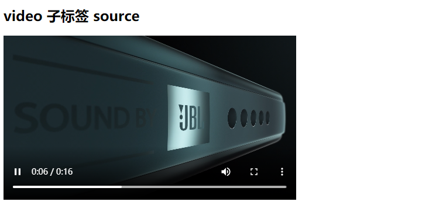

### 8、iframe 标签


* `<iframe>` 是 HTML 中用于在当前页面嵌入另一个 HTML 文档（如第三方内容、广告、视频等）的内联框架标签。它允许在一个网页中显示来自其他页面的内容，实现网页间的互联互通
* 所有主流浏览器都支持 `<iframe>` 标签
* 不当使用可能导致性能、安全或用户体验问题

### 8.1、基本语法

src 属性指定要嵌入的页面 URL，可以是相对路径或绝对路径

```html
<iframe src="URL"></iframe>
```

### 8.2、常用属性

| 属性名        | 说明                                                         | 示例                                            |
| :------------ | :----------------------------------------------------------- | :---------------------------------------------- |
| `width` | 设置 `<iframe>` 的宽度（像素值或百分比）。                   | `<iframe width="800"></iframe>` |
| `height` | 设置 `<iframe>` 的高度（像素值或百分比）。                   | `<iframe height="600"></iframe>` |
| `frameborder` | 规定是否显示 `<iframe>` 周围的边框（HTML5 中已不推荐，建议用 CSS）。 | `<iframe frameborder="0"></iframe>` |
| `scrolling` | 规定是否在 `<iframe>` 中显示滚动条（HTML5 中已不推荐，建议用 CSS）。 | `<iframe scrolling="no"></iframe>` |
| `name` | 规定 `<iframe>` 的名称。                                     | `<iframe name="myFrame"></iframe>` |
| `sandbox` | 启用对 `<iframe>` 内容的额外限制（如 `allow-same-origin` ）。 | `<iframe sandbox="allow-same-origin"></iframe>` |
| `allow` | 控制 `<iframe>` 内嵌页面的具体功能（如 `camera` 、 `microphone` ）。 | `<iframe allow="camera; microphone"></iframe>` |
| `loading` | 延迟加载（ `lazy` ）或立即加载（默认）。                       | `<iframe loading="lazy"></iframe>` |
| `title` | 为屏幕阅读器提供描述性文本。                                 | `<iframe title="视频播放器"></iframe>` |

### 8.3、实践应用

* 嵌入网页

```html
<iframe src="https://www.arryblog.com" width="800" height="600" frameborder="0"></iframe>
```

> 将名为 `https://www.arryblog.com` 的网页嵌入到当前页面中，嵌入的 `<iframe>` 宽度为 800 像素，高度为 600 像素，且不显示边框

* 嵌入图片

```html
<iframe src="https://sce7a2b9c9d95a-sb-qn.qiqiuyun.net/files/course/2024/08-27/2052535547fa551878.png" width="800" height="600" frameborder="0"></iframe>
```

> 将图片嵌入到当前页面中，嵌入的 `<iframe>` 宽度为 800 像素，高度为 600 像素，且不显示边框

* 嵌入第三方服务

嵌入优酷视频（打开视频播放页面 -> 点击分享按钮 -> 复制代码）

```html
<iframe height=498 width=510 src='https://player.youku.com/embed/XNjM2MzAzNzUyOA==' frameborder=0 'allowfullscreen'></iframe>

<!-- 其中  allowfullscreen 属性为 允许全屏模式 --->
```

> 大部分视频网站通过源代码的方式嵌入第三方网站的功能（直接复制即可）

* 嵌入地图

嵌入百度地图（打开百度地图 -> 搜索具体位置 -> 点击分享 -> 复制链接地址）

```html
<iframe src="https://j.map.baidu.com/aa/5NJ" width="600" height="450" style="border: 0" allowfullscreen="" loading="lazy" referrerpolicy="no-referrer-when-downgrade">
</iframe>
```

注：

`referrerpolicy` 属性用于控制 `<iframe>` 请求资源时发送的 `Referer` 头信息。 `Referer` 头信息通常用于告诉服务器请求是从哪个页面发起的。这个属性可以帮助你控制隐私和安全性，尤其是在处理敏感数据时

* `no-referrer-when-downgrade` 是 `referrerpolicy` 属性的一个值，表示在以下情况下不发送 `Referer` 头信息
* 如果请求是从 HTTPS 页面发送到 HTTP 页面（即从安全协议降级到不安全协议），则不发送 `Referer` 头信息。
* 在其他情况下（如 HTTPS 到 HTTPS 或 HTTP 到 HTTP），会发送 `Referer` 头信息。
* 这种策略在安全性方面提供了一种平衡。它确保在从 HTTPS 页面请求 HTTP 资源时，不会泄露来源页面的 URL，从而防止潜在的安全风险（如中间人攻击）。

> 在大多数情况下，这种策略是默认行为，因此通常不需要显式指定。

* 嵌入广告或第三方内容

```html
<iframe src="https://huodong.taobao.com/wow/a/act/tao/dailygroup/23509/24308/wupr?spm=a21bo.jianhua/a.banner.d1.5af92a895B8bah&wh_pid=daily-565955&disableNav=YES&status_bar_transparent=true&custom_content_source=a2113w.30197676" width="1000" height="550" sandbox="allow-same-origin allow-scripts" title="广告">
</iframe>
```

注：

* 严格限制 `sandbox` 权限，防止广告代码恶意操作。
* 避免 `allow-popups` 防止弹窗广告。

* JavaScript 控制 iframe

```html
<script>
    function changeURL() {
        var iframe = document.getElementById("myFrame");
        iframe.src = "https://www.arryblog.com";
    }
</script>
<input type="button" value="改变URL" onclick="changeURL()" />
<iframe id="myFrame" src="https://www.icodingedu.com/" width="800" height="600" frameborder="0"></iframe>
```

### 8.4、iframe 最佳实践

| **最佳实践**                 | **说明**                                     |
| :--------------------------- | :------------------------------------------- |
| **安全性**                   |                                              |
| 设置 `sandbox` | 限制 `<iframe>` 的权限，防止恶意代码攻击。   |
| 指定 `allow` | 控制 `<iframe>` 内嵌页面的具体功能。         |
| 避免混合内容                 | 确保 `<iframe>` 的 `src` 使用 `https://` 。   |
| **性能优化**                 |                                              |
| 使用 `loading="lazy"` | 延迟加载，减少初始页面加载时间。             |
| 明确设置 `width` 和 `height` | 避免页面布局抖动。                           |
| 减少嵌套层级                 | 防止性能下降。                               |
| **可访问性**                 |                                              |
| 添加 `title` 属性            | 为屏幕阅读器提供描述性文本。                 |
| 避免关键内容依赖 `<iframe>` | 重要内容应直接放在主页面中。                 |
| **用户体验**                 |                                              |
| 提供备用内容                 | 当 `<iframe>` 无法加载时显示备用文本或链接。 |
| 避免自动播放                 | 尤其是音频内容。                             |
| **SEO 优化**                 |                                              |
| 避免滥用 `<iframe>` | 搜索引擎通常无法索引 `<iframe>` 内的内容。   |

## 七、语义化标签


HTML 语义化是指我们在写 HTML 结构时用有英文语义的标签，使 HTML 更易于开发人员和机器的阅读和理解。

**为什么要语义化 ?**

* 为了在没有 CSS 的情况下，页面也能呈现出很好地内容结构、代码结构，易于阅读；
* 提升用户体验：如 title、alt 属性用于名词解释或图片内容说明，以及 label 标签的灵活运用等；
* 有利于 SEO 优化：与搜索引擎建立良好沟通，有助于爬虫抓取更多的有效信息，爬虫依赖于标签来确定上下文和各个关键字的权重；
* 可访问性：帮助辅助技术（如视障用户的屏幕阅读器、屏幕阅读器）更好的阅读和转译你的网页，利于无障碍阅读；
* 国际化：全球只有 13%的人口是英语母语使用者，因此遵循 W3C 标准通用的语义化标签可以让各国开发者更容易弄懂你网页的结构；
* 可维护性：语义化更具可读性，减少网页间的差异性，方便后期开发和维护；

### 1、HTML 文本格式化标签


对文本内容进行格式化处理的相关标签

### 1.1、span 标签


* `<span>`标签是文本中的`区块标签`，没有任何显示的效果，可以结合 css 来定位区块的样式
* 需要被特殊标记的元素也会使用 span 标签

```html
<h1>语义化标签</h1>

<h2>span 标签</h2>

<p>
    商品价格：
    <span>368</span>元，优惠价：<span>298</span>元
</p>
```

### 1.2、文本格式化标签

| **标签**       | **功能**                                     | **示例**                                                     | **语义化用途**                                               |
| :------------- | :------------------------------------------- | :----------------------------------------------------------- | :----------------------------------------------------------- |
| `<strong>` | 定义加重语气，表示特别重要的文字（粗体显示） | `<p>这是<strong>重要</strong>内容</p>` | 表示文本内容的重要性和紧迫性                                 |
| `<em>` | 强调文本（斜体显示）                         | `<p>这是<em>强调</em>内容</p>` | 表示文本内容的语气或情感强调                                 |
| `<mark>` | 高亮文本                                     | `<p>这是<mark>高亮</mark>内容</p>` | 标记需要用户特别注意的文本                                   |
| `<del>` | 删除线文本                                   | `<p>原价<del>100元</del></p>` | 表示已删除或不再准确的内容                                   |
| `<ins>` | 下划线文本（插入内容）                       | `<p>现价<ins>80元</ins></p>` | 表示新增或修改的内容                                         |
| `<u>` | 下划线文本（非强调用途）已被 CSS 替代        | `<p><u>拼写错误</u></p>` | 不推荐用于强调，建议用 CSS 或语义标签                        |
| `<small>` | 小号字体文本                                 | `<p><small>版权声明</small></p>` | 表示次要文本（如版权、免责声明）                             |
| `<sup>` | 定义上标字                                   | `H<sub>2</sub>O` 或 `2<sup>2</sup>` | 用于科学公式、脚注等                                         |
| `<sub>` | 定义下标字                                   | 同上                                                         | 用于化学式、数学公式等                                       |
| `<pre>` | 预格式化文本                                 | `<pre>保留空格和换行</pre>` | 用于显示代码、诗歌等需要保留格式的内容定义预格式文本。 被包围在 pre 标签 元素中的文本通常会保留空格和换行符。而文本也会呈现为等宽字体。 pre 标签的一个常见应用就是用来表示计算机的源代码。 |
| `<code>` | 计算机代码片段                               | `<p>使用<code>console.log()</code></p>` | 标记代码片段                                                 |
| `<kbd>` | 键盘输入文本                                 | `<p>按<kbd>Ctrl+S</kbd>保存</p>` | 表示用户键盘输入的内容                                       |
| `<samp>` | 程序输出样本                                 | `<p>输出结果：<samp>Hello</samp></p>` | 表示程序或系统的输出内容                                     |
| `<var>` | 变量名                                       | `<p>定义变量：<var>x</var>=10</p>` | 用于数学表达式或编程文档中的变量                             |
| `<abbr>` | 缩写词                                       | `<p><abbr title="World Wide Web">WWW</abbr></p>` | 表示缩写词，可通过 `title` 提供全称                            |
| `<q>` | 短引用                                       | `<p>他说：<q>你好</q></p>` | 表示短引用，浏览器可能自动加引号                             |
| `<blockquote>` | 长引用                                       | `<blockquote>长引用内容</blockquote>` | 表示长引用，通常缩进显示                                     |
| `<cite>` | 引用来源                                     | `<p>出自《<cite>书名</cite>》</p>` | 表示作品标题（如书籍、电影等）                               |
| `<dfn>` | 定义术语                                     | `<p><dfn>HTML</dfn>是标记语言</p>` | 表示术语的定义                                               |
| `<b>` | 视觉加粗（无语义）已被 CSS 替代              | `<p><b>粗体文本</b></p>` | 仅用于视觉样式，无语义                                       |
| `<i>` | 视觉斜体（无语义）已被 CSS 替代              | `<p><i>斜体文本</i></p>` | 仅用于视觉样式，无语义                                       |
| `<figure>` | 一段独立的内容                               | `<figure><figcaption>小米智能家居，智能门锁</figcaption></figure>` | 代表一段独立的内容，与说明 figcaption 标签配合使用。figure 标签规定独立的流内容（图像、图表、照片、代码等等）。 |
| `<figcaption>` | 一个独立的引用单元                           | 同上                                                         | 标签为 `<figure>` 元素定义标题                                |
| `<time>` | 日期和时间                                   | `<p>会议将于 <time datetime="2028-06-15T14:30">6月15日下午2:30</time> 开始。</p>` | 包含 `datetime` 属性提供机器可读格式                         |

```html
<h1>语义化标签</h1>

<h2>span 标签</h2>
<p>
    商品价格：
    <span>368</span>元，优惠价：<span>298</span>元
</p>

<h2>文本格式化标签</h2>
b标签：<b>定义粗体文本</b> <br /><br />
em标签：<em>表示被强调的文本</em> <br /><br />
i标签：<i>斜体</i> <br /><br />
u标签：<u>定义文本下划线</u> <br /><br />
strong标签：<strong>定义加重语气，表示特别重要的文字</strong><br /><br />
del标签：<del>定义删除字 </del><br /><br />
mark标签：<mark>一段需要被高亮的文本</mark>

<h3>sub 标签</h3>
<p>碳在氧气中充分燃烧：C + O<sub>2</sub> = CO<sub>2</sub></p>
<p>铁在氧气中燃烧： 3Fe + 2O<sub>2</sub> = Fe<sub>3</sub>O<sub>4</sub></p>

<h3>sup 标签</h3>
<p>2<sup>3</sup> + 3<sup>2</sup> = 17</p>

<h3>pre 预格式化文本</h3>
<pre>
  预格式化文本

  被包围在 pre标签 元素中的文本通常会保留空格和换行符。而文本也会呈现为等宽字体

  pre 标签的一个常见应用就是用来表示计算机的源代码。

  &lt;div id="app"&gt;
      &lt;button @click="count++"&gt;
        Count is: {{ count }}
      &lt;/button&gt;
  &lt;/div&gt;

</pre>

<h3>figure、figcaption 标签</h3>
<p>
    代表一段独立的内容，与figcaption配合使用。figure
    标签规定独立的流内容（图像、图表、照片、代码等等）。一个独立的引用单元，标签为figure
    元素定义标题
</p>
<p>
<figure>
    
    <figcaption>小米智能家居，智能门锁</figcaption>
</figure>

<figure>
    
    <figcaption>小米智能家居，平衡车</figcaption>
</figure>
</p>

<h3>blockquote 和 q</h3>

<blockquote cite="https://example.com/quote">
    <p>设计不仅仅是外观和感觉，设计是产品如何工作。</p>
    <footer>— Steve Jobs</footer>
</blockquote>

<p>正如 <q>时间就是金钱</q> 这句话所说...</p>

<h3>time 标签</h3>

<p>会议将于 <time datetime="2028-06-15T14:30">6月15日下午2:30</time> 开始。</p>
```

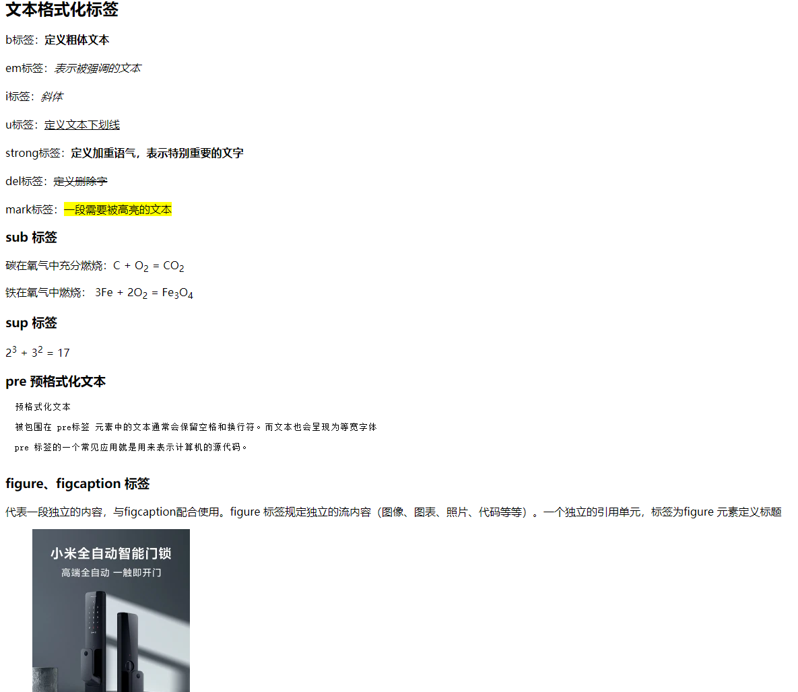

### 2、HTML5 区块标签

| 标签        | 描述                                     | 应用场景                     | 最佳实践                                                     |
| :---------- | :--------------------------------------- | :--------------------------- | :----------------------------------------------------------- |
| `<header>` | 页头                                     | 页眉或区块的头部             | 页面顶部导航栏 文章/区块的标题部分                           |
| `<nav>` | 导航条                                   | 导航链接集合                 | 主要导航菜单 面包屑导航 页脚快速链接                         |
| `<main>` | 网页核心部分                             | 文档的主要内容               | 每个页面只能有一个 `<main>` 不应包含重复内容（如侧边栏、页眉页脚） |
| `<article>` | 文档的核心文章内容，会被搜索引擎主要抓取 | 独立、可分发的完整内容块     | 博客文章 新闻报道 论坛帖子 用户评论                          |
| `<section>` | 文档的区域，语义比 div 大                | 文档中的主题部分             | 当内容需要单独标题时 通常包含 `<h1>` - `<h6>` 标题             |
| `<aside>` | 文档的非必要相关内容，比如：广告 等      | 与主要内容相关但可独立的内容 | 侧边栏 引文 广告                                             |
| `<footer>` | 页脚                                     | 页脚或区块的底部             | 页面底部版权信息 文章作者信息 联系信息                       |

```html
<!DOCTYPE html>
<html lang="zh-CN">

<head>
    <meta charset="UTF-8" />
    <meta name="viewport" content="width=device-width, initial-scale=1.0" />
    <title>HTML5 语义化标签最佳实践示例</title>
</head>

<body>
    <!-- 页头 -->
    <header>
        <h1>欢迎来到我的博客</h1>
        <p>分享知识与见解</p>
    </header>

    <!-- 导航条 -->
    <nav>
        <ul>
            <li><a href="#home">首页</a></li>
            <li><a href="#articles">文章</a></li>
            <li><a href="#about">关于</a></li>
            <li><a href="#contact">联系</a></li>
        </ul>
    </nav>

    <!-- 网页核心部分 -->
    <main>
        <!-- 核心文章内容 -->
        <article>
            <h2>HTML5 的新特性</h2>
            <p>本文将介绍 HTML5 的一些新特性及其应用场景。</p>

            <!-- 文档中的主题部分 -->
            <section>
                <h3>语义化标签</h3>
                <p>
                    HTML5 引入了语义化标签，如 &lt;header&gt;、&lt;nav&gt;、&lt;main&gt;
                    等，使网页结构更加清晰。
                </p>
            </section>

            <section>
                <h3>多媒体支持</h3>
                <p>
                    HTML5 提供了 &lt;video&gt; 和 &lt;audio&gt;
                    标签，方便嵌入多媒体内容。
                </p>
            </section>
        </article>

        <!-- 与主要内容相关但可独立的内容 -->
        <aside>
            <h3>相关链接</h3>
            <ul>
                <li>
                    <a href="#">MDN HTML 文档</a>
                </li>
                <li>
                    <a href="#">W3C HTML 教程</a>
                </li>
            </ul>
        </aside>
    </main>

    <!-- 页脚 -->
    <footer>
        <p>&copy; 2028 我的博客。保留所有权利。</p>
        <p>
            联系方式：<a href="mailto:contact@example.com">contact@example.com</a>
        </p>
    </footer>
</body>

</html>
```

## 八、表单元素


* HTML 表单用于收集不同类型的用户输入
* 如：登录、注册、发布、提交、编辑信息 等等

类似效果如下图：

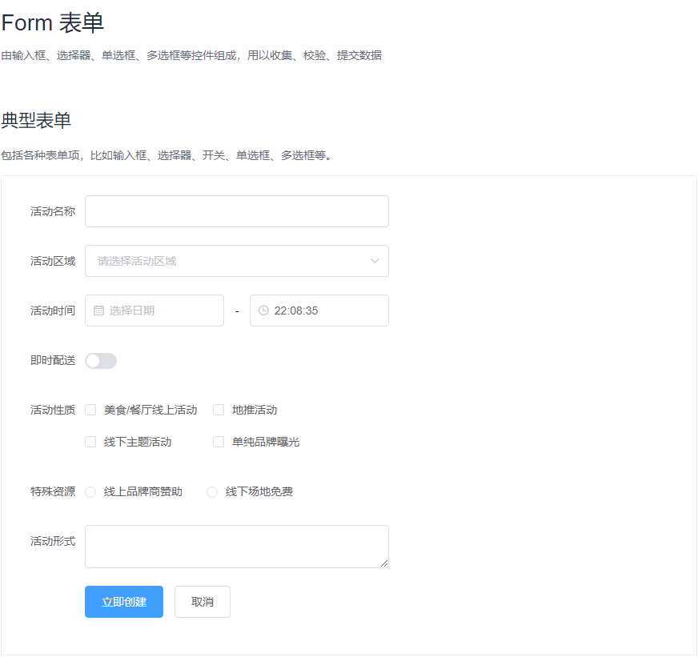

### 1、HTML 表单基本用法


* 所有的 HTML 表单都是以一个 `<form>`元素包裹
* `action`属性：提交表单时向何处发送表单数据
* `method`属性：规定用于发送表单数据的 HTTP 方法

```html
<h1>HTML的form表单</h1>

<form action="/user/login" method="get">......</form>
```

### 2、单行文本框


HTML 表单中的 单行文本框用法

| 标签      | 属性                           | 描述                                                 |
| :-------- | :----------------------------- | :--------------------------------------------------- |
| `<input>` | type="text"                    | 单行文本框，单标签                                   |
| `<input>` | value="艾编程"                 | 文本框的值                                           |
| `<input>` | placeholder="请输入用户名 ..." | 提示文本，以浅灰色显示在文本框中，并不是文本框中的值 |
| `<input>` | disabled                       | 表示用户不能与元素交互，即：禁用                     |

```html
<form action="/user" method="POST">
    <p>用户名：<input type="text" /></p>
    <p>真实姓名：<input type="text" placeholder="请输入您的真实姓名 ..." /></p>
    <p>所在城市：<input type="text" value="北京市海淀区" disabled /></p>
</form>
```

### 3、密码框


与单行文本框类似，其属性为 `type="password"` 显示内容为 隐藏

```html
请输入密码：<input type="password" />
```

![image-20211122232031676](data:image/png; base64, iVBORw0KGgoAAAANSUhEUgAAAqAAAACiCAYAAACea3/nAAAfRElEQVR4nO3dPW8a6f7G8Wv+uy/hYMEWG0urI53I1mmSApqVnVQUKygHybITV1tsE8nGoBRWiogJjpRmi1TZEFmCEnQKqsRoG6bYFOcIK8UqEkkREOxbWM2/mAEGGB7s2OM8fD+Sdcxwz8wNaynX+d0PYziO4wgAAAAIyf9ddQcAAADwdSGAAgAAIFQEUAAAAISKAAoAAIBQEUABAAAQKgIoAAAAQkUABQAAQKgIoAAAAAgVARQAAAChIoACAAAgVARQAAAAhIoACgAAgFARQAEAABCqb6+6A5+qg4ODq+4CcC6PHj266i4AADAXATTAwcEB/4jjs8XfLwDgUxfyELwtyzBk2ec51ZJhpFXpXninAAAAEKI5AdQNi8ZZftIVzc+Hcd0pp5RPnDFIditKJ/JKlZ/KjJ7hPAAAAHxyFlZAC01HjuP7aRakVFkdZ/x4p5yaOLOrSno6pMYyNUk1ZWLT76WDUmm3onQso5qkWiY2JwBTHQUAAPgcXPoQ/FSADfzpaCq/SqPwWWjOPrdTVkqiOgoAAPCZ+GS3YepW0jJiGanckbPRkBEwcXTQJt50VA1Mn14VduHUAAAAAIRlYQDNJyaGuhN5qZZRLHBo/YLYlmKZuJqOGyy7qxsq2wlfkHTnpw7a5OIXd2sAAABcrkucA/oR4jk5Tk6DXBmNxmVWOyprEHwTssudsTbBojKrjpyqKUbnAQAAPg2XPgQ/VUEN/IlpfgHVljVo480HDR5yBwAAwKduQQBNaXX1vJduq137uEVI3UraC6gJ5QcH84kZIdbSebYXBQAAQLhmB9BuW3bQdklnmgO6bIB1h8oHVU3bcq/5s566Q/vzVsH7VsIDAADg0zc7gLbbqqmg5mTYW3YOaLctW3GtnmOkPJ5zGGYHAAD4Qs0MoHYjL6VWdd4R+G6jotpHnH8x2IYJAADgU/Nt4NFuRVZeKjTPuHo8vuq176pRqSllPmX1OQAAAMYEBtBuo6Jaoanqgv01u5X02NzPQrPq/mI/V6ZWULN6QfEzn5CRX9SooNzUMXduqXkxvQAAAMAFCAygUbMqZ9YZ8ZwcL2fKrMoJSHd2I69C01mwR+cZFJpy5u02360oHWtf1N0AAABwiYKH4D9SPHdx4XNuGB41UnVhIwAAAHwKPtlnwQMAAODLRAAFAABAqAzHcRi8DnBwcHDVXQDO5dGjR1fdBQAA5iKAAgAAIFQMwQMAACBUBFAAAACEigAKAACAUBFAAQAAECoCKAAAAEJFAAUAAECoCKAAAAAIFQEUAAAAoSKAAgAAIFQEUAAAAISKAAoAAIBQEUABAAAQKgIoAAAAQkUABQAAQKgIoAAAAAgVARQAAAChIoACAAAgVN9edQe+VAcHB1fdBeBcHj16dNVdAAB84Qigl+Dg4IB/xPHZ4u8XAHDZzjgE31UlbShd6Z7zdu75ln0x9+pW0jKWu5hkWzKMtM7ddQAAAFyI4ABqWzIMI+AnpkxNqmViM95fFC6j2jBTyieWDYIpmRvRgL5ZWjJ2uroVpRN5pcpPZUYXNwcAAMDlCQ6g8Zwcxwn46aicklLlzoz3HeXicgPfjIAay9Qk1ZSJBb3vD6ZttWtxrU4Exm7blgobii/7CbsVpWMZ1TQ/OF9udbSl0tGJeoFvlZQttWafWcoq6O1WKatstqTZZ3rXnnXfhe1bKi26/sx79HRydKSTZW+84Ds4/zk9nRzN+Ay9Ex0tcc9WKXv2vgEAgLnmzwG1LRmJ/PTxWkxGZvxQoemFz9ERNZ3c8kFRtizD8v43oeFdDe+3VFmd6oYalZpUqw0PS/7fJ/oxCJ+FppzcjJ54bXSp1dF17STdwFS88VrZF6cT758qmx29iiT3tL+5Iqmnfm9NN9b9bXs6OXqsP27uqXijruzRifb2N7USeNsd7fWP9LgUUXFnPajF+HXrp1pL7mhFUqv0QqeSTv0dm+qf1Ho9OmeoVVd9JaliQKdapaymPr6kye9gYG27qMCur9/Q2osXOjoZ9SXoM73X91rzHzk5Ukk72l+bccpE2xena9ouLvruAADAWSxehJQqq1M1NTubdVVJx9Se9bZtybBWx6/RrSgdaysXGFDjyjmO7lTSirVzbnC0LRmWpG5Dldoo2Hb9bSZ7VUkrlqm51drV5zIsTbUbtJkOz+OfLaNF38ES1ne0/fpIJyv7KhZ9x1slZV/fmAqIvZMjPa733RfZrKSIkts39ceLujQMgDvafp3V4+x7bRd3FBSTVjb3tV3KqtSaEeSG9yuprqT21r3gpW0Vp4KXW1HU2orcCqkbUnWaVVaSIknt7W+q9/pUOg0O1es7RRUnrjrrOxh7Pzi1SvXHytbHDw1Da6+v3kpkLBz33ve1cmNF0ozrDdoNv/++XgQlY80JxwAAYK7FAbSWUWyy3BmgkPO9iJqqOt7v8ZycnDundBj02m3VJOXGrhBXzqkOX7XbNRU23Nfdti3FN9R+nlCt0FRVC9iWYpm4mk7VDardDZXthIz0IEgOqqyFYZswrO/sa1DBHGRLlz+sRZTc29fm5r6KkZKO+kk3bLZKyr54r2QyovpY6FpTMtnTi+yRe96MYuBp/US99RmV0t6JSvW+FPF+/+Om9vYHyaqlUva1bhR3tN6qq66b2hteZM0XfFsqHfWl3onqvaT2iqN7uVVHP194DfwOJK1tjwfSydcztEpZvdZ4pdW97pq2izfkZmMvMA/f0zA8r/j++8wKmL2TIz1+nyR8AgBwTpdfAZW8OaUbsgxDVtNxg2dqVaszT7DVyKe02nFftds1pVZNNTJSoblEXIzn5Dijl9FoXGa1I6VjwzCdKnfkLBxzj8qsOjIX33Guk6OsGzi9kLO5X9Tm4M051b/W655u3jjVUamn/Z2dYeV0c3OqaeAx7yp6fRpRJFJXvbUZGJpa9bpWtre1Uu9LK5va35c7R7Ie0f6O16h3oqP697OH+yVJ71Uv9XRzZ39OG88w8AV1uaTsa9/r9R25xVg3uPaGFWBfOB42Lbq/rxe1d3KkemRfO+tuu/5JXaeDIDv8fOsTt37sVoKLm9LJkY5OdnxD/L7pDzsLPyEAAJjhciqgHtsyZK12VDWjGgytu28suFi3LTtl6k7UbdzIp2R2TJnOeaOgb17pvPmgl2Rzv6jN3omOStJpKavHU6O/E9W/SFJ7O1K9d1M7K9IfkqYqp76K4HBeY1D5s/Vap5Gb2tuRSqXgKqgb2loqDaqqrZKy9e+9KuhgAc6akjdLc4f7pe+V3N9Rr5RV6caC4el+XY8nx8791m4EHFzXTrGo3smRskc3tbcfmXMDqfde+n4w1zMivf+jr7Xk/LLl2BSBzX0lS1llj5LavvmH3NkPRe2TPQEA+CiXWAHtavWOo9xzQ4YxviCp27alOfVPaVVxJRRLS51cW/mUqU5UMxZFzV6ENJjjOSafGGvvO/OMi6bOZ22nqM1ZVU//8VZJ/f6pHj9238oerWltMDyvEx3VR+33vp91N9/CohUpuZKdWQWd7kNfR9ms+pK0tq2dlRVpZV97OtLjUkvFHUk6HZ8fGUkqKWl9Z0/9o6yO+nMWCJ2lAiq5FcvHda1sF7Wzua/ipiS1pMj3M6qtLb3u3VRyRW4IX7mh4s5OYMt51m+sSS/qqmtPxaBVVQAA4MwusQIaVTQqRXOOnDsVpQ1ruOio3a5J8dzsUBuNK1f1FiIl3IVEUckbWh/daNYiJNsylMi7w+ydsmYuVPJdSOnY3EkEF+/0ReCq72Hlb90bch8OFa+4FdDHWdUlaW178T1a9eHCIklaTyZVn1EFlda1s+/+Nlh7tF+cHtdf2dz3KoQtBc4BdVtpc39POirpZG1fa5JWIhN3PGsFdGVT+8VNd1ukuhdee/3ZW0y1Xuu0L92QpH5PazfWAxczDf8bTMwxnVyt35+32AkAAJzJpVRAAyuPkmpjpcfgSmSqPBiy952XiSmt6eOzxHOOBjm1W1nqlPAFLaoJqvxJXliNKBKZqIDO1VLpRU/JPd8WSSubSq5kVTpZm6pMDobxk+8f6/WNopJ9d6HNqI/eCvid2Qudxq1oc99NtL2gBednqICO7QggSRoPr5NB1l1xv6Pi3olXxV3TdlGSRvNog+eAjqY5RCIRRZIzpjVotNgJAACcXWAAHVQQB5apgKpm+OZYVhU8XdPb1qi2xHB3t6KfM1K548hURelYTNbqrO2SLssFbsPk6Z0cqf5+ZXEF1F+tW9tW8UwV0J5OjtzFOpNrZdZ3tvU6+1iliL9611K9vqJkcUWD5eorm/sqtkrKHvW1t7+m06OStJPU+8dHOpmz2j6wN++9FfYT81hP51VAvXmxbpgcDLn7DL6feavjVzaVXKvrxemp6ic9rS/s9Mpwgdj0yn0AAHBRAgOov4IoabhZe9y/X6Y3HzOoYhlo+ESigsplWwnDkBRc8fTfz33LVPXcC5A+If26Xrzfdjej14IK6NgQ/KDBRAXUWx3eO/EHOW+Lo7VtFQMD17p29pI6epxVyRtC7p3U1Uu6Q+ljz/zxrT6v91d0Y2Vdm3t9HdVb2pwzB3RcT/3hOPko4A0DpL8SOgzdkdlbSg3brGm7WNR6q6Rs9oV3+/E5p61S1tvP1A3v46F7saBhd7/AdVLunVXK1vX94DMMF3WNtnl6n2T4HgDw9ZozBD+oVrqvUuWO7qx2Ja8O2F29I6ezqnRs8FSklMqd6tTThPzD8YWmo6oXYE1Tclene+cPV6d3Vfl5Iuxq0Nb3hKSh8UVIgavcZy488itoeiH/xWzDJEm90z+k5J4bClvjg7f++YaR5HSEG3NaUrbuVv78VdK1bffJSYPKZ3D49Kxsar8YUSnrhdDNfXnTP7V+Y00vXoz2yRyIJPfcuZ4rm97WTHPmgHoLhvqjk4fzUEfD6REl94raVG84j7O3klSxuOOdn1XdC6KRum8+5tq222ZgfTSs3js5Ujbb19q2O4Wg/v3oe9jc39PJUVZeVh0a5ee1qdX9k4HWb/4Q/Lp2/Jv4D4O8NAjhAAB8zQzH8e+Y6VnmEZaTvIpooeloozEawl+2Qrr4qUTnM+9pSb5Gc57MdHYHBwd69OjRBVwJCB9/vwCAyxZcAY2eY8jbv0I9PjGEv4SoOWve6MeJmlVNJ+ypRqMnNwEAAOBS/d9VdwAAAABfFwIoAAAAQhU8BxQf7eDg4Kq7AJwL8z8BAJeNAAoAAIBQMQQPAACAUBFAAQAAECoCKAAAAEJFAAUAAECoCKAAAAAIFQEUAAAAoSKAAgAAIFQEUAAAAISKAAoAAIBQEUABAAAQKgIoAAAAQkUABQAAQKgIoAAAAAgVARQAAAChIoACAAAgVARQAAAAhOrbq+7Al6rVaunvv/++6m4AZ/LNN99ofX39qrsBAPjCGY7jOFfdiS9Nq9XSP//5z6vuBnAuf/75JyEUAHCpGIK/BFQ+8Tnj7xcAcNmWCKBdVdKG0pXu8IhtGTIse/m72JaMdEXdsYPudeddxrbG7zvxriwjrZlvz7yvrweV9Nk+B/AV+Oabb666CwCAL9w55oDaauSlQjM+u4VlKJGfPh4zMtMHa4bGmhaacnKzrw0AAIDP24wAassyElLT0VQWtBvKq6A5+VPxnCMn5z/HkmGtqlM1FR0e7KqSjqmdC7jHDLZlyFrtqGpGFzf+ZPX18vA/+u7Brq5L0ptn2momdLx7/RLvd0+///hED25Hgpu8eaath+9098kDuU3e6NlWRdeGr2df97dr9wP67r73zjzW9Md6o2dbD/Vqqb7f0v1j73sCAABfjDNWQLuqWG69MmEElDglpcoBATGek1OdbBmVWXXca6Z/lp5Wde5caVsyEnkpVZ4IuVMNZRmWVjsfca+r1H+pw3u/68e5wXBSRLd/uavf7/2ql/+ecd71XR0fv9GzrS09u3+sRNMLiPe29FtA8x/uumH29oNj/fvloQ5f/qJf9Kvu/fZ2vOHDrVHQvOUPqgRLAAC+ZmcLoPZzZWpSYaIy2q2kFWvnfEPnbnWzYnph1LbkFlRzio9OUjrWVs7JyczFZcQMtb3rjg/hx2Rk3HtujPWlobxqUsxQRlKhUFDem845OQXAHfovqOmMXWEJ7ufIaFGwvQRvnmnrYXCd8G1gMLyl+8c/6cPhPU3mwHnnDcKkdF27x8fufV8tHxAjtx/ogaT+S/+1JvRf6vA/04ffPNtSMzFdJe2/PNSv+mV2xRYAAHzWzhBA28Pqp93uSvFRHGu3a0qtPvW1daubq5Yhw5Dc8OcLn5PiOTlNyWjYysXjwyH8ySF3uyHVMm4gdaVUHlQzbWsYQIdTAKaG/m01Ju+dT8hfzJ0M1+Hq6+Xhr9IvD3T7+q6Oj3fPfIXrD451e+qyL+Ve9raCIl3/5aH+890D7V5/o2cPpfv3pYdbW4HXH4bMN8+09VDDoDoIooEit/Ug4KNc332iD4dbOvRPD3jzTPd+u6b7x4RPAAC+VMsH0HZDFZXVabYVsxrqmoNQ11XbluIb4/VBfxWy0Mwp7s0rnRy4r00M5acD53h6lciaf4jfHU7/aHMXPblB2vzIW/RfHk4MT9/S/elGOrz3m67df6KffIffPNvSjELo6Gr3g+ZansF31/Tu4ZYO7z7Rg+Nd9V8eekPm0rOtphLHo/mqhx+8c4bD9of68OSB/v2/yc844Ye7ejIVgCO6/eCJdHhPW+/u6/inDzr0hVoAAPBlWj6Art5RNReVuhWlahU1uqZbeew2VKmlZA4LoL5ha8eUKmnFrIruVE3lHEfDtUm2JSNhjyqYc40qqrMiZ9dNweEOky8pcvuBjodlSXcR0phXD7X17q6eHB8HVCh/8C0Omvbm2ZaaAceCQuu9rfEB+EFwjVzf1YMn13T46//Uv31bf717q1sJNwLuPvmgw2dv9GD3uvof3k1c8bp2j72659hnnD28Ps0XQu+5n5XwCQDAl+3s2zBFTeUKGVmNrkwzqm6jolrK1NNh8huvGnYlyR9YB8fbtqSaKt51zqv9PC0jX5MkFZpTK50+D7eCVpIPvNVvMxYDDU9PTB6ZCK0BQ/D9l4cai8GR23rwwF2I9EqSXm2NrVTfGr64p63fg6qZH6H/P/3+VpLe6rf/vNHtS9sRAAAAfAoWBFDf0LdvHDp+pyzFflZl1VQlU1OhWQ2sPHYracUyUio1GTRtPc9I5WZZlcRz2eac+aELrN6pjm/59MUZD5Oj+Zru66AK6LkMQurxE10bzEP9a3yLqOnFQW98Q/S++ave269mroL3GW4BdawHEXeLpi3NC+QAAOBzN/dJSPlETO1cR+XUxBtRU0/LUiaRUa3QDFi04z7lKJaJq+lUp97vVizlCzmZcVO5Ql7W3McZneHJS7Ylw7A01dK2ZCx6alIY+i91uDV7lbokN5A9ezN8eX33F+nXLfkODRq68y9/+sj5n4Ou/e936cd/K6K/9E4/6t8RSdd39eRaZeze177z1T37H/Tuh2v6hyTpL717e03+t2/dP9bxsfcT0Mn+y8OJ/Ueva/f4vm69ejj2HQAAgC9LcAAdbDbvzFgRbluKZdxhb+WtqWBnWzFl4k05QSvfbcsNpt6F47mm4pnY1CM5u5W0Enl31Xtjw1nq6Ujdti0VNtx7ditKuxdQzFpVxznP3p9ukJ73OM/l9PXycEtb997JPH6iuz/Mb/3DtX94p7mB9fcfn+inf/QnWl3X7rGpd/e2LiSs/fXurRsu+x/07u1vure1pa2tLd377a1ePRz//fCl25dRaJX0pqlXeqcPk92cZbjafXJ+63XtPrmrH141RQQFAODLFDwEH8/JcYLeGA3JD7cr6laUjhnK+LZaiuccjU53H90Zb0aHQ/LlTtUXTOPKdcpKxwylvRXutmUoYZfVcaaH9mvttqSoe97Y7vZdNSo1pcyn3gp8N0B/CrNC3zxznwp0fF2S+vowp+1woc9wm6PjsUU5f717K303eOXu3Zl4tqXDl3OedDTqie8pRD/o7pPR8earW0rsStJtPTie2sjJ7dvEEPxf76Qff4q41334Srfu3tXv97b07v6xpqalTrq+q+PjGe9FbuvBrPcAAMBn7wzbMD1X2shL5Y6cqi8WRk1VHdMb5jaG2xqNbQZfaKrZMBSz3ZXxU4XIqKmqsyrLiMloN+WMBdiReK6pgjG+b+eYVFkdM6qoxh8F6gbf2uiAt3m9qzZ+vbGnKV3MNkzXd49nr+y+ntCthw99i3xueXtg+gOa99jLt5L0g+7+NHGJ3eOxPTiv785aSe4G1qktOd809eqHa/ppqr3/vv6+SW5ovabErtR/WdG7wf6gt7/Ts60tPZQmFjL5N7d/pYdbyzyMc/4OAAAA4PNkOE5wrRPn99///lf/+te/rrobwLn8+eefWl9fv+puAAC+YHMXIQEAAAAXjQB6Cb755pur7gIAAMAniyH4S9JqtfT3338TRvHZYfgdAHDZCKAAAAAIFUPwAAAACBUBFAAAAKEigAIAACBUBFAAAACEigAKAACAUBFAAQAAECoCKAAAAEJFAAUAAECoCKAAAAAIFQEUAAAAoSKAAgAAIFQEUAAAAISKAAoAAIBQEUABAAAQKgIoAAAAQkUABQAAQKgIoAAAAAjVt1fdASzv4ODgqrsAnMujR4+uugsAgE8IAfQzcXBwwD/i+Gzx9wsA8Js5BG9bhix79ondSlrGvAYL29iyDENGuqLuMj29EO4905Xw7ggAAIBxMwNo/E5ZdsILa7YlwzDGfmKZmpRPTB0fhbuuGpWaChvxgKt3VUknpKajZjyj5/NzrNStKG2k9fG5Ma475ZRqmeeae8uAz+t+NluV9PTxwc+CPA4AAADNW4QUNVXtlKXMc9nxnBzHGfvplFNSoTl1vGpGZVuGDCMmN6MOApo1DH22FVPF7CgXHwRda34g1IZyZSkTW9TO060oPSMkxjI1SXklAt/3Qu7w83bkfszBZ4vLrDpTn9ltl9Lq6pLfOgAAwFds/ir4qKmqk1Nc3anKX3AF1A2I8Zwjp1mQUmV1hiEtp7i8of3VjqpmdHiPp2VbiXlD8dGo4mZVzUJeiaXLjAU1J4Nip6xUQGh2f5oqTF6i21ClVtBYEbdbUdqYDMJttWtxrUaX7BoAAMBXbMltmKJTlb/gCqgbMiXJbuSVMjc0ymRuiLXslGqZ2ESYlQrximIL5oPGc00V8onFQ91RU1XnjtppQ4Zl++aibii3avmqsV6wtmxJceWcqkxfiOw2KqoVNjQ1iSC1qrFip91QfvKY//qhznMFAAD4tAUGUHcIfTCvcbr6OW8OqBu2bDXyKZkbbVlGWpVuV5W0O+xerVYDqo9V5XJVdcwFIdRuKC8pby0R6OznytRSKt/xxUevkup0Vt0FUEZM7ZwjJ7eqSmUy1dp6ntH4+ZLUbqs20bLbtqX4qiiAAgAALBYYQOO50fzHoOrn3J+qqajdUD5lamOYyKIyq03FxyqfE4uKuhX9nImrWTVnBjm7kZcKZZW1aOGSLSuRV6r81FfRbI+CdKwis+P2d6NhKG011K4kxiqVtpVQXjVlYuPTC6bD5rzFVt53N+czAQAAfG2WfxLSjJXhQSvgu21bqmUUM0YhLl1pazQvcxBu3a2altoWqVuRlZcKG6bMXGFBFTSunOOoarZlDau1GWXizWHF1Q2mthp5Kb5hKld1V+T/7K36T+Q16m+nrJT/8mOV3/HFVuGthPe2sfLfc/jfaGKKwdjuBBd4HgAAwDmc8VGcAQt7JgKlJEXNwTB7UwWlVO44qpoft0Tcfp5RLVXWnbik+J35VdDhKnhLq16ls1lQwJSBhPKDa8qt/FbNqOxGXoXC1JKkic+2xCKmS9StWMp7v7thvKuKNTwiq9L1piG4RwZbT13ceQAAAOdzxgA6a/ui2DCwLHf+su09g+pnbjCUHXWroDO2b7Ib0tOxSudgWsGMKQMT58dzjnIbZ+ifJHXbshXeVkxRMzcMvO734n4n3hHlzKgb1L3/Y5Aq31H8Qs8DAAA4n0upgI7z5lFaDQUNwS/WVeXnjGqFpnL+aZbxnJoFr2I3IW7OmUdqfcSTkGZOQ0ir0j7fJc/PnWbgOM7oexnuXzrYjWA0f3e47dVFngcAAHAOSwVQ2xoErOUqoKNV9AnlvSF4J7eh81RAbSumTK2gZkDqiefchU3BcxIH2z4tdZOxjfJnCtiQfzinNLDyyTZMAAAAkxYG0HzCkLX61AtYy1VAR8Pdk/MipyugUbPqq7KN61bSSuRTKndy03txundSrllQPnERj+kM4gXmWGZq66VJ3UZFNbEZPQAAwCKzA6j3FKDm2DDsuFGlM6ZMLSVz4+LSl20ZimXiak5sDj8lnpPTjCsTC652jh4F6v4k8praCN9I5KdPlDRzFbyvj/59UQfzJUfYhgkAAGDStzPfiZqqOr7X8ZwcZ7xJPOfIyZ3xjrblBb6CmlW3yhkbjMcXmqrKDXYJu6yOs2Rwi+fkdFaVjhlKlweP+XTDn7l0nwKuOfi8k9/FsMk5Pj8AAMBXznCcyViJT9HBwYEePXp01d0AzoW/XwCA3xlXwQMAAAAfhwAKAACAUDEE/xk5ODi46i4A58LwOwDAjwAKAACAUDEEDwAAgFARQAEAABAqAigAAABCRQAFAABAqAigAAAACBUBFAAAAKEigAIAACBUBFAAAACEigAKAACAUBFAAQAAEKr/B1nxWe4/VUlKAAAAAElFTkSuQmCC)

### 4、单选按钮


HTML 表单中常用的 单选按钮

| 标签      | 属性              | 描述                                       |
| :-------- | :---------------- | :----------------------------------------- |
| `<input>` | type="radio"      | 单选按钮                                   |
| `<input>` | name="自定义名称" | 设置 `互斥` ，需将多个 name 属性为相同的值 |
| `<input>` | value=""          | 向服务器提交的值                           |
| `<input>` | checked           | 表示默认被选中                             |

```html
性别： <input type="radio" name="sex" /> 男 <input type="radio" name="sex" /> 女
<input type="radio" name="sex" checked /> 保密
```

![image-20211122224915293](data:image/png; base64, iVBORw0KGgoAAAANSUhEUgAAAjUAAAAzCAYAAABv0/msAAAJQUlEQVR4nO3dYWgb9x3G8a/GXsTGrM1CiuS8iGtv7RII3daNSTBaNV1fDDbu9qJGetHU9EWbsb3sOmkjbQobdzBWwvbGb8ocMtDRslRifdE3npWxoWMkxW/c0I2we+PohgdJMY3z7vbiJEeyTtLJsWLn9nxACN+dz7+TDunx/35/KRUEQYCIiIjIQ+4L+12AiIiIyF5QqBEREZFEUKgRERGRRFCoERERkURQqBEREZFEUKgRERGRRFCoERERkURQqBEREZFEUKgRERGRRFCoERERkURQqBEREZFEUKgRERGRRFCoERERkURQqBEREZFEUKgRERGRRFCoERERkURQqBEREZFE+OKglb5jkvFKBKVsxFoXO2Uz06xSSN9/Ib5jknEKNKsF9mB3I9vc3GR5eRnP85icnOTOnTvMzs5y+vRppqam9qGieMZbt4udykEjIPIUuE/+JvxqGf7uweEJuLUFz8zCL0/DY7sp3XcwMx6loMRelOs7JplilsYe7U9ERMZrxJEaH8dMYTr+0C1dO0UqFX2L8/sP0traGhcuXGBubo75+XleffVV5ufnOX78OO+88w7Xr18faX+Djj3yZrsHou7eA6lTxiI/hnf06hp84wI8Owd/mIe/vBbef/c4nPotfLiL0v26Q83Kk22dpwMfc9Nh2FmYLpSwKGMfsPNVRESiDQ815dy9NwC/jlOzKMUcmjEqTYIg6Lg1qRj31rv2/gectbU1rl27xrlz5zh16hTT09MATE9P89RTT/Hmm29y9epVPvnkk5H223vsDSwMKs2ga3mz8wE5AHV3cutlsPJ7PkpRXYNL16B5Dl74Cnx2Fy5eDe9feAL+8xa8+w/480il+9SdGlZHArMawY7noHVrWF2/2T+E5igDtWJmT8OoiIiMR3So8R3MlMmSB1gNGtkiGdsN/xOmTG77Bb9GMdP9Qv8wvc5vbm5y+fJlzpw5M3C7l156iffff5/PP//8AVU22IOp2yXMNHsbafxN+PFl+NMZqN+Axy3IL8LCe+H941a4/IOX4ZX34L9xS3eXKFJhYZfl9obQgIbVG0LvN4yKiMj4RIcaz6NGlpmZ8MfsQoVKHpaKdLzIR488dPZe9P6Hm6FYG6W81mWEGJcKdmN5eRnTNGNtaxgGKysrsffde+zRITAz2gMyprqjLteEoxTlXJxLaDZxs+yvl+F3Jtzegh9dhNt3u9ffvttavgW/N8Pth/Nx7HLMCnplSwHVmSVSKRPHd7FTJo7vM7NQwst0jCa6dmsbSBeqfXrNRERkv0SGGt9zwcqTby9IF8h7NmWjQH6ELt5hl5/2m+d5HDlyJNa2R48e5caNG7H3Pc7LT3tfd5pCtfd5ihq9CEcwdq6L30j7Nw++egRWb/YGmrbbd8P1TxyFv/47xk7dpciw3DeQ5XYGoFYoskodTe9p0ukspSCg5LUCqj1DM6hS8BzUZiMicvBEhJqwN8FoD9N0LLNK8WcmZUsB1UJ6R99M+OZZjT1dqvVmO6YZUZOTk9u9KMMcO3aMiYmJMVQxurHX7S5RrBkUIhOsS73cb91whyfg69Pg3Rq8nXcLvnkMHjk0tFjsnItl9YbDez01OwLljp4a3zlLsWbR6Bx5qdvbIShHI/y9RTibsrE9ByfzcF1qFRH5fxAxpTsMEgXAd7qXJc2dO3e4efNmrICwvr7O1tZW7H3XihlSxYgVmRQ9i61S7P3CeOu+N2rRiJ6q79Ypk6Wxy5R5ayschZk5PHi7mcPw8XrYPDy4XA8qiyxwlvJ2yBhyvmZLBNV7P6YLVYJCOIU71R7yaV1q7XwM/LpDzSiwWChRyjuYGRtX071FRA6M+FO6fQdzaI9Iq7eiY9tcOaK/5ID8izs3N8fGxkasbTc2NpidnY29736Xbvai4XScdYcz3AwqkR23YeAxKgu7fiN/dhb+tRGO1vQbhXnkULj+nxvwzONDdpgudM/G6zlP+/cztRvb27OfMl4pfF6aFYw+/U/bo5XpAlUFGhGRAyV+qEkXqA7tEWm9yG9vG/ZmdE6t3THyv6+ee+45arV4jbrVapXnn38+1rbtS2+d+k1f303D6bjqhtZoBDWKmYjmX3eJ4ghT+qP84jT8tAqPTkD15d5g88ihcPmjE/CTD+Dc90b8AzvP04YFloWFgWFENLbPOHj51s/t56HnXI9uhBcRkYNlzF+T4OHVDLrac2BHv87+mZqa4sUXX+TSpUsDt7t48SLFYpHJycmh++z3mSeRI1a7nAo/jrrb0oVq6w08T72zNt/BzJWxGvc3OvHYFLw7H85wys+BV4aV1gfvrbwW/pyfA/Mi/LEIX45feg/fMUnV8wSlsOW9sLgIZ83uJt90gUK/A/IdzBFmdomIyP4aa6hx7RzlrhklPl7HO0TUiEa38U7pBjhx4gRPP/00b7/9Nqurq6yvrwNhL8rq6irnz58nm83y5JNPxtpfttTvw94sGpH//YcjXqPmvL2uO+JIKLVqzNdTpDJFqDT3ZKTiByfglW/D0fPw0afwpUOw8K3w/qNP4chb8Np34Ptf2+1fcLHbl5O6Ck5TqC7C2YhLoK4d8zyL/6naIiLyYA387qf74dopcmWLRtD5puLh1SBb6hNksjP78r1PJ0+e5PXXX2dlZYUrV64wMTHB1tYWc3NzvPHGGyONdPRwbVK5MlYjiB7h8D1cYDdjV2Otm/Z3H9XAqNAM8tTNsPnZqDRHmMEW7Ycn4frPws+h+c2V8LLTZ3dbPTc/3/0IjeeYZNqfpxRZYqsR3rVJpWwqe/TdZSIicgAEAzQrRoDVCIKgEVgQEOdmVIIPrfC+Ge4kMHasb7b237C6f9dqDKrmIbN93FYw6LCaFWPoNg9U5/PV8Vx1aj9vRiVq7f5oVoy+9YbnrxEMLLdhxTu/OXjHLiIioVQQBH3nvg7+lm7p5eOYrU9NNiqR3zgejmB1L7PG9C3Y8Q2vO4prp8i58bdPhvCxcgr3P1olIiJ7a2CoEREREXlYjHn2k4iIiMiDoVAjIiIiiaBQIyIiIomgUCMiIiKJoFAjIiIiiaBQIyIiIomgUCMiIiKJoFAjIiIiiaBQIyIiIomgUCMiIiKJoFAjIiIiiaBQIyIiIomgUCMiIiKJoFAjIiIiiaBQIyIiIomgUCMiIiKJoFAjIiIiifA/z0sExB5OKaYAAAAASUVORK5CYII=)

注：

以上代码，点击 文字时，不能选中按钮，需要使用 `label` 标签

### 5、label 标签


label 标签用来将文字和单选按钮进行绑定

当用户单击文字时，等于点击了单选按钮 ， `在HTML5中直接使用 label 标签包裹 单选按钮和文字 即可`

```html
性别：
<label> <input type="radio" name="sex" /> 男 </label>
<label> <input type="radio" name="sex" /> 女 </label>
<label> <input type="radio" name="sex" checked /> 保密 </label>
```

**在 HTML4 中**

* label 标签是通过 for 属性和单选按钮的 id 属性进行绑定的

```html
所在城市：
<input type="radio" name="city" id="beijing" />
<label for="beijing">北京市</label>

<input type="radio" name="city" id="shanghai" />
<label for="shanghai">上海市</label>

<input type="radio" name="city" id="shenzhen" />
<label for="shenzhen">深圳市</label>
```

![image-20211122230322804](data:image/png; base64, iVBORw0KGgoAAAANSUhEUgAAAnAAAABaCAYAAAA4u2vaAAATeklEQVR4nO3dUYjbeH4H8K/KPewMoXvbkMNOHuKdaS9NYNm2aakM5c7Z9B4KLVIfMsgPyQ33kE1pH9NUatm9BFokKA1D+zIsHJ3ZFCQuNCdf7+Fe0nFKi8SxW+ZhZ8O1hOplIpUp7B6zyezbvw+SPbIt27LHGo+y3w+YYSRZ/uvvv62ff///X5KEEAJEREREVBq/NO8CEBEREdFkGMARERERlQwDOCIiIqKSYQBHREREVDIM4IiIiIhKhgEcERERUckwgCMiIiIqGQZwRERERCXDAI6IiIioZBjAEREREZUMAzgiIiKikmEAR0RERFQyDOCIiIiISoYBHBEREVHJMIAjIiIiKhkGcEREREQlwwCOiIiIqGQYwBERERGVzNdGrYwcFdVAh9DljLU+LMlCLXShVY5ekMhRUXU0hK6GGexuYvv7+3j8+DGCIMDi4iJevnyJpaUlvPPOOzh16tQcSpRPseX2YUl1wBPIbAJHFO0Df/0Y+I8AeGMB+OwA+NYS8FfvAN+YpuiRA7UaQBc6ZlHcyFFRbcrwZrQ/IiKiWZkwAxfBUSWoTjR2S9+SIEnZjzzPP047OztYW1vD8vIyVlZWcPPmTaysrOD8+fO4f/8+nj59OtH+Rh175sPyT0S5Bw+kDQMmGgVEL+4O8JtrwLeXgX9cAf713fjv750H3vo74CdTFD1qO2iZDchJOx1Z56qDca2woukwYcA6Ye2ViIhofABn1A9PdlEbTsuEnjPlptghhBCpRwhbOVzvW/MP5nZ2dvDxxx/jvffew1tvvYWzZ88CAM6ePYu3334b77//Pj766CN8+umnE+138Ng9mFBgh6JneZiukBNQ7jS/bQBmY+bZJ3cHePAxEL4HfOdXgV98CWx+FP/9zjeB//0+8IOfAf8yUdEjtJ0WzFS0aXqi7z1IHp7Z88zhAXcdBoBWszrTwJuIiOiosgO4yIEqqdgIAJgePLmJquXHGQ4YqHdPbi00q70ntTKd0/b39/Ho0SPcuHFj5HbXr1/Hw4cP8eLFi2Mq2WjHU24fcfw22/At2gf+5BHwzzeA9jPgTRNorAOrP4z/vmnGy3/0XeB7PwT+L2/R/Q00YWN1yuIOBtwCnjkYcB818CYiIpqF7AAuCNCCjFot/ldetWE3gI0mUie07IxSeqzUYOaiimZrkuIlXWE5urum8fjxY6iqmmtbRVGwtbWVe9+Dx54d8FYnq5CCyp3V5Rhnn4x6nm5gC3nj9r95DPy9Cnx+APzxJvD5l73rP/8yWX4A/IMabz9eBMcycpZgkKwLuLUNSJIKJ/JhSSqcKEJtVUdQTWWJfSvZBqho7pCxoURERMXLDOCiwAfMBhqdBRUNjcCCoWhoTDDDYFwX6rwFQYDTp0/n2vbMmTN49uxZ7n0X2YU6+3JXoLmD71NWVirOTPWvyz/I/98D4NdOA9vPB4O3js+/jNd/8wzwb/+TY6f+RuYPg6HBZ70/2EsCQFNPTcipoFKRoQsBPUiCcauGULjQAgccFkdERPOUEcDFY4mUTvottczU888QlXUBV6v0jXOLAwU397TVJLAoaGbq4uJid+zYOOfOncPCwkIBpZhc4eX2N9BsKdAyo3UfbWPYuvHeWAB+4ywQfDZ6u+Az4LfOAa+/NrawsOo+THMwED4cA9cXPPeNgYucW2i2THjpjFrb6gZ8dXjx89aBW5IFK3DgVMs1XICIiF4tGZcRiYMmDUDk9C571bx8+RLPnz/PFQzt7u7i4OAg975bzSqkZsaKqoSBxaaee79AseU+zEZ52ZeH8dswIMObMqL+7CDOrtXeGL1d7Q3gP3fjiQ2jixsA9jpWcQtGN6Aa015lHcI9/LeiuRBafNkQqZPKS4YLpOsgajtoKRrWNR16w4FateDzEiNERDQH+S8jEjlQx47pSsZCpbatGxnjwU5I6mJ5eRl7e3u5tt3b28PS0lLufQ/rfpzFYPgiyx3PNFZgZ84GiIM7xV6dOmj59hLw33txFm5Ydu311+L1/7UHfOvNMTusaL2zogfa6fDxh51JN51ZqNVAj9+X0IYyZLxiNwtd0eAyeCMiojnJH8BVNLhjx3QlJ7TutvFYqvTlHPp6r+bqypUraLXyTSJwXRdXr17NtW2n+zht2CVTphkMX1S5gSTLhBaa1YyJCf4GmhNcRibLX74D/JkLfH0BcL87GMS9/lq8/OsLwJ/+CHjv9yd8gf526pmAacKEAkXJmHRTcxA0kv8778NAW8+epENERDQvBd9KK0DQUtAznA7oG183P6dOncK1a9fw4MGDkdttbm6i2WxicXFx7D6HXVMsMxM55eVXiih3R0Vzk2ClgXa6bJEDtW7A9I6WdfrGKeAHK/FM08YyEBjAVnIR36134/8by4C6CfxTE/iV/EUfEDkqpHYDQo+n42jr68AttXcCQkWDNuyAIgfqBDNsiYiIjkuhAZxv1WH0zOyLEKTOhlmZql7FXkYEAC5evIjLly/j3r172N7exu7uLoB47Nj29jbu3r0LWZZx4cKFXPuT9WEXjjXhZWZ14kzmpDHtrMudcSTQkzI22hKkahOww5lkoP7wIvC93wHO3AV++nPgl18DVn87/vvTnwOnvw+8+7vAH/z6tK/gw+p0ifYUuALNXQduZXTj+1bOdpb/biRERERFGXkv1KPwLQl1w4Qn0ifQAEELkPUhQZtcm8t9UC9duoTbt29ja2sLT548wcLCAg4ODrC8vIw7d+5MlMEa4FuQ6gZMT2RnrqIAPoBpcpKFlhude4G2AMVGKBpoq/HEDMUOJ5hJnO2PLgFP/zy+ztvfPom7Tn/xZTJG7i+mz7wFjopq53qFmUVMJun4FiTJgj2je/kSEREdKzFCaCsCpieE8IQJCOR5KLb4iRn/DeOdCKVvfZjs3zN7n2t6o0pTMt3jNsWowwptZew2xyr9fqXeq7TO+6bYWWvnI7SVoeWN268iRhbXM/O1b5y8Yycioq8eSQgx9HoLkaNmdEPRcBEcNbnbhGIjzLh+XZyZ7F1mevMeHD++3Fl8S0Ldz7/9qyGuK0c7ehaSiIhoWiMDOCIiIiI6eQqehUpEREREs8YAjoiIiKhkGMARERERlQwDOCIiIqKSYQBHREREVDIM4IiIiIhKhgEcERERUckwgCMiIiIqGQZwRERERCXDAI6IiIioZBjAEREREZUMAzgiIiKikmEAR0RERFQyDOCIiIiISoYBHBEREVHJMIAjIiIiKhkGcEREREQlwwCOiIiIqGQYwBERERGVDAM4IiIiopL5agVwkQNVsuDPuxxfQb4lQXWieRejfNhmp8Y2R0SvstwBnG9JkCQJVtaZJHKgSiPWd7eZ5ETkwxq1v7hQkFQHvqNCyrPvSgOaYqA+cqfzsb+/D9d1sba2hg8++ABra2v48Y9/jC+++OJI+40cFZLq4PA05sOSVEx6XvMtCdIR6k1umGg1b038uuMUVW+Ti+Co/e01XnaUeiuyzc6s7nwr3+dv9E762uWodprjuwHFtTkiopNgeADnW5CSoEySJFi1EEII6PJhMNd93ALWheiuz9zdRhMts4Ehq4+kprkQHlAfexKpoKEpgB/gJH2n7+zsYG1tDcvLy1hZWcHNmzexsrKC8+fP4/79+3j69Om8iwh51YZi1KfPaMgNmGghCGZXpuOotyjvjwMADc2EUU9lffwNNFsAjHrv56XvMbpOi2mzs6y7qLYKzzRQ7xxL33fH0McEQWnkqJMHwgW0OSKiE0MM45kCii3CzFUQip21JvVcYLqH6XV2IkxAdP+doIyhrUz9+iOPqwCffPKJ2NzcHLnNhx9+KHZ2dqbaf2grfXXkCROKyD7MuM6nqztF2OFRnm+KUW91v6LrrSNuSxOUzTOT7XO034HXOZ42W1jdeWbcDuzh3x0doa2kPutCDLbL3v97t0/X7fG1OSKik6SYMXCyDpFk5IQQ8EwAio0wtWzoY0gKL86E9P2CrxtAq4lqepnqAJo7dP+eCSh2OHS9q1UKqZIs+/v7ePToEW7cuDFyu+vXr+Phw4d48eJFIeU47B6Voed5jzIfLrTKiOeHNhSY8IY+X8+dnT0p9ZZJ1iHEKgK1DsP0hmak+1WOqc0WWneyHrcDTYdwNVTQ2/We7s6vaO7Qz/pkjqfNERGdNKMDuP7gaKpxLj7aBmDq8Rd6d+mIAcZxF20dBgCjHr9uGxgMArO+oN3e1zmaZAxTzxiy2Xn8+DFUVc21raIo2NraGrNVPDYoHeRWm60Rm8ddXXV4EKu1vnFyObrApm4TRzP7epsB3zrs4vM30ISNsNEeW3/HPRyzqDY3cBzpttUJ1BrrEHqAak+3caet1WGghWZ1Pm2KiKhsRgdw6YDJM6d6gcixYCg2Vif4qSvrAkJ4MAGYXvxLuTH5C3cnVqQfcdKueiJOpkEQ4PTp07m2PXPmDJ49ezZmq8FsRGgrGdslJ8p24zDrWan0Bb4K7HBM1i20kbX3gTGSkgSp2kQL8gXUTBsizr7dxhpQ71WZ8AKZRj4MPWU/9kEh+YHgmYHqp+vNgQkGtlnqZY2izM6+7qIZVLx7713kfI0eFVEd83LqMzoSENipJli6E5lSTIK7TZuP6iNvc5JmxotscEdFJM3UX6rATSs8XY+TgVrM1kH2bWjoj2H0dH0EEZM8CHOw+ye6OioPFQRVo7qyzeocWFxdx9uzZXNueO3cOCwsLM3rl5EQ5ky6sIa/QX8dDurOyA8zRjr/ehnfDdapQlnXoIoStGLCS7FIU+IBSQw0A5FXYfp5JIEdts6PNvO4qFVRkPS5Pq4kNv9MdPCoIiz9Xsx6uUGSbIyI6aaYO4A6/LEPYSur/brATwbnVRAsmGhkzVzOzCuN+FXcyGJ1sYKV2eJLwN9Bsxa9VFi9fvsTz589zbbu7u4uDg4OCS5TW6c4a8ag2MaKDtjAnt956A5MgaAFyLfk8VKCt24DTnmvmp7i6izNpupwMO+hpK+nu0fl2vxMRvSryj4GrGxPtOHJuIT38Ku4WHZNVmDjTVUNNaSEIfFh1A4q9WqpBycvLy9jb28u17d7eHpaWlgouUVp/F2q6S3t0F2rRTna94XD8VzyIszfg7X6mUkHNMXbnFVZ33es8Jlnrvs86gIyJTCOydFEAHzJqxzeniIioVIYGcFHg947Z6X4LRwh8QB71zdrpOjWnGzeX1pnEsBG0oPQMGAKACmoyYNTrMBQb68c4g3QWrly5glYrXw7LdV1cvXq1mIIkY68Ou59l6MLF2OqsaHDnMJPvxNRbBt+SoAarAwGvZ2YFxMmygrrosxRWd0GQmY2NHBXtRnyspuzg1pgu5GBDhSSpcNoBWp3uZyIiGpC/C1XWk1/MAYJW3+DrPv5GE7InoE888wDozvyULNS6J7xV1FJBYxQcdrzUagoAE56roVKy2w6dOnUK165dw4MHD0Zut7m5iWazicXFxQn2Hs/uGzkLtcfgezp8pnDWeMPjU2y9HUU84/rwx81hncqrGpzq/NtmUXXntw2g70LdkaOiGujdcYK11XVoTjWj3fiwkoykX1uHEC4a8FPdz0RE1G9oABcELZhZA8r8NowxXRuyPvyODON1umBSGaBkfBvah5fGMHUNFd/qDVCCo/xqzwpKi72MCABcvHgRly9fxr1797C9vY3d3V0A8fij7e1t3L17F7Is48KFC/l22J3JGAfAuQZsBwFaPe9pfNx13x4ShFeguR5Qn+xq+kNNcaKeeb3Ngt+GkYz5HOgCrGhYt/3uBIfZdBGO/iE1zOzrLrlUUOr7wrckVB0NYc8XQTwO0E/frSL50dX5seZqlSSDD9iTTF2fFINDIiq5r2Uv9tE2FNTC/uURHMuAYofH2G0Wj28zPQFd1qHryVJLgmQApheiZlVhOatYhw/IjZxfzJ1f/QnFRjinb/RLly7h9u3b2NrawpMnT7CwsICDgwMsLy/jzp07+TNIkQO16kALBdzkWPIEnvFsSS0JfJN6Mb0xs1Rl6CJETa1CUm2EE3QDRo7aE3ibnpvzmb1mVm8zEmehvPizEQRowUBL6h872oLUTP0nddp2rleYWZudad35bRhQYNfSZTThiYw2UdHgegGkehWSE7cbV2i9x1htAnY4vgt/ArNqc0REJ4bIMvIWVf23nwmFrQy5nU9yWyF7ktsE9d97yDMHlnkmMm4PFT9/3K2Lxt4G7BUzeCut7Ns2pW9LlF2Hw2/B5ZkZ79tgQYRygm9ddJRbWcXHHtdd7rYV2kIZekuzXie9zaY/j1ntLbPthLZQFFN4fYeVqy3lvU3ZCW9zRERHkZmB89sGTF30/Xr2sdFswfTcibNvNc1Fz4/sScg6hNy/SED0LokvYTDlS7zKKhl1n7UsFtdjmm8lsymBeFJLRlZk8P0on+F1kpNvxVmoxrC0UV/2DPEs7JLNu8kQd58qdpL5zluPFQ1uRhIsX1sabKdERF81khD8JiQiIiIqk2JuZk9EREREhWEAR0RERFQyDOCIiIiISoYBHBEREVHJMIAjIiIiKhkGcEREREQlwwCOiIiIqGQYwBERERGVDAM4IiIiopJhAEdERERUMgzgiIiIiEqGARwRERFRyTCAIyIiIioZBnBEREREJcMAjoiIiKhkGMARERERlQwDOCIiIqKSYQBHREREVDL/D5B/C/BzYnCyAAAAAElFTkSuQmCC)

### 6、表单分组


将需要分组的表单信息进行分组

* 相关表单控件分组
* `<legend>` 提供分组标题

```html
<fieldset>
    <legend>个人信息</legend>
    <label for="fname">名：</label>
    <input type="text" id="fname" name="fname" /><br />
    <label for="lname">姓：</label>
    <input type="text" id="lname" name="lname" />
</fieldset>
```

![image-20250516190525006](data:image/png; base64, iVBORw0KGgoAAAANSUhEUgAAA2QAAACWCAIAAAA+ONwQAAAgAElEQVR4nO3df1BTZ74/8A9JwKC2xr1iYAlsUfmOSLGV1n4Ba1W4bNt46bj8kBawM17aThesGwVqF7Hb3SKtQpR1xe1cpb27BSzyo97yFW2p8Vf5McWFrghxBttQSEqA3jW7pSVASL5/HAwhydGQH4D4fk1nh/PknOecdO345nmez3PcDAYDAQAAAABYw5vpB7h/6Q00qtPrxgy6MYNej8wOAAAwM9yIOBw3HteNx3Vz53E4bjP9QLOMG0YWp9+oTj88ahjR6Wf6QQAAAMCcB48zz93NnceZ6QeZLRAWp9WY3jA0rEdMBAAAmOU8eBzPeRwuhhkRFqfT8Kj+R+3YTD8FAAAA2GoBnzvP/X4fYkRYnCZDI/qhYSRFAACAe4znPK6nx32dF1HgMh3YkiKX4+bBc+NxOVyuGzPOrTfQ2JhBN6Yf0RnG9MjxAAAAM4z5G/x+zosYWXQ5q7PPXI6bpwfH444j2yOj+qERPSIjAADAjLuf56MRFl1rTG/45486s8Z57pwFfK6NPfyoHRseRUEMAADADFu0gHd/1rtgGtq1hobNc56nB8dznq1JkYgW8LkcNxoaQV4EAIC5Y2Cg3/TQy2vpTD2J7YaG9Qs9p/A3+JyBsOhCozrzXXLmuU8tKTI853H1BsL4IgAAzA1vv5Utb28zbdn3Vl5QcIhLb8rEU0dS6YhOP6pzzv6LA//SlcgGav92q/3bn4go+BfzxY8tTon08npwNgaz2fhMc8bw6KQpfi7Hzerss1KpJKLKykqRSCQSicLCwizPWcDn6sZQ8gIAAHOBWVIkoo72NleHxcsXPh8Y6H81XeJIJ8OjBnfHotOoznD4f3rzq1VE9PxTSzY8/CAR9WlGc8uVueXK7K2+O2N83HnOn+zu6+uTSqVElJGRIRQKp3TtlL+xVCoVCoUpKSlTvdAOV69enT9//qpVq1x6l5KSkmvXrl27dk0oFK5evXr16tXR0dElJSUlJSXnzp2zu1u9gcyGFa0WUlVWVmZmZhKRSCRiUqNIJIqPj5dIzP80e3pwBm3aplH5YexLVHhum79py6bDnczPy3edYT66uDfk5bPm18YcaTv05OQm1QfPxBz6mu1TokldBey+ULVdxPZkqg+e2UknrJ6gqkzLKu8xHvomHsuP9yMi+rIgKf/SxHnrsssk4bevKc+SlKiY5qya9CfoLu3jek5npNWH3+7fyRqLEvLIyk1nT4cAADPMbAKacfni+ac2/bvV850yQz0w0F9VcZKI4rYmOTi4qDfYv3BxeNQQtbe95esf33xBtOM/fBbyJ4LB/m3+R2p695X0nG76x+e5wfPcnZwXmajD/BAdHT2la6cWFqVSaV1d3VTvYbf58+d3dHQQkYvyIpOymZiYkpLS19fHtNTV1a1evdrBzkcnJ0Uux82y9vn5559vamqSSCTGaKhUKisrKwsLC5VKZUFBgenJHu4c7l2Loy/uDn2thmj5LpM21QcvnY650LJdREzy2/wMnTm3zX/j/rbO/RNnKT+M3XQ6Zre1pLjqSNu5J4m+yA7cGRtcU53qO/mWe0NevrH7Qst2EXUXx23etDegc/9GK0/GBMqA3ewPbxoETfmn5EsTfc0aVeVZkpKHsmryn2ACZZpv4bEtvuztRl+Wn+resEvq51Bq/LIgKZ92VWSuncI1iH0AAKwGBvpzf/dbq+1PbYxycDiQiC5f+JyIvLyWXr7wedzWJEe6GtXp7S6Lzny/q+XrH//4SsDLTy8lov5/jv5P0y0el577vz/7twd4OYmif3vAPaO4a89/f1v48kOOPKSl1atXC4VCoVBoR4qbQlg0JsWMjIyp3sY+TEZ0XV5kkuLBgwdNoyEzpsikb0foxialOg+LIeXKysqmpqaPPvqImXc2DitKJJKwsLDnn38+LCwsPj7erJOhEdawqPrgmZjON1rOBMdtrjBt991+rmri5xO7ajadPq/cZja8d/HQ4c6YI+ZjfhePHfr62T+dYxLkk6++EbC5QtadajJmSaoP3j0b+EYNc6F/6q6Yd3d+dnH/xslpsbs4bnP7rrYLK2M3nWZ7+ilqrihRrcvOZ4LXE4lb/dPqG3u2xPuxtU9c2HCJ1mVPJeQBAIBLxCW8wIwmXr7weVXFyac2RlnGOCZEDgz0Ozi+WFVxMig4xMtrKTOE6UhvujHDPHd7LvxGPVz8Wf/LTy9lkmLnd9pf7uvo04wSUe5HynN/WBX4c/6vxcLr3/504rM+yXM+Dwnn2f2QloRC4V/+8hf7rrU1LE5/UmS4Li8yidAyKRLR6tWrnR4WeVzz30IyMzPj4+ONKxQLCwuJiBlNDAsLk0gkhYWFZmGRx+UQsZa5+G4/10JE3V9P/WGVHx6pCdh9wXyKufvrG7R8y7Lbh/5Pbwl81yxoKjq/ppXLjSN3T/4yhl775Iu8jZO68k+taiMipWJy982FMYd7xkcNv1P2kDWq7m+ILEf+elQ95BtufAy/teF+pxobVPERLO3GgcnGL+tpXVb4xFR1d1pS+cRsdXNhzOF65pknhjONjczkuPHwcMIl66Oe1HM6I+1U98QlE5Pp+TH15Le18NgWVUFSPu3KosNMu39KvjTxO+Pd2QZZAQDmin1v5RGR6WhiR8f1OCIikpusX7Qv1cnb2wYG+gf6+5gpb2aJ5IaNUUxYfK+o0MtrKdOz11Khl9fSKS2XNPv73XYffN7/gCd3/4u/YA4lxxU8rlvX+6FdfcPJBZ27jnf9v9+tJKL9L/qXX/m+uK7/7RRXLJeyh01h0TgzO81JkeGivNjX18csUjRtZMKiU+gnzxdzuZNGFpuamojIdGGiRCIRiSZCWHx8fGFhYVNTk2m9i1kn9rh46HDn8l1RtgwrEn3TrqBVAf7mzSaUihsUELPC0aciIiJfEctiRz9/izSmVHXTQ4mW/xWxtY9TVX5Y75+S/wQRJeZXREyehu45nZF2yi+7rCKciJoLY7IK/csk4arKtMM9KfkVib5EqsryZkpcK6kpi7jTNHR9/jtbC2vKfJmFmO+cDj+25YnMsop1k6ahVUR06XBDdllFJjNDnZVQ4pt4rKzCj1TlWZK8oghMWAPAXBYUHPL2W9mmFSdVp8qqTpUNDPTL29ue2hhFRKuCQ+yuemG6IiIvr6VLlgqDgkOYPpkO5e1tciJmwHKqc9x6e4tNz169FfXIIuM6xaYbg688I1y6yH3pIvdfhf/s+Kd9TLtgAfep4Ac/bdE4PSzW1dUJb5vShXcPi0xSZH5+/fXXrZ5z8ODBKd2VzaVLl+7wqXPz4rVr1ywXJjpS0WLG7I+S2WJY46SzsaWyspJM4iPzkVlYdHQr0O7iuNdqKOb4tkn5j2VY0fXWSmrKxn/sUfWQqj4tqZyIJo2rfafsofq8JIvRPrv0NDf2+IZHWO9hfC3j+H3XJqT4SuqbJeGk7DGmVd94m+7um/hbZpWkb/y2deV5KhWR9cv8tiYwtwvfkuhXX75sKxNbfSPW+ZfUd/fQE7Pld0oAAKczFkQP9PetCg5ZslQ4MNA/MNC/KjhkVXBIR3sb87N9nQcFh+T8/h1m/jpuaxITExnMiCYzvhgUHPJqumSqg5d270ui6Bt+5rHFxsPlPvzK+v/9VfjP9Hqqbvjf//NzT+NHK37Ov9LxL3vvY51pNbTzC1ymGj9dav78+U7s7Q5fra6urq+vz3VF30qlUjR5II2Jj6aYnXScdcfxouaY4y15ZgsKPz3duXxLlNNuZBe/LdKaLeM/NxYl5CXReF5cK6kpG8/PPacz0rIyyP68qGqo7/Zbt9t6AlN1f0PUczjB9NcVP5WKtkRsoPy8pHq/rWaFMuwe8rcx5C3zNe3Q3+/ntl0GADAHXLp4/tV0yXtFhZcvnl8VHMJkR3l7m5fX0ritScynjqws9PJa+sdjxe8VFb5XVDjQ32e6GpK5aVBwCBMcpw2HQwaTqLn/Rf8tuTc2/radOSz6tXHVF3E5bk5/v54j6+vuHhaZwFRSUiIUCl09Db1hwwar7VevXh0YGHj88ccfeshpxUFCofAO/+JKSkocLIh2m/zLh94waVwwLCzMcpbZjFKpNPvU7m0Wv8gO3FlDz/7JSp2y6nyFIjAh0upc87LgAGo3a1sZYBorRQErLa4KDA6w8zEZ4elZG+rz65sl4ZMnef227E6pl1xqViX6+op8/Ulldp2fvy+xtRPdrom5U+CzOnLpm1lWkdlcGHNYEnOKNkyxAhoAAKyTt7dVnSqLT3hhyVIhU+BCRMzg4ttvZRvXFDqImWK+fPG8aVhk1kTanRTtnuTzWzKvU6U1HkY/uujc71dduv5PIlof/CCz4SKj87uhAKdWtxBRdHQ0M0ZmR7yxqfY7JSUlJSWlrq6OGcCcZlevXu3q6nJuUiSi6Ojoa9euGWfYTV27dq2vr8/BsMiZPGc8Nnk9LDNkyEw9W2XcfPEOndhI9cEzO2uW7zpjdUcbpazm64CYp60nKP/lK6nm7MXbh92fnu5cvnLZpFMCApcraj415rMvPqsxrXdxGT9fP6pvaLx92NPc2OMrErG303hpSwRr1Yiv/zLqvtRsnjTHrZXUlFVkr6NLX37ptO8AAHA/Gxjov3zx/NtvZf8mLZVJikby9jYHd7cxxQwiMj9cvnh+YKDfwd2/OfauCXs6VHCl/V8/3X4P8NCI3oPn5rXInYiuf/vTPwZ1xvb6jh9MJ6ydhdlM2o4Lbd0oaKbyoouSIhFFR0evXr2a2SjHtP3atWuvv/46szW3I/3zJhej6MYmVTGLRKKCgoLKykpjXjTdbbGpqamysvKjjz4y69OsE9soZTVfB+w+sc3q2KHVOeju4riQwL0XiWhj2u7lZ48UMwnqi/feVcS8wfTzRXZgaGyxish3+xvPdr577OL4hYdrlu96dePkTlg1F8YkZZSriIh6VBMprbEo/5JvYiIzgKdSGauke04fKlGt28YMDa5NSPGt//A0c9WX5ae6NzAL/tja6cv6etrwhEXJiMo4+/9E4lb/nlOHyscfRFWeVdhIRM2FBc3jLd1d5GcycfyN8ZlNvshddHVbL/oGAACGvL2NmT62unf3VDGdMKOVzJQ0UwrNlEvb1yfP3mLT9M3eP43oD1apLl//V4q0c2ly86bs9l3Hu/JOqbLe//YX2/+WIu280v7DOxWqn0b0rzw9ixYBTmGfReN8NBFNT1m065IiIyMjQyqVlpSUMLXeQqGQWaooFAodL9nhcd2GRycOR3QGz8kjyvHx8UqlMjMzk5luNu62yGzKbWwxNaKzcx5acWhT6CGT48A3xvfWvlu9s+/2c0c6A2NC3iUiK+sdiYg27j/zRtzmwFAik9fDTJXfdxUxWfW3b5poslF24ztJxje7mG4o45uYn9WTJIk5RUSms8PW23tOl1/yTTxmPq+duOFUfl5SPbN1jt8WabYqIS8roYSImZIOJ6K1CX5ZCTGHmftn1YzPYj+RuNU/7ZQk5pR/Sr400bbvGL4l0S+rPC2p3G9r4bEtdz8fAGBu8vJa+tTGqMsXz9/hBGY5o4PLFul2GQ3zv/veyhsY6K86VVZlXB9pUvhiO7vDomiJR3aC7+9PKg9WfRfs73li54oNIQ96C9wHtfpv1Fp5z9DBKtXTb3YQ0e9eEPl5edh3FzaOvO7PzTDFJZQlJSV9fX3TExY7Ojrmz5/voqRoZPq6P2YzHafUtegNpBkcNW1ZyOdavsSlsLCQ2WHxrq/7GxnV2/a6P7CgKs+SXFpnc4UKAAC4muXA3ntFhcZUZzpT/Ju01Jzfv2Nfaqw6VVZVcTIu4QWzAhdm2aJ9L4YRLHS3e3MS3ZhhU3b7327++JvnfPY9L5o/byIVDGr1+8uVf/ykN3T5govvBNsdSdkYJ4ddUg1tZnreCs1w9VuhGS76Rhw38uBxTF8PPTSitwyLEomEGWJkWB1QNF7uiue8HzRXlKj8U9YiKQIAzBqW4W/VqoeZauglS505A2sWPYno1XSJvL2t4/bePVPiwbN7ySIREY/rVvtW0PbCm3/8pLfkwsCW8J8JBe5E1KcZ/bjhH/8Y1D0TKvjvXSucnhTJsdf9TXlkEWw3qtP/MDRpLHCeO2cBn2tHVz9qx4ZHERYBAGDOkre3MXXQpo1MPco073FzBw94ct15dr4Y2lTtVc3xT/s+/0rDFCPwuG5Rjyx6+Wmh+HGB4507HcKiaw0OjZkOLhKRpwfHc97U8uLQ8BiGFQEAYM6znJt2ygY6zuLB4yz0tGfE516HsOhaY3rDP3/UmTVOaXwRY4oAAACzwaIFPK6j71K7JyEsutzwqP5Hi8IULsfN04NjuYTR1MiofmhEP2b3TtwAAADgJAv43Hl3/Ft7DkNYnA5DI/qhYSuFzFyOmwfPjcflcLluzO8qegONjRl0Y/oRnQExEQAAYDbwnMf19LhPkyIhLE4btrwIAAAAs9l9nhQJYXE6WZ2PBgAAgFnrfp59NkJYnFZjesPQsN6sPhoAAABmGw8ex3Me5/6saDGDsDgDRnX64VEDIiMAAMAs5MHjzHN3c8p+inMDwuKM0RtoVKfXjRl0Ywa9Hv83AAAAzAw3Ig7Hjcd143Hd3B17R8uchLAIAAAAAKwwxAoAAAAArBAWAQAAAIAVwiIAAAAAsEJYBAAAAABWCIsAAAAAwIrXreye6WcAAAAAgFkKW+cAAAAAACtMQwMAAAAAK4RFAAAAAGCFsAgAAAAArBAWAQAAAIAVwiIAAAAAsEJYBAAAAABWCIsAAAAAwAphEQAAAABYISwCAAAAACuERQAAAABghbAIAAAAAKwQFgEAAACAlWvCok7d+pXG9tPVV6urr6rvepbiukY7cQut/Krcxnu0Hs8puqDQ3v1EAAAAAJjEJWFRnh8Z+kKRXGfr+S1H4uKOtNzlpOtHo9bmNBj7HKzNXR+RedaGBKiTFe/cX6tezLf1cQAAAABgnPPDoqYmOSJbTjcKciruOljI0Go05C3yufNJsmNSykqP5N0+FsRKDwYVn5SxpEWFNMRtnHtUkZZqkxa7GYVIFbZ+GwAAAID7mpPDoubj5IDnasWf3LolS25NCoo7aUte7O1VkFrde6dTlEU5f16T8Upvpp+Pz+1/1uQpvC+kBky0bC7qmnRR0icGKz5JcuQLAgAAANxXeHc/xVaaxjfFEW/LY8vkpTECoqMtMgqN9FnWeKblkFhwp/vI5deJvHrVRN4sPVe/ntn4cG6pKGJxc2smaz98wZJJx2Uv+sgWWpw1qCZRqC3fBwAAAACcFBa/b8yJidjfFJAuUxzdJJDt9kmm0t5DRzvagjav37y4LrWq5mjsCpZFg13yFiK6IGvRpYqtPY6mJj31pJYeJiK+wJtq386p7rE4yS82d5/Y7AaxR1qLoi3OrEv3OTjl7wcAAABwfzJPZ8XFxTZemZqaSkQ0KK/enZx8vFW7MuPMQIF4CRGR9nu1mrRExH84/bwiVJoUGxdYHLTtaPGh9PAlFh21trRSQIB3dW0TiZ+0+FRTm/5iWeimcNnAlL4XEVHrhzk5Vyxau1qJIszabP/WAAAAAHPVo48++thjj5k1WhnKi4+Pn0KvfFLIKfnUN0cTAqyPHArCM2p7U7+QJr/WesvawGHtx2UUU3r0odS4MtnRJyPNP1a3qmPOVCWULs5mjr0jf50ballnzRNYTmF7PyoWr7Vobe4otlgeObWvDAAAADDn/P3vf1+xYoVlu/Vp6EWLFtnaMS8o48rddr0hEjyZcabV2geDZcUfUmxZrNivgdYXlR2MTDJbZbhy7/n3ic6W3j5WFL8Ykdtm0U9ITkNtesDkNp+QiIj1FmdqfeisedsUvi8AAADAXNTZ2fnII49YtjuxwMUeij/nVvPTzyfwiZeR+/CynLzWpLw15idNesaA9Nre9Lt37Bm0NVV+ZXwauvemQrAiwHP8o8WpW4M873ApAAAAANw2o2FRU7bjdXnkf8kieUQUkJ6XlPNcqvTFloyV7Jd0FW1en2ttJDO5tKfAOIetHRSI952I/F6tXegtGKx9KXxzS3RHw2+DmIlyrVoma9KIwwRO/joAAAAAc87MhUWdXBqdXPt4Qcf28dWG/Jiiqm0Bm8OTgxSlYrYgp9MqlBHS3qLJaxtl6T5nTN4EKMv0iuNfaPF5eVlLnqE0Rnyi+UxywKrNS3rPv+xNRNqz0s27fc70nBBbbqwDAAAAACZc827ou9Kpy7ZGZN5MOlOXETSRVwXiI1XpS8o2R+c03umtz3yBtxmBaW2NpkJa5J2eGmbSJBCX1pwQB/GJFEWxUaVrik+sKU7ObnT2twIAAACYa2ZgZFF7s3rHs3HF30eeaLQYQRREHm0+T2ujIrxkez+rztnkba3CWiGrqJ78lr+Gidf36Rpz0mpjj1UFUW8tkUapUKs9iYhWbE4mrbpLVvtxb0Se99596TvExbUHw833ZgQAAAAAE9MeFjW1qWvjZOEFDc0Z4VbnmgWRR+W9kWmRcbHpAc2lqVa28la31tVOHnlUqCde/rImvew8/1k+UUDsK5G5O5f5pE06lf/k0aMriVYeHfphxst7AAAAAGY7N4PBYHpcXFwcHx/v4FYyWo1aQ4LJk8OmH2uJb8OAns4kzClbq+V8cXQQX6fVfK/lm3et1agtGwEAAADAVmwh0CVja3yBN8tbnpmPbQt1po8mWhMrYhr5AitT01YbAQAAAMBRM1TgAgAAAAD3AoRFAAAAAGCFsAgAAAAArBAWAQAAAIAVwiIAAAAAsEJYBAAAAABWCIsAAAAAwAphEQAAAABYISwCAAAAACuERQAAAABghbAIAAAAAKwQFgEAAACAFW+mH8BWe/bsmelHgNniwIEDM/0IAAAA9wtnhkV5XZnCSyx+VODEPhl79uxBPgAj/HkAAACYNs6bhr4hTf5lemmP0/oDAAAAgBnnnJFF7XVp5JrMVuL3pgX5pJl8oPNJ/bghN4zvlLsAAAAAwDRzQlhUf/xSRGyx98GW3m0+pu29x8Whh0IjHrZIioMaDQkECx2/MwAAAAC4lkPT0Fq1TCr28YmVRVZ/I9u1xtsEX54b96Yi6a8FYrNQqC6OemDx4geiitWO3BkAAAAApoNDYVFRsb+YMhsGOtKvx3n6xRXf1DLtmrM7QiNLw6sVpTHOL3YBAAAAgGnj0DR00GvnO14jIqJ9soZRcURgQO37pcmNO+KOa9NrFUeftZYUvVPP/xCHaWgAAACAe4Kzts4RhL9Z2zAYGvGfUdUrU6t6TsSK2M9dKMB4IwAAAMA9wQlhUauRy47n5rxZ1qol72dzpduDqLG62vhxQETs496O3wUAAAAApp8DYVEjLz6UW3ayWnZTS8Rfk5CaKiAihaxOYTxFUVcsW3/G8Fex4w8KAAAAANPPgbAo8PEhCt995ugLmtzFOaF5JzJWmJ9S+2KxzJGnAwAAAIAZ5cg0tED8h1IxEVHtlC7T3pQ1UETkCuzUDQAAADDbOe91fzbqkkYERkUFRki7pvvOAAAAADBVzqqGVpRmvyS3KHJWXCFaP7lpSVCogFopNGiJk+4MAAAAAC7jtK1zgtaLxRZFzw1yizWLC8UnbhlOOOmuAAAAAOBSTgmLkUW9cv4SAd+iM3F0byZhU0UAAACAe5VTwiJf4G29WoUv8MYWiwAAAAD3rmkvcAEAAACAewfCIgAAAACwclaBi2sdOHBgz549M/0UMFscOHBgph8BAADgfnFvhEVCPgAAAACYCZiGBgAAAABWCIsAAAAAwAphEQAAAABY3TNrFlHgAkZYwAoAADBtHA6Lg3LZWe2qhDVmm29rb8hqB1fFPu6cPbn37NmDfABG+PMAAAAwbRyehv6qaPPOql7jobq2+M+taqLemh1xR1oc7RwAAAAAZpSjYVHbo9CuXRVkPL5Zu+NI7S0HOwUAAACA2cGBsKjVqNXqhuaWgJXeGrVardZoieRXZNrwNUF3vnBQoxm0/7YAAAAAMG0cWLNYl+7zXBkREUX55BNRUEGnjP+JnL5K9akj+l5NumSfC3wiIkou7SmIZK5SF0f5vCSjyBO951Ods6ARAAAAAFzFgbAYU2owJL/klhOkaMkQVSe7VwXxq3KbwgvaqpOXkOJIZMTNnNYjTETkC5z0uAAAAAAwnRyrhr7R2uAtTn+I6Kai1dsn4pi08Ve5soe9+URDi4n4Am9vi8FD79TzP8RpSCBY6NCdAQAAAGAaOFTgor4ik0dHrCGithb5Wp/F3wftzU7i3/WyhUiKAAAAAPcGh0YWW67IxM+eIaLWZpn3w5lJeRlajVqtJiJS3xqvgCEi4gm8l9w9QwIAAADAbONIWNQQP6D2xcgcv1w6qYn7cA0RNfxhTXIFETEFLulrGvlERCE5DbXpAU54WgAAAACYVo6ERYH4v7659asdoeujFLzUM2FERJGHensPEREp8lctayvo/avYKU8JAAAAADPC0U25Bc/m5sYQ6YqT/7NWY9sl2psy2U2tg/cFAAAAgGngaFjUfJyeeiX1TM8Zcc2Ogus2XNAljQiMigqMkHY5eGcAAAAAcDmHClw0Z3eExtbGfqIQiwTi3g6tdryghcwKXIj4Am8BU+KyJChUQK0UGrTEkTsDAAAAwHSwPyxqb+wXP1crlimObhIQEfH5Ddm3q1uIiMibMtasHf85+f3egmgiIlooPnHLcMLuuwIAAADANLI/LPJX7pX9sJdvsiWOsboFAAAAAOYGh9Ys8rF5IgAAAMCc5miBCwAAAADMYQiLAAAAAMDKoWroaXPgwIE9e/bM9FPAbHHgwIGZfgQAAID7xb0RFgn5AAAAAGAmYBoaAAAAAFghLAIAAAAAK4RFAAAAAGCFsAgAAAAArBAWAQAAAIAVwiIAAAAAsEJYBAAAAABWCIsAAAAAwAphEQAAAABYWXmDy82bN7/66qvpfxQAAAAAmG3Mw2JgYOCKFStWrFgxI08DAAAAAHmKtdEAAABLSURBVLOKm8FgmOlnAAAAAIBZCmsWAQAAAIAVwiIAAAAAsEJYBAAAAABWCIsAAAAAwAphEQAAAABYISwCAAAAACuERQAAAABg9f8BrpxpYgaby9gAAAAASUVORK5CYII=)

### 7、复选框

| 标签      | 属性              | 描述                             |
| :-------- | :---------------- | :------------------------------- |
| `<input>` | type="checkbox"   | 复选框                           |
| `<input>` | name="自定义名称" | 同组复选框应该设置 name 为相同值 |
| `<input>` | value=""          | 向服务器提交的值                 |
| `<input>` | checked           | 表示默认被选中                   |

```html
兴趣爱好：
<label>
    <input type="checkbox" name="hobby" checked value="篮球" /> 篮球
</label>
<label> <input type="checkbox" name="hobby" value="乒乓球" /> 乒乓球 </label>
<label> <input type="checkbox" name="hobby" value="书法" /> 书法 </label>
<label>
    <input type="checkbox" name="hobby" value="跑步健身" /> 跑步健身
</label>
```

![image-20211122231450169](data:image/png; base64, iVBORw0KGgoAAAANSUhEUgAAAt8AAAAwCAYAAADJhxa6AAAOwElEQVR4nO3dP4yk2J0H8C8nB3ZH44y6ZNF16OAcOADJQUUXjQwXHUgtbTtyh04sQWYHJ8h2w9ZGbc1IICcGzUR24MogcOANHK6unCyE66S12XPwoIDiTz16quiem+9HQuquAoqCB/z48eOVJoQQICIiIiKii/u3514AIiIiIqJPBYNvIiIiIqKVMPgmIiIiIloJg28iIiIiopUw+CYiIiIiWgmDbyIiIiKilTD4JiIiIiJaCYNvIiIiIqKVMPgmIiIiIloJg28iIiIiopUw+CYiIiIiWgmDbyIiIiKilTD4JiIiIiJaCYNvIiIiIqKVMPgmIiIiIloJg28iIiIiopUw+CYi+n+giDRoUfHci0FERCdoQgixbJIKibOBZ+YQvqk4SQJns4cvfChOsUwRQbOC9n87Rpm60A9va4iMEqmrj07+nNK/A7/7M/C3b0+Pa/wY+OIXgPMTtXlXiYNN4vbWRf0OEmeDxH36OjnM+x64e8K2ffv2LR4fH/HNN99MjnN9fY2rqyvc3Nw8aRmH6rabyf/CXEC1CQMYtLPF06NApFlALrDdLW+Tl2wrPaP7a4FIi2CUKXqLXETQImOkjXWnk9952bpqrd1WpvcbpYkXHOvm102VONjsfcXj7IevZyIiWok4oYxtYcdl/8U8FEAo8onxYcei7L8o7Gb8PBQABkM4NjNRitgejjsYxifuzaM3ysQytIMtjr/ypXz2v0LgN+rDT79QnPHEd7TjUm6j0e8diryMha2wfQ7buSxF2d2+Ct68eSPevXunNO67d+/EmzdvFOcshBC5CE+0l0F7Vp5+ul3k4cj4x/tBPe8wL0VZymnml6XvYm3l2Nj2PGzn/v5Wlnm9j06tm+Y7P21RLtVWhturWf4lyztybFmyL9TH0bC7LGE+3pZG2u30fjyyXyutFSIiWsPpshPDBLw7JFXnNXOLEAF2gzucBR68DLa7nc4YmT7K2AbCHEII5CFgxzmMSIOmNYNTf54ONxVyfNiISwEhxGG6Zh4yM1QhcTQ4vQUFgD32mQ3D6C9DM5/eUMawAcB2sV0pSf6P7+bff/VD4C+/ajOYKllPVAkcK0CYl4htwI7Lw3dMjQdsPBO5EBAiR4iw/ltACB+m7iI9vNeu88lsmq5D112kCzLfj4+PeP36tdK4r1+/xuPjo+KcW2E+sn2bdaCQbR6f/ijr22H6cpxu2xaTmVMdui6nWZL5vkhbUXXYziXiwkJT3aDrJtxUIA8zeA/nL3m4ZFtp94scYf1alUQIAARW93hUD8olHQGs42k1DceTF7sACLfwfQEh5L4abs3RtpSH458EO0Y50c57xzQiInoxTgbfuunjPga8uwRtWGtiGwJB1H2tQuJYCMK8DSiqBI6mQdt4yJoTkpNgP/gUA27anDBKxLYJoxOT6G6KMga8jXO4CDD9HGEQHf4vog08xLg/BDMFIk2DplkIkMHbHAf2xwpEGw/ZUcnKc/vyF8D2Gnj4H8UJqgTOxgPiEr6pw5Ubr/7OBSKrQFzWgXJlwAgDWE53O07N1ukFEhsvAzIPm16AEUElPJkrHzjH+C9H0wabwRoN7IYXjE+zuK0A7T7aHbr76yCAlBfExxdjpl9fBA/m92Hfed22UuDBQ+8ivxlkAkBV94K2HfrrrICMveWLVXIHDzFuEfX3scCCpmmwAiDzNtAU9lUiInrZlB641N17xPBw1zlhmtsQyBLs6peq5A5eFiLvnmGaLGoZw25OSKkLA+idVIA9EqfJDO2xz5oZtMHLxsuAXhDdD6qtAJ1gMEIBE74QEDK1LrNDZQwb/cC+/RwLAULko4G3zKqvfeL79c+Bz38m/97eK05Ur/PDBZDuIs3N+uLJhC9SGA91Fk/X4fpzGdrubNNhMDLIul2opv8ZjGY+x4bZNlG3wcMgM6zHWfVzPIvwpLYCtPvoIFt6HEDKzGyf3D97Gd3B/C73nc8tubNQxPeTdzfOqtihfXqgDvrvXeidu3LDO4TlcF8dXACPXUgREdFLotjbiQ7XD5EluzbQMP3ObfgmY9QPvg7Z0l4mLcIOOLqdasD1Q5lJr/YobANtlYg9molSvc1a7Yv5Mhg0t5rtwfKv7dUP27+3/yEfmAOAX/5heQlBlTjjt8mLSF6o1Bc/yrfVi2g+W3nq/ZV9aPA8XnYyEkjOXrhUSJy5uwGn3p92zraiZqR8qzKwjW25rj/CXjYyb9O7kM8yG0g2k+3Drr98exdIPrzba2szdw3ajH+BqPPgbhFZCEL/EPQX0XjmexTLToiIPjrqXQ2a/kygITOqxxmjbrb0kLkRPrajs7iV2fW7BJlp1J8zMt8imikdQZ15a4LoCrskg9mkuvd7ZL3AvqNz8huZqSyLuWA5yu3PgP8LgJ/+u+yp4o+fy9d//1fg4a/n+hR50rfjEqLMkR9f1Pgmxst1IhTmLdxk089yNnc+igiaVcAcXbHP4zzBs7omIOsGTE4CuD4GZT3BrkDba5ABY+E1yzptRYGuw3RTGeB1SsA+FnZcdo5LAkLcw0WnfXQKrfft7bjBXaAlQ+rq8mI/DOs68wr7Au3FcFQsq/lekvl+YRfIRESfqtngu4hmDuqnhjpKqxJn/IA/yOjU2fUs69RBOsP5yvqSTvnJXIapn62r9gVgAjunP243YFIrJzi/X/8cePUj+cDcHz+Xf3/9LXD7h/N9xi6yENiyLr7aRbA2Y9+zKZXoPnDpw4SsHy+sbqY2Q/IQ1Q93pvDNl1dKsJYmIOsGTKmrA6aP3OyXbCHYIaqfUSh9F/rC1Xa2tjJW7z2Zve2XeQ1LTVK4+nGN+3TN9+wF9AqWPuyqrIhOHjv2exO536Qg9MPzLnN15ZPLq5z5ls97vKQLZCKiT9Vs8N1kYJ401LXf+32beZa3ecfKTpoP3CJEGyyr1RlPZ5hkXWVT4y2z4OHW7TzcOcwwnTsjqmp7LwOoVz+SGc1/fr+wdvekPQwjlnWlaNZtiRgyc6aUEdNd+GGnlxvbBoIAJvsWnmXexkCnZMu2CwTF0x/sPVtbGav3nqz57t896Gtqv49r3Os68eN9SwjM9Rxzef1a9ab8pPn/cKEwWevRVSFxTl9IFFE7f9PvlLftEzh1sL7fZ7ANyOdLxpICH5AQ2EUW8IlfIBMRvRQLf+FS/tBGcfya4kmhX3YiH7JsnuKPirr2ERNdllUJ7kZ72Jip4TV9iNKQJ9pkhyQLsX2hQeJ337dBFSD//u77p89Pd9P2xzlMHyL1YbruUcBTZ93yGK5i34qmL38gRj4A68KP7bqM4nm1d2mmMq0z70XFB08/S3eR3gN39fSm7yPsPKy81Lnbygcrdggw3LdGH8J+gZqyk2Yxh2VJsmcSc/CkdlM65I6X0h3G0WAVMW7HVoNhwMwS7CpZfmIaZj8T3r1wqS/WeiVOSmUnAQqj5AUyEdELsSj4LiILgQ30Iu3KgGF62Ix2MydPKEHU6V6wiOqMTgLct7Xgt3sHVhAiL2PYwe5oXhWSOw9m3u97epC9BhD6R9lE3UUqcsDzkIXbF90bRxNU/ffvz/DQXBFNn5AHpTwe9sP+Hyfnudu269twfYSBNejDeM719fWir6Iy/vAuTd1v8kx/3927NCp3eXp9y4/c5RlX95RzB9wfssYmbgfddy5z1rbyQSokkeyvurcWqgR3vYewq06PRuou0VaU9EpyZBeqt3unvbivEjia/JVYMVk6VCDS6l8DnnleRraFO5kcMNrPHZbDyWOsUs15fUvRDkPYCOG/wN5liIg+VcrBd5XUwXHqo3fnsu6uLg8DWIMAXNZc2/DgNXdwD11pdW877/DgmcjrH3nplTZ0fgrdN034wsd+0802ylvIm7p/3vGfaY4Q2DbswHrirdvLdTX42av+/999L39GfMp/bhbM/FCicxSIdrtfnHuYq6OINPkz4uJ4HZvwyxiFpR5YXV1d4f3790rjvn//HldXV2ozbtSBkWfmZ832mb5ADku9Xrlejv1Id466myI3PWwWtKmLthVVxQ5BpzQM1Q5JZiPupXVln/k46rZv6y9rJ8AKbWXKcUmOb8qHLk0Dev39zHykDtv0IdJt/VyJ/Ln3Uz8PL7tyzWRyoPO5w3I4hd6YmouGel9Nb1nkTUT00vxAZaQqcergdvrgLwMTDZYGGUQDQLVHYbu4901kWSDLS4x+8Gb6AikAuP3X2mxZnTk6nORkXek20qBp8hU7LjvvDxa+zsClcFM5v7tk+2L6Gf7SBn77J+Dr8vS4n70Cfvtfl1+mlnzAzmvuNvgTo+ku0hJwNg6S8nQt783NDd6+fYuvvvpq9kdRrq+vcXV1hZubG+UlLiINViCXN73AJjZ9AXGbwNlo8MJ8PLAKLGgBDoHT3LzySMMmMk4GaMBztZWmD/yWHZeHbVztEmS2i/tmXXd+5Cnt/eBVO4/McmAotBPgsm2lkXkbaJ78pV13cix5Fy+st5M/ul073zPMIVLFK79qhyQDkFnQAlseqxa2XXmMzg4X1emyyYmIaE3ihDK2BWCLuDw1phBClCK2IYBQ5PW0dj2hnA/UhzAXeYjD9I08bMex47L3P8L8aHlyEQJi8PLYdzw10scmDwXsWNRrX8R2Zz303pPr9PBeGQsb7Tac8vLWmfyOx+3l0p/XrIOmHc5/fi5C5X3pGZWxsE9sf0nuX93vPLmfd9pKHqLX/tZ2fAzpmj1OjSzz8fjqu0RzbDpqt4f9T2EZOuNOtrs8PLkvExHRuuaD7zIW9uJgoQ308nA4bXOyUg+S5Enq9MmtCfz7wfvU+P2T5kcQEKk6dfKeHU6tB9VtQV29tvaMQacy5eD7E5WHZ9iedfAdhovncWhPE9P1EhKLjrVERLQGTYiZ++JERERERHQ2C7saJCIiIiKip2LwTURERES0EgbfREREREQrYfBNRERERLQSBt9ERERERCth8E1EREREtBIG30REREREK2HwTURERES0EgbfREREREQrYfBNRERERLQSBt9ERERERCth8E1EREREtBIG30REREREK2HwTURERES0kn8Bi5bAOphgKmoAAAAASUVORK5CYII=)

### 8、下拉菜单


* `<select>`标签，即 下拉菜单
* `<option>`是内部选项

```html
请选择 省：
<select>
    <option value="湖北省">湖北省</option>
    <option value="湖南省">湖南省</option>
    <option value="安徽省">安徽省</option>
    <option value="陕西省">陕西省</option>
</select>
市：
<select>
    <option value="西安市">西安市</option>
</select>
区：
<select>
    <option value="雁塔区">高新区</option>
</select>
```

### 8.1、分组下拉列表


在下拉列表中实现分组显示，最佳实践

* 第一项通常是提示项（禁用并选中）
* 考虑使用 `<optgroup>` 分组

```html
<label for="country">国家：</label>
<select id="country" name="country" required>
    <option value="" disabled selected>请选择国家</option>
    <optgroup label="亚洲">
        <option value="CN">中国</option>
        <option value="JP">日本</option>
    </optgroup>
    <optgroup label="欧洲">
        <option value="FR">法国</option>
        <option value="DE">德国</option>
    </optgroup>
</select>
```

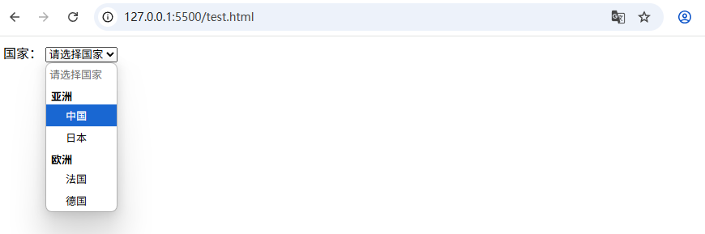

### 9、多行文本框


* `<textarea>` 表示多行文本框
* 有 `rows`和`cols`属性，用于定义多行文本框的行数和列数

```html
用户评论： <textarea cols="100" rows="10"></textarea>
```

### 10、按钮

| 标签      | 属性          | 描述                                       |
| :-------- | :------------ | :----------------------------------------- |
| `<input>` | type="button" | 普通按钮，也可以简写为 `<button></button>` |
| `<input>` | type="submit" | 提交按钮                                   |
| `<input>` | type="reset"  | 重置按钮                                   |

```html
<button>我是一个button标签，是一个普通按钮</button>
<input type="button" value="我是一个普通按钮" />
<input type="submit" value="提交表单信息" />
<input type="reset" value="重 置" />
```

**总结，常用表单控件**

| 标签      | type 属性 | 描述                                       |
| :-------- | :-------- | :----------------------------------------- |
| `<input>` | text      | 单行文本框                                 |
| `<input>` | radio     | 单选按钮                                   |
| `<input>` | checkbox  | 复选框                                     |
| `<input>` | password  | 密码框                                     |
| `<input>` | button    | 普通按钮，也可以简写为 `<button></button>` |
| `<input>` | submit    | 提交按钮                                   |
| `<input>` | reset     | 重置按钮                                   |

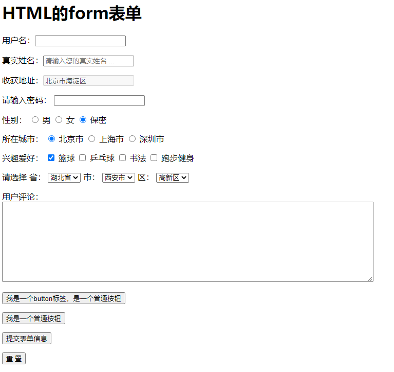

### 11、HTML5 新增表单控件

| 标签      | type 属性  | 描述               |
| :-------- | :--------- | :----------------- |
| `<input>` | color      | 颜色选择控件       |
| `<input>` | date、time | 日期、时间选择控件 |
| `<input>` | email      | 电子邮件输入控件   |
| `<input>` | file       | 文件选择控件       |
| `<input>` | number     | 数字输入控件       |
| `<input>` | range      | 拖拽条控件         |
| `<input>` | search     | 搜索框             |
| `<input>` | url        | 网址输入控件       |

> 注：兼容到 IE9，手机端完全兼容

```html
<h1>HTML5新增表单控件</h1>

<form>
    <p>
        颜色选择：
        <input type="color" />
    </p>
    <p>
        日期选择：
        <input type="date" />
    </p>
    <p>
        时间选择：
        <input type="time" />
    </p>
    <p>
        电子邮件（提交自动校验）：
        <input type="email" />
    </p>
    <p>
        必填项：
        <input type="text" required />
    </p>
    <p>
        数字（min最小值，max最大值）：
        <input type="number" min="2" max="10" />
    </p>
    <p>
        拖拽条：
        <input type="range" min="10" max="50" />
    </p>
    <p>
        搜索框（多一个清空按钮）：
        <input type="search" />
    </p>
    <p>
        网址：
        <input type="url" />
    </p>
    <p>
        <input type="submit" value="提交表单信息" />
    </p>
</form>
```

datalist 控件

为输入框提供一些备选项，当用户输入的内容与备选项文字相同时，将会显示智能提示感应

```html
datalist 控件：
<input type="text" list="language-list" />
<datalist id="language-list">
    <option value="Java">Java</option>
    <option value="JavaScript">JavaScript</option>
    <option value="Python">Python</option>
    <option value="Go">Go</option>
    <option value="C++">C++</option>
</datalist>
```

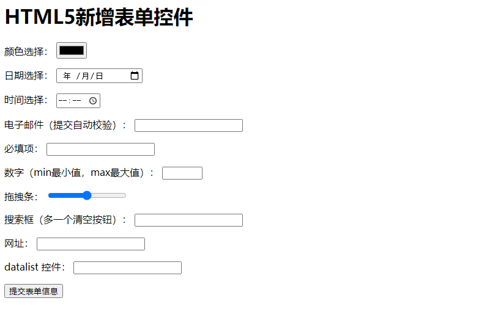

## 九、其他 HTML5 不常用 但 实用的标签


关于 HTML5 标签有一些是 不常用 但 实用的标签

### 1、 `<details>` 和 `<summary>`


创建可折叠的内容区块（无需 JavaScript）

* 常见于 FAQ 页面，或
* 考虑添加 `open` 属性默认展开

```html
<!-- open 属性为默认展开 -->
<details>
    <summary>点击查看详情</summary>
    <p>这里是隐藏的内容，点击摘要时会展开。</p>
</details>
<details>
    <summary>点击查看详情</summary>
    <p>这里是隐藏的内容，点击摘要时会展开。</p>
</details>
```

### 2、 `<progress>` 和 `<meter>`


进度和度量显示

* `<progress>` 用于未知总量的进度（如下载）
* `<meter>` 用于已知总量的度量（如磁盘使用）

```html
<label for="file">下载进度：</label>
<progress id="file" value="70" max="100">70%</progress>

<label for="disk">磁盘使用：</label>
<meter id="disk" value="0.6">60%</meter>
```

### 3、 `<output>`


显示计算或用户操作的结果（常与表单结合）

```html
<form oninput="result.value=parseInt(a.value)+parseInt(b.value)">
    <input type="number" id="a" value="0" /> +
    <input type="number" id="b" value="0" /> =
    <output name="result">0</output>
</form>
```

### 4、 `<ruby>` 、 `<rp>` 、 `<rt>`


`<ruby>` 标签是 HTML5 中用于为东亚字符（如汉字、日文假名等）添加注音或发音标注的标签，通常与 `<rt>` （注音内容）和 `<rp>` （备用内容）配合使用。

其核心作用是为文本提供发音辅助，尤其在教育、多语言支持和无障碍访问场景中具有重要价值。

* `<ruby>`：包裹需要标注的文本和注音内容。
* `<rt>`：定义注音文本（如拼音、假名等）。
* `<rp>`：为不支持 `<ruby>` 的浏览器提供备用显示内容（如括号）。

### 4.1、语法

```html
<ruby> 基础文本 <rp>(</rp>
    <rt>注音内容</rt>
    <rp>)</rp>
</ruby>

<!-- 给 汉字 添加拼音-->
<ruby>汉<rp>(</rp>
    <rt>Hàn</rt>
    <rp>)</rp>字<rp>(</rp>
    <rt>zì</rt>
    <rp>)</rp>
</ruby>
```

注：

在支持 `<ruby>` 的浏览器中显示为“汉 Hàn 字 zì”，在不支持的浏览器中显示为“汉(Hàn)字(zì)”

### 4.2、可选标签 `<rb>`


用于明确包裹基础文本，提升代码可读性（非必需）

```html
<ruby>
    <rb>汉</rb>
    <rp>(</rp>
    <rt>Hàn</rt>
    <rp>)</rp>
    <rb>字</rb>
    <rp>(</rp>
    <rt>zì</rt>
    <rp>)</rp>
</ruby>
```

## 十、表格

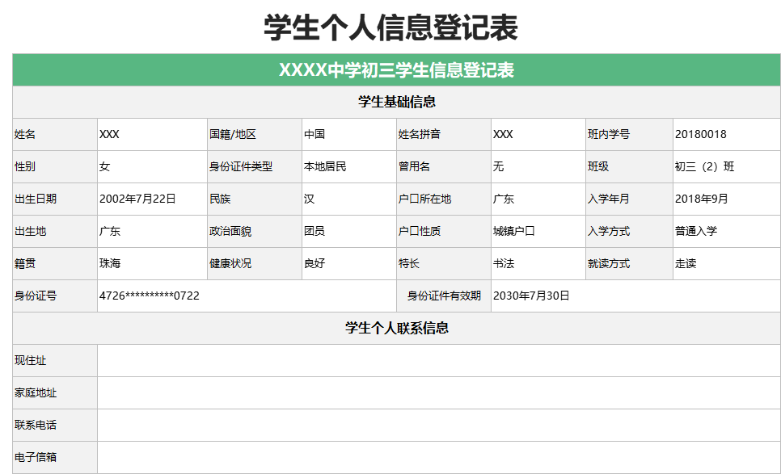

### 1、HTML 表格标签

| 标签        | 描述                                          |
| :---------- | :-------------------------------------------- |
| `<table>` | 定义表格                                      |
| `<th>` | 定义表格的表头                                |
| `<tr>` | 定义表格的行                                  |
| `<td>` | 定义表格单元                                  |
| `<caption>` | 定义表格标题（作为 table 的第一个子元素出现） |
| `<thead>` | 定义表格的页眉                                |
| `<tbody>` | 定义表格的主体                                |
| `<tfoot>` | 定义表格的页脚                                |

### 2、table 标签属性

| 属性          | 描述                                       |
| :------------ | :----------------------------------------- |
| `border` | 表格的边框                                 |
| `width` | 表格的宽度（HTML5 不支持）                 |
| `cellpadding` | 单元边沿与其内容之间的空白（HTML5 不支持） |
| `cellspacing` | 单元格之间的空白（HTML5 不支持）           |

> 注：在 HTML5 中 table 标签的大部分属性 `已经废弃` ，全部用 CSS 代替了

```html
<h1>table标签</h1>

<table border="1" width="500" cellpadding="10" cellspacing="0">
    <!-- caption标签，表格标题 -->
    <caption>
        同学通讯录
    </caption>
    <tr>
        <!-- th，表头 -->
        <th>姓名</th>
        <th>性别</th>
        <th>年龄</th>
        <th>所在城市</th>
    </tr>
    <tr>
        <td>arry</td>
        <td>男</td>
        <td>18</td>
        <td>北京</td>
    </tr>
    <tr>
        <td>豆豆</td>
        <td>女</td>
        <td>21</td>
        <td>上海</td>
    </tr>
    <tr>
        <td>翠花</td>
        <td>19</td>
        <td>男</td>
        <td>深圳</td>
    </tr>
</table>
```

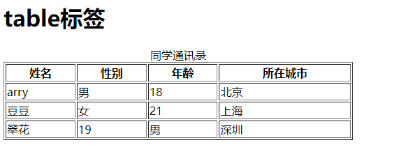

### 3、table 标签跨行、跨列

`td 标签 或 th标签` 的属性

| 属性      | 值     | 描述                   |
| :-------- | :----- | :--------------------- |
| `colspan` | number | 规定单元格可横跨的列数 |
| `rowspan` | number | 设置单元格可纵跨的行数 |

注：td 标签的其他属性在 HTML5 中已不支持，直接使用 css 即可

跨列

```html
<h2>表格实战 - 跨列</h2>

<table border="1" width="800">
    <caption>
        学生个人信息登记表
    </caption>
    <tr>
        <th colspan="8">高新一中初三一班学生信息登记表</th>
    </tr>
    <tr>
        <th colspan="8">学生基础信息</th>
    </tr>
    <tr>
        <td>姓名</td>
        <td>XXX</td>
        <td>国籍/地区</td>
        <td>中国</td>
        <td>姓名拼音</td>
        <td>XXX</td>
        <td>班内学号</td>
        <td>20211101</td>
    </tr>
    <tr>
        <td>性别</td>
        <td>女</td>
        <td>身份证件类型</td>
        <td>本地居民</td>
        <td>曾用名</td>
        <td>无</td>
        <td>班级</td>
        <td>初三（1）班</td>
    </tr>
    <tr>
        <td>出生日期</td>
        <td>2002年9月1日</td>
        <td>民族</td>
        <td>汉</td>
        <td>户口所在地</td>
        <td>北京</td>
        <td>入学年份</td>
        <td>2015年</td>
    </tr>
    <tr>
        <td>出生地</td>
        <td>北京</td>
        <td>政治面貌</td>
        <td>团员</td>
        <td>户口性质</td>
        <td>城镇户口</td>
        <td>入学方式</td>
        <td>普通入学</td>
    </tr>
    <tr>
        <td>籍贯</td>
        <td>海淀区</td>
        <td>健康状况</td>
        <td>良好</td>
        <td>特长</td>
        <td>书法</td>
        <td>就读方式</td>
        <td>走读</td>
    </tr>
    <tr>
        <td>身份证号</td>
        <td colspan="3"></td>
        <td>身份证有效期</td>
        <td colspan="3"></td>
    </tr>
    <tr>
        <th colspan="8">学生个人联系信息</th>
    </tr>
    <tr>
        <td>现住址</td>
        <td colspan="7"></td>
    </tr>
    <tr>
        <td>家庭地址</td>
        <td colspan="7"></td>
    </tr>
    <tr>
        <td>联系电话</td>
        <td colspan="7"></td>
    </tr>
    <tr>
        <td>电子信箱</td>
        <td colspan="7"></td>
    </tr>
</table>
```

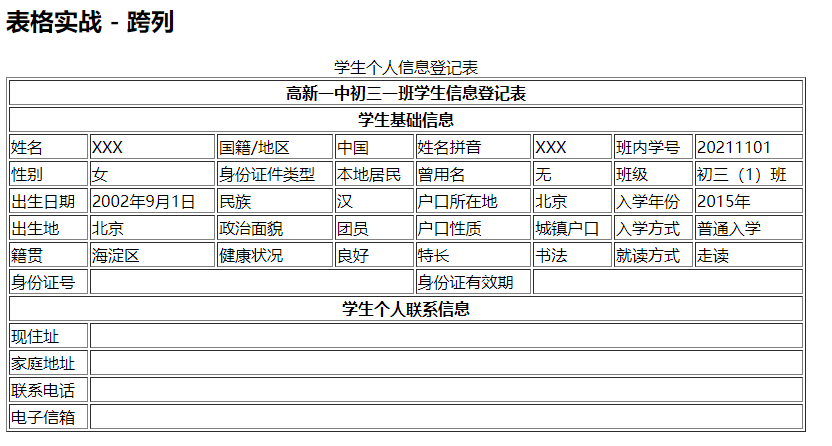

跨行、跨列

```html
<h2>表格实战 - 跨行跨列</h2>

<table border="1" width="800">
    <caption>
        版本规划任务分配表
    </caption>
    <tr>
        <th colspan="2">需求：V0.3版本规划</th>
        <th>优先级</th>
        <th>任务分解</th>
        <th>产品负责人</th>
    </tr>
    <tr>
        <td rowspan="3">功能模块1</td>
        <td>具体事项1</td>
        <td>3</td>
        <td>任务1</td>
        <td rowspan="3">@翠花</td>
    </tr>
    <tr>
        <td rowspan="2">具体事项2</td>
        <td>4</td>
        <td>任务2</td>
    </tr>
    <tr>
        <td>1</td>
        <td>任务3</td>
    </tr>
    <tr>
        <td rowspan="6">功能模块2</td>
        <td>具体事项1</td>
        <td>2</td>
        <td>任务1</td>
        <td rowspan="6"></td>
    </tr>
    <tr>
        <td rowspan="4">具体事项2</td>
        <td>3</td>
        <td>任务1</td>
    </tr>
    <tr>
        <td>2</td>
        <td>任务2</td>
    </tr>
    <tr>
        <td>1</td>
        <td>任务3</td>
    </tr>
    <tr>
        <td>4</td>
        <td>任务4</td>
    </tr>
    <tr>
        <td>具体事项3</td>
        <td>1</td>
        <td>任务1</td>
    </tr>
    <tr>
        <th colspan="5">备注信息</th>
    </tr>
    <tr>
        <td colspan="5">...</td>
    </tr>
</table>
```

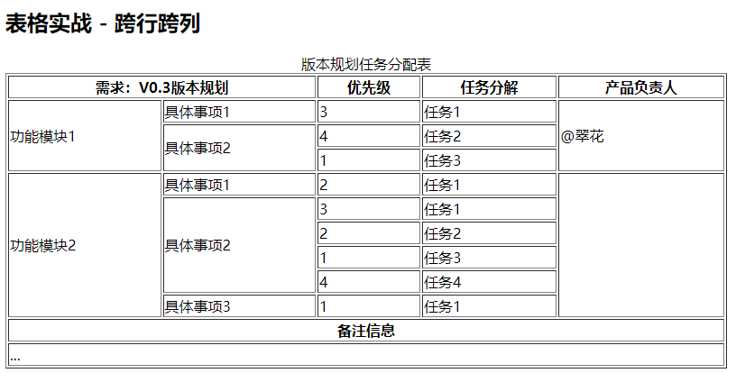

### 4、thead，tbody，tfoot 标签

```html
<h2>表格：thead、tbody、tfoot标签</h2>

<table border="1" width="500">
    <thead>
        <caption>
            同学通讯录
        </caption>
        <tr>
            <th>专业</th>
            <th>姓名</th>
            <th>性别</th>
            <th>年龄</th>
            <th>所在城市</th>
        </tr>
    </thead>

    <tbody>
        <tr>
            <th>计算机</th>
            <td>arry</td>
            <td>男</td>
            <td>18</td>
            <td>北京</td>
        </tr>
        <tr>
            <th>外语</th>
            <td>豆豆</td>
            <td>女</td>
            <td>21</td>
            <td>上海</td>
        </tr>
        <tr>
            <th>市场营销</th>
            <td>翠花</td>
            <td>19</td>
            <td>男</td>
            <td>深圳</td>
        </tr>
    </tbody>

    <tfoot>
        <tr>
            <th>备注</th>
            <td colspan="4"></td>
        </tr>
    </tfoot>
</table>
```

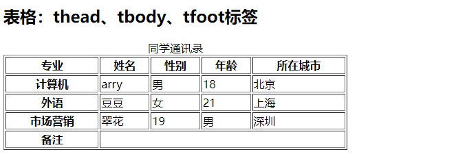

## 十一、所有标签属性归类总结

[点击查阅，HTML/HTML5 常用标签及属性，用于学完标签后，快速总复习 ！ 👆](https://www.arryblog.com/knowledge/html5-css3/)

上次
