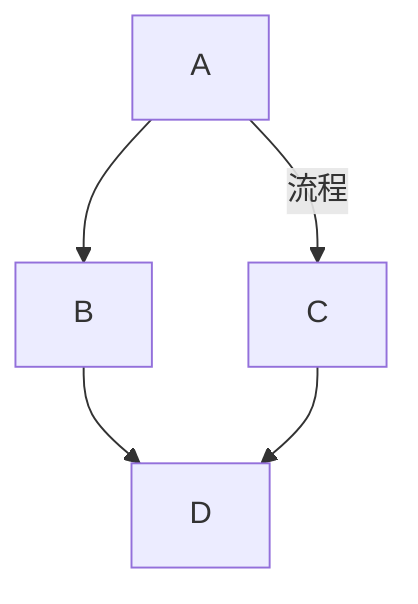
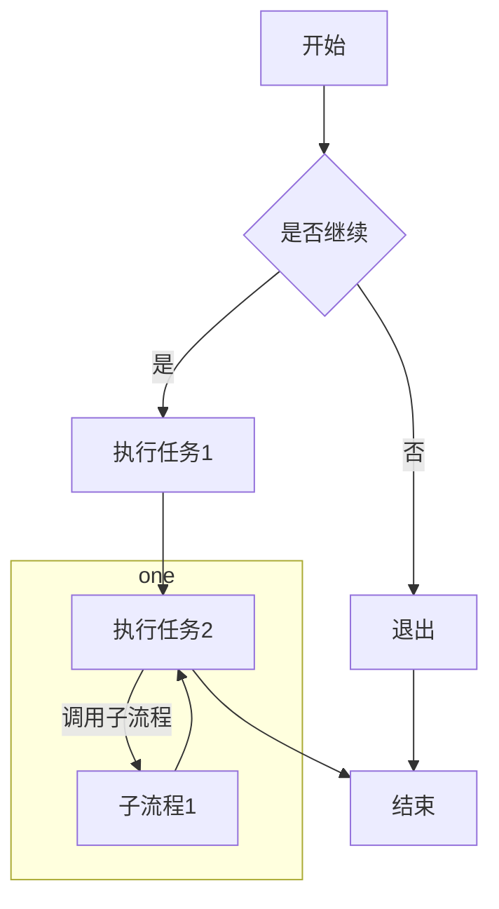
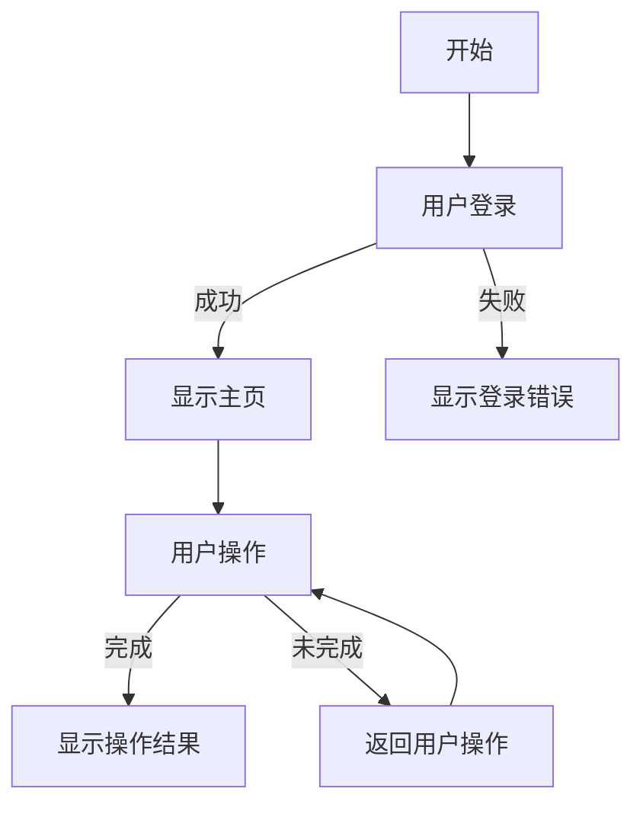
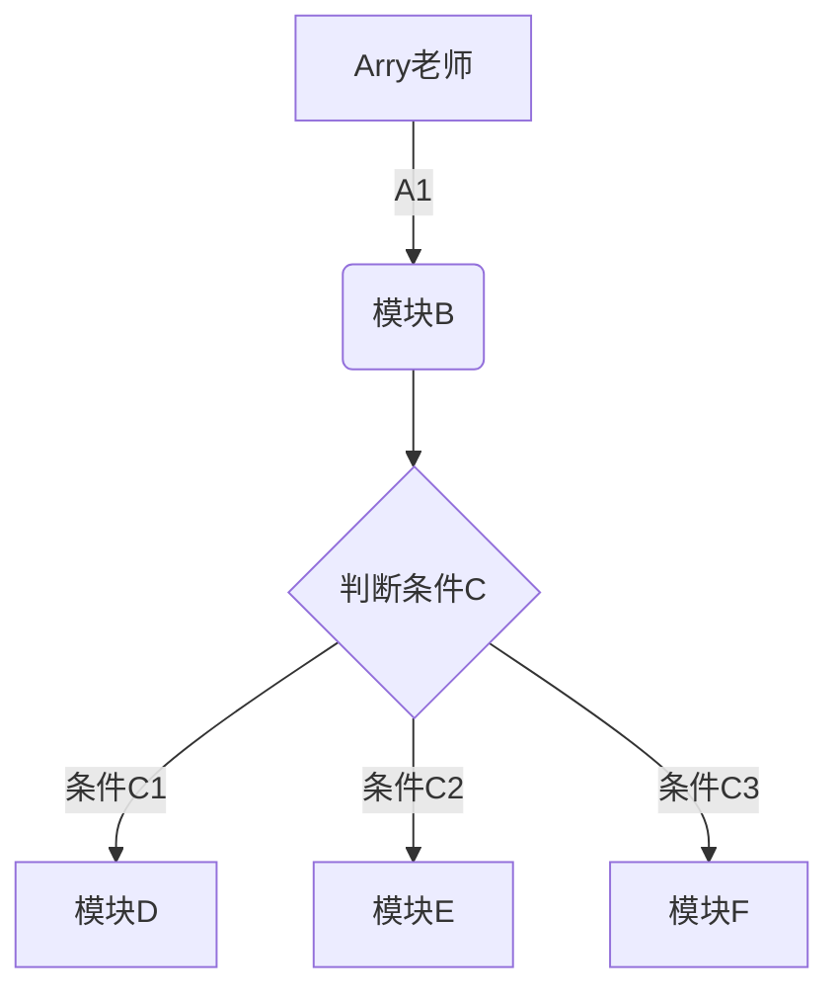
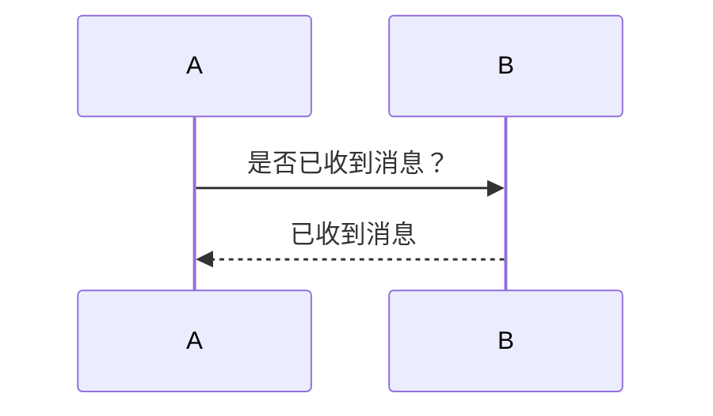
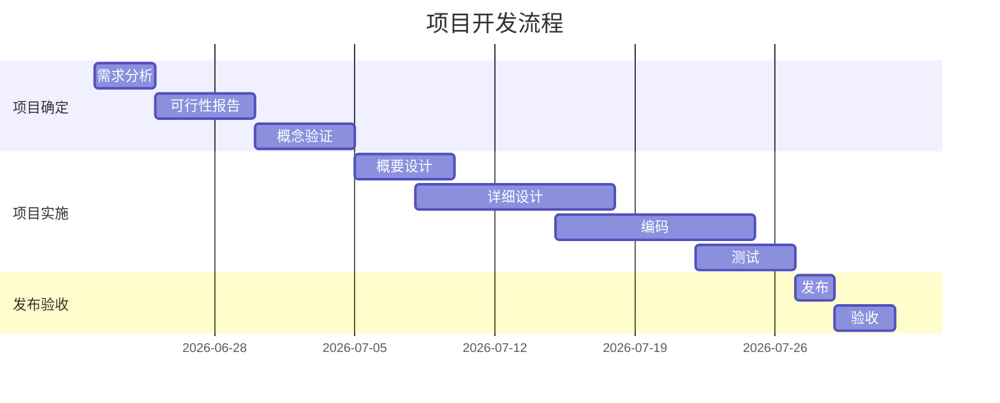
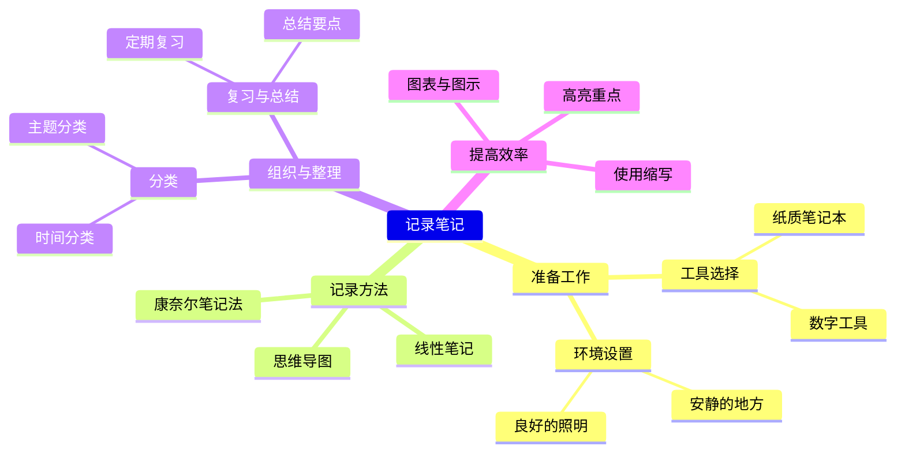
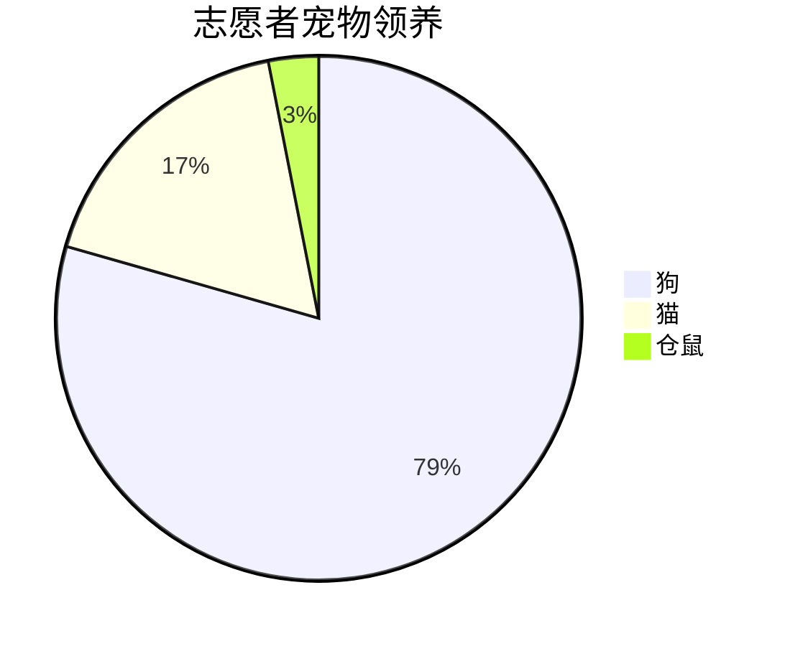

## 五、绘制各类图形

TIP

Markdown 本身并不直接支持绘制流程图的功能。

然而，许多 Markdown 编辑器或扩展提供了对流程图的支持，通常是通过集成像 Mermaid、Graphviz 或 PlantUML 这样的图表和图形库来实现的

### 1、使用 Mermaid 在 Markdown 中绘制流程图 - 准备工作

TIP

- **选择合适的 Markdown 编辑器**：

你需要一个支持 Mermaid 语法的 Markdown 编辑器。常见的选择有 Typora、VS Code（配合 Markdown All in One 或 其他相关扩展 ）、StackEdit 等。

- **启用 Mermaid 支持**：

在某些编辑器中，你可能需要在设置或配置文件中明确启用 Mermaid 支持。例如，在 Typora 中，你可以通过「设置」->「Markdown」->「Markdown 扩展语法」->勾选「图表」来启用 Mermaid 支持。

> 在 VS Code 中，安装 Markdown All in One 扩展后，通常默认会启用 Mermaid 支持。

### 1.2、Mermaid 流程图基础语法

声明流程图代码块：

在 Markdown 文件中，使用三个反引号 ``` 来声明一个代码块，并指定语言为`mermaid`

~~~markdown
```mermaid
[你的Mermaid代码]
```
~~~

指定流程图方向：

Mermaid 支持多种流程图方向，包括从上到下（TB/TD）、从下到上（BT）、从左到右（LR）和从右到左（RL）。你可以在代码块的开头使用`graph`或`flowchart`关键字，并紧接着指定方向

```markdown
// 从上到下
graph TD

// 从下到上
graph BT
```

定义节点和连接线

- 使用方括号`[]`来定义矩形节点
- 使用圆括号`()`来定义圆形节点
- 使用大括号`{}`来定义菱形节点等。
- `-->` 实线箭头
- `---` 无箭头实线
- `-.-` 虚线
- `-.->` 带箭头的虚线
- `==>` 加粗箭头
- 可以在连接线上添加文字描述，使用`|`将描述文字括起来。

~~~markdown

~~~

> 渲染效果：

![image-20241218012652330](data:image/png;base64,iVBORw0KGgoAAAANSUhEUgAAAIsAAAEPCAIAAAD9LaDSAAAT9ElEQVR4nO2dfVAT57rAHxItBSpXBKEcC9hbpoqIp2UDRkFuyyi0xgsWhgvHoHag0hYZMMgAwyhWoY62KlAZOj0WFQ9ae71SiydOox06UiJQCMfyIdwLXkDkyDeoDRgg2ftHICIgrrjv7kvu+/sr2Wze59n88uzu++6XCU3TQMAYAd8JEJ4BMYQ7xBDuEEO4QwzhDjGEO8QQ7hBDuEMM4Q4xhDvEEO7M4zuBmaBpKFf0maBrH2C1/yITdAHYAGtDmiHtzaIBl7ULEbXfUDbgttbSwhLrHwHr5ABAON9k5bpFiBq//Y8HiFpmEbIdwh1iCHeIIdwhhnCHGMIdYgh3iCHcIYZwhxjCHWIId4gh3CGGcIcYwh1jMtT70x6Rv3/mLb7zYBcjMlT7t4wKAMg/p+jlOxU2MR5Dt8ryAbw8PKDi15J+vpNhEaMxVF1yATziU9PDwqGiqLyH73TYw0gM9StyL4KXN2UNK32DQZlxqZrvjFjDOAz1lv+qhJDI92wAYFVIvBdcKDKa/QWjMNRTUlLhJdu8Sv/OivL1gPySWn5zYg3czyRhQr+qqAKUFVJRxoSJFed/DEkPtOItKdYwAkPVF44pPeIV6f7Wj6fVZvrvLirvCXzPhr+8WGLur+Vqi8b2ESZiRPsLc97QrbJ88PBdPblWVnmHAFwous9LTqwyxw09vHnuAnis8566vVkhDgfI7xrgISl2mePboQVvpSsqp/9o5S6FYhe32SBhjtfQ/wOIIdwhhnCHGMIdYgh3iCHcIYZwhxjCHWIId4gh3CGGcIcYwh1iCHdwH9vW6ejefz5C1LhWq0PUMotgbaitra1/6H9/+c8/Fi1i/6YXfX19A390t7bSK9zeYL1xNqFxZXR0NDQ0lKKor7/+GkX7J06coCgqKChoeHgYRftsge92KCcnp6mpafny5Tt27EDRfkRExPLly1tbW48fP46ifdbg+y8yPdXV1SKRaM2aNXfv3kUX5e7du97e3iKRSKVSoYvyguBYQ2q1Ojk5maZpmUy2ZMkSdIGWLFkSHx9P03RKSoparUYX6EXA0dDhw4c7OzvFYnFISAjqWB988IFYLO7p6UlLS0Mda5bwXcSTuXbtGkVR7777bl9fHzcR+/r61q9fT1GUXC7nJuJzgZeh7u5uHx8fiqKuX7/OZdzS0lKKonx8fDo6OriMywSM1nL0+PZAIpH4+PhwGVosFgcGBhq2f1yGfiYYGTp37lxVVZWdnV1ycjL30RMSEuzs7Gpqas6cOcN99Jngu4jHaGxsFIvFIpGourqarxyqq6s9PDw8PT0bGxv5ymEqWNTQyMhIUlLSyMjI1q1b3dzc+ErDzc3tww8/1Gq1SUlJw8PDfKUxCSwMZWdnt7a2Ojs7f/rpp/xm8vHHHzs7O7e2tmZlZfGbyWP4LmJapVKJRCKxWNzS0sJ3LjRN0y0tLWvWrKEoCpOBBp5rSK1Wp6Sk0DQdExPj5OTEbzJ6nJyc4uLiACAlJeXBA/5v98yzobS0tJ6eHnd39y1btvCbyURCQ0Pd3d17eno+++wzvnPh1dCVK1d+/vlnCwuLgwcPmmB2b/+DBw9aWloWFxdfvnyZ51T4Wr12dHTohw+uXLnCVw4zc/36dYqivL29+R1o4KeGaJpOTk5Wq9Xr169///33ecnhmfj4+GzcuHFoaCg5OVmn4+14OT+G8vLyampqbGxs9u7dy0sCDElKSrKxsampqTl9+jRvSXBfto2NjZ6envjszs6MvjPg6elZX1/PSwJc19Dw8HBSUpJWqw0LC3N3d+c4+ixwd3eXSqU8DjRwbSgzM7O1tdXJySk2Npbj0LNm586dTk5O7e3tx44d4yE8lwWrPwyD29AkE/QDuxRFlZaWchyauxp68OCBfr9AP/bFWVxWMIwZ7t27l+OBBhOaqwNW8fHxxcXFbm5uubm5AgEWI7Yz0N3dPXXi0NCQTqcTCoUvv/zyC7ZvbW3N8Efg6JzTwsLC4uJiMzOzQ4cO4a8HAKbtAJmams7wKSK4+LE6Ozu//PJLGD+OyUFEYwK5IZ1Ol5ycPDQ05OPjExgYiDqc8YHc0MmTJ2tqaqysrHAYJ34u+q/tk5ysnzy19+o+yb6rM9wvui5XIpFIJLlTvjlL0G6HGhoaTpw4AQBpaWmWlpZIY7GPu1dQZoKkJS7/gN/je29Z+4UFZyVsy3WQR7pMnLkuV5JYAAAAQUfkchcA6L26b1vWNLeFCj4ij3CZOvlpIDRkGD4ICgoSi8XoAiHCytovUu4AkoSCa3Anc9JvXZAgKTC8Ee3K378hUi6PhLpcSeLE2YKOPCmy/9q+8LbnSwOhoSNHjrS3ty9ZskQmk6GLghiXSLkcAGCDH8BYWcCu/P0buLuBKipDZWVlBQUFAoHg8OHDZmZmiKIgpL94X3hj2MQKmKynPldy3uHMfj9rAID6k5KEi2MzJkgKAIKOnHGYVGpjBIc9VyJIDPX39+uHD/TX6KAIgZ4/ewUfTpAUBH0hj3Qd28yMvR7DJfILR8n4BsklQi6P0HsaX7P1XmVlLYdkTCEmJqasrGz58uV5eXlCoZD19jmgs7MT9D/or175BxwKJAlTasGAQUP/1dTwLNVkK9OyePFihj139g0NDg7qz7ouKChwdHRkt3HO0BtiQv1JyXmH/P0brMZ33kQiyjHsQCRMWO9NIugLefI7TA2h2g6Zm5vPXT2PqcuVfO+Qf8DPCupzJQnwhTzStf9qanhbqDzSdXxKhHw/AADU/5gFlAhUAFCQkOqQf0Auj9C3YvjKbFKYA0NkPFJfXgBLHcb320QOr840742LIq91jgCOYQfy40BZwdJTkLC+Wp9v6m9chKAvXAAAetvuADg8ZbZcScKjENGV4DD5n25kAQBY+R3YD3W5km0TNl6q8b06Ki7/gN9ixkkQQ0+n7kYBBB1xBQDor1JWUl67rJ82q+iVQccj0S5Qd+PxNNdIuTwSAMhaDhX15QVAObwKAHW54ZkQF+f3ZDf1VQcKAPTl5egZ/ez9t9lBauhp3L5xEUS7PODaPkmm4xH5/ikCrByWQlaipAAAgo/sn/Th42G6cVQT+q5UXPnXUoZ5oNrbNjc3Ly4uZrdlLmG+t/0EdbmSRGC3P0RqiFVcx4bxWIRsh3CH1ND0CAQCrVbLdxYAxNDTeK6zeS5dujQ8PLx58+aXXnqJ4VeYX41DDE3PggULmM98+vTp+/fvh4SEPNe3GEK2Q7hDDOEOMYQ7xBDuEEO4QwzhDjGEO8QQ7hBDuEMM4Q4xhDvEEO6wMHI6Ojp68+ZNw1uNRgMAWq22svKJywVEItGLx8KESYs2OjoKADdv3jQ3NzdMdHV1ZeWEdRYMzZs3r7Cw8MqVKxMnajSaTz75xPBWKpUak6Hy8vJTp05NmhgfH2947efnx9bysrOWk0qfcV7EM2eYW0il0pkPBbG4vOwYWrZs2caNG5/2qVQqtbW1ZSUQJixcuHAGB35+fq6uszo3bjpY21OYIWMjKyA9W7ZsmT9//rQfsbu8rBl6WhkZXwHpsbKymtbEhg0bWCwgYHdve9qMjbKA9Eil0qllxPrysmloahkZawHpmVpGGzZsWLlyJbtRWO6xTsrYiAtIz6QyQrG8LBtatmyZn5+f/rVxF5CeiWX0zjvvsF5AgGLUJzQ0VP/C6AtIj1Qq1Z/8huiJY0zPrK+42leh6DdhJlT/JFqhkNmVtCYma//detW6f2HUNFcUfd/VUPmQ4VmHOp2OppkuLwDtuPwVSeRM1/NNhOmoz+gw7brOymUt+3d6uPlzD+ttvjj3e0fWhdjbLWX/ThCDD0aun7vHfH6mhkxMQCAwEQrZv7M8ZjerHwPd8goEz9cmOfqAO8QQ7hBDuEMM4Q4xhDvEEO4QQ7hDDOEOMYQ7xBDuEEO4QwzhDptX6/cr4sKOKSdOCT5aGcX+MS3c6P1pj39Gxfi7kJOKj1ax2Drr91Pwkp3Nes8GQC9stwiMW1Jtpv/ufAg5qUhf9XjKt8CiJIRrOSv/yGCAO+0s3U0SQ2oz/XfnBx+tfMLHyl3s1hDK7VBP8x2ErfNO70/n8yHkJOo1BEJDty6lVXjs3e3/1FtPzm16SkoqIFjMZrlMC+vbIWWGVJQx9tpLdjaQuwckcExHcwV4eTM922D2INxTgNpMf6moJF6RbqxlxAkot0Mrd52P96o49rf/QRiDX5R3OpDH4KDH2myce3MrfYMBLpZVo46D1tC9NiXA60uMcyW3KiTeCy7k/oT4ZDKUhmozZRfAI37rmwhj8ImVf1ZGiDJDKvpr7YSptZn+37JZWEj35Yx/1GfFR5WKzT/ukYr8DZNwHvWx8s9S+D97NmPDJjBdgfAppmRsG3eIIdwhhnCHGMIdYgh3iCHcIYZwhxjCHWIId4gh3CGGcIcYwh1iCHeIIdxhevSBpqG19mF/xyMmM+ufICcUCpnM3N+psXuN6cPJOEMzpKsr6btdxegfrNNpaZrp8mpHdM/1gFWmd43RaunWW4NM5tRoNHv27DE1NU1PT2eYxL+6WTCckzPuNQ8N/aFjOPO+ffsGBwf3798/8V7BM8N8kZnWkFBowrDRwUGT1p7fzM3NMfzdmWP/+nPcL+af9/9x//59RxdTS0v2F5lsh3CHGMIdYgh3iCHcIYZwhxjCHWIId4gh3CGGcIcYwh1iCHeIIdwhhnCHGMIdYgh3iCHcIYZwhxjCHWIId4gh3CGGcIcYwh1UhgYHB2/fvo2ocaxobm5+9OgRAJigedYV+4bMzc1XrFgBADt37uzq6mK9fazo6+uLjY3VaDRvvvnmggULUIRAUkNfffWVvb19T09PbGzs0NAQihA4oNFooqOj7927Z2trm52djSgKEkMLFy7MycmxtLRsamravXu3Tsf09No5hE6nS0xMbGpqsrCwyMnJWbRoEaJAqLZDDg4OWVlZ8+fP/+233w4cOIAoCo8cOnRIqVTOmzcvIyNj6dKlCCPRKCkqKhKJRBRF5eXlIQ3EMWfPnqUoiqIohUKBOhZaQzRN5+XlURQlEomKiopQx+KGkpIS/d8uNzeXg3DI+0Pbtm0LCgqiaTolJaWmpgZ1ONQ0NDQkJibSNL1p06aIiAgOIjK9fuhF0Ol0MplMqVRaWlqePXvW3t4edURE3Lt3b+vWrQMDA56entnZ2QIBF/19LgwBgEajiYyMbGhocHBwyMvLs7S05CAou6jV6vDw8La2Nmdn51OnTpmZsf9A6mnhaNTH1NQ0Ozvb3t6+ra0tLi5uZGSEm7hsMTo6KpPJ2trabG1tc3JyONMDXI7LGTpJNTU1KSkpnMVlhdTU1KqqKtRdn2nhdOTU0En65ZdfcnJyuAz9InzzzTdXr17louszLRzsL07C0Em6fPky99GfF4VCwVnXZ1p4METT9OnTpymK8vDwUKlUvCTAEJVKtXr1as66PtPCz/Gh7du3b9q0Sb8X3tLSwksOz6SlpUUmk42OjnLW9ZkW3o7gpaamenp6qtXq6Ojovr6+iR+Njo6eOXOGy2S+++47jUYzccrAwEB0dLRarfb09ExNTeUymUnwZkggEBw9etTZ2bmrqys6OtrwA3V2dkZFRalUKi6TqaqqioqKam9v17/VaDQxMTFdXV3Ozs5Hjx7lpmf6NPiMbWZmlpOTY2tr29TUlJiYqNPp6urqduzYUV1dzbEhlUpVV1cXFRX1+++/6w8rNDQ0cN/1mRaOxhRmoKWlZfv27Wq1es2aNSqVanh4WD/9xIkTb7/9NgcJ1NXVbd++Xf9aKBSKxWKlUmlhYZGXl8fDvvUU+D+TZOnSpRkZGUKhsLS01KAHADgro4mBtFqtUqkUCAT8dH2mg39DAFBRUaG/ndZEqqqquIk+9a+g0+lKS0u5if5M+F/Lff755z/88MPU6QKB4MaNG/Pmsf78ncl4e3vrT9aZREBAAL97cXr4rKGhoSGZTDatHgDQ6XQclFFVVdW0egCgsLAwNjb24cOHqHOYGZ735SwsZrrdV2VlJeocZv4TvPLKK4jOsWIO/2u57u7uwsLCwsJCQ3fEwLueYX9+7T9MzVD9jTRDuoauwp9KTk+abm9vHxAQEBAQYGdnhyg0c/g3ZKCoqKiwsLCkpMQwZfUb2wID/rJ0Fap/8Z26P+R//+HXhm8MU9auXRsQELB+/XpEEWcB8u0wc3x9fX19fZubmwsLCy9duvTw4UMdrTO3nGf9p5cRRexpe6TVjQKAhYXF5s2bAwIC3njjDUSxZg1GNTSJ48ePN5ULQ0L/4rIW1ZOr/7t84OL3/+VEDcbExPA7tDMD+BoCgNK/92ppAVJDuuFR7802iNpnBUz/OAQDxBDuEEO4QwzhDjGEO8QQ7hBDuEMM4Q4xhDvEEO4QQ7iD0dj27OhXxIUdUz4xyWPv+fRAVGN5nDPnDQEAgJfsbNZ74+Oft74VhfmnecQr0v2tec2KHYxwLbfio0rF2b1wzP+vtXynwgZGaAgAwCZwSwhc3J3ZyHciL46RGgJYIQ4HaG7ve/acmGO0huDV1z1Aebeb7zReGOM1ZCwYr6GO5grwem0x32m8MEZr6FZZPnj4vsXpZdtIMFJDtZmyCxAcFriQ70ReHOPosT7BrW9FsgsQfLQyaiXfqbCBcRhSZkhFGYZ3IScVilU8ZsMuc96QlX+Wwp/vJFBipNshI4IYwh1iCHeIIdwhhnCHGMIdYgh3iCHcIYZwhxjCHWIId4gh3CGGcAfrsW2dFjpaB7VaVFer99x9tNh+PqLG2QLrq/VHh+nKon4kT5cb561/W4jurjSsgLUhApDtEP4QQ7hDDOEOMYQ7xBDuEEO4Qwzhzv8BiBXKpwv/sqMAAAAASUVORK5CYII=)

### 1.3、绘制流程图的步骤 及 应用案例

TIP

- **定义起始节点**：首先，定义一个起始节点，作为流程图的起点。
- **添加后续节点和连接线**：根据流程的逻辑，依次添加后续节点，并使用连接线将它们连接起来。
- **添加子流程和条件判断**：如果需要，可以使用`subgraph`关键字来定义子流程，或者使用条件判断语句（如`{条件}?[是]->[否]`）来创建分支。
- **自定义样式**：可以使用 Mermaid 的样式语法来自定义节点和连接线的颜色、边框等属性

~~~markdown

~~~

渲染效果：


以上流程图代码解读

```markdown
- `A[开始]` 是起始节点。
- `B{是否继续}` 是一个条件判断节点，根据条件的不同，流程会分支到`C[执行任务1]`或`D[退出]`。
- `C[执行任务1]` 和 `D[退出]` 是后续节点。
- `E[执行任务2]` 是在`C`之后的任务。
- `F[结束]` 是流程的终点。
- `subgraph one` 定义了一个子流程，其中`G[子流程1]`是被调用的子节点。
```

绘制 简单的用户登录流程图

~~~markdown

~~~

渲染效果：


~~~markdown

~~~

渲染效果


注：

相关 [流程图语法参考(opens new window)](https://flowchart.js.org/)

### 2、序列图

~~~markdown

~~~

渲染效果：

![image-20241218012839350](data:image/png;base64,iVBORw0KGgoAAAANSUhEUgAAAaYAAAEQCAIAAAB0gEc8AAAUkklEQVR4nO3dX2hb993H8a/sxMYmfkamoKY1dBF0F9uF8OgpS6wlK05B4HYWpAzKqpphm2VjIPniuQhZJJ7HMiEXYUiCsWXYYiQmN2OG47YBQyO2J7HT0dPV6LYDhYLzR+Qszx4XGye19VxItiVbdpz4+EhHv/cLX1hH589Pyc+f8z3nd362q1AoCACooanWDQAA+xB5ABRC5AFQCJEHQCFEHgCFEHkAFELkAVAIkQdAIUQeAIUQeQAUQuQBUAiRB0AhRB4AhRB5ABRC5AFQCJEHQCEH7D/k8tLq4sLK6sqq/YfGC2tqbmrvaG5tq99zJP3KiezvVy6bfyvy4/zTxw+ftLQfFBe/jdlRCq4ni08Pv9Ry2HOw1k2pgn7lVLb3K1urvOWl1ccPnxzytDUfqN9iAdtpOXTg8cOlOqz16FeOZnO/srWLLC6stLQfpF86VPOBppb2g4sLK7VuyGb0K0ezuV/ZWuWtrqyKy84DwmquwupK3V050q8cz8Z+xYkRgEKIPAAKIfIAKITIA6AQIg+AQog8AAoh8gAohMgDoBAiD4BCiDwACiHyACiEyAOgECIPgEKIPAAKIfIAKITIA6AQIg+AQog8AAoh8gAohMgDoBAiD4BCiDwACiHyACiEyAOgECLPQnd+e8R1ZPB6vtbtQGPIT7575Iir4uvynVo3yvGIPMvkJy9fPDd6Xn9/wqh1U9Awzs0+elRY+5o9f6n755MPat0mZyPyrPLg1seT59/8zclzcvGvnIqxH06cPFfrJjgfkWeRe5kP9dGTmrzx5qhcynxW6+agEd25dWn012eO1roZzkbkWeOz6+9/dK7nDRHRBq8EL/yOqw9Y4lJ32b287ovyj6/u1bpJDkfkWeLOrUtnrvzshIiIHD359pmPPs4wiAELVNzLu38lOHn2OrdN9oTIs0B+8vJFmTzrK52Nv/+LSWEQA9Y7+u6vuG2yV0Te3j249fHkO3+8X3k2ZhAD+yPo/U6tm+BoRN6e3ct8qJ/5yfHym8qcjbEfHvzl9xfeebvHU+t2OBqRt1efXX//o+C7J1+pXKr1nBcGMbBnFcMXL5/93uyfGLHdG1ehULDtYOb95aUlaftWq21HhLWW/r3c1ibul+vrf5B+5XR29iuqPAAKIfIAKITIA6AQIg+AQog8AAoh8gAohMgDoBAiD4BCiDwACiHyACiEyAOgECIPgEKIPAAKIfIAKITIA6AQIg+AQog8AAoh8gAohMgDoBAiD4BCiDwACiHyACiEyAOgkAN2HqypuUls/LO5sF7B1dTsqnUjNqNfOZ6N/crWKq+9o/nJ4tOVb1btPCissvLN6pPFp+0dzbVuyGb0K0ezuV/ZWuW1tjUdfqnl8cOllvaD4uK07CgF15PFp4dfamltq7ubIfQrB7O9X7kKtl8RLC+tLi6srK404Dn5Xw+eiMi3j7bUuiHWa2puau9orsO8W0e/ciL7+5WtVV5Ra1tTPf/k7MW/HjwVEffLrbVuiIroV9iNxuwiAFAVkQdAIUQeAIUQeQAUQuQBUAiRB0AhRB4AhRB5ABRC5AFQCJEHQCFEHgCFEHkAFELkAVAIkQdAIUQeAIUQeQAUQuQBUAiRB0AhRB4AhRB5ABRC5GE/mHpYi0yZxRfZlKalsi++s7we0RJ72L56q6CmGvyFM1hsLqENTezwfmjMGO4qfptNaAM7rbrBH72RDHokm9IGrj5r3f60EfZt/3Y2c1VCY9VWyOuR3vjMc+zT1MOB3EDx45h6+Jo3NVxcyZyKBO4OljbJ65FRiaWC7uLhN32E2YA2UrnX7uh09ZVL/whoJEReYwiljeFqoWLq4UBu46Vv2DCGN60xFQl80rP+M7+JL2wY4Z0ObE5FAnfXX2UT2oBsJKyIiMxlJiSU7tq6qYgnmDSC27Wh6sIfvRWKD2m52HSyT7yv5QbC+uaW5/VIb1z6o/N5ca+llT82neyr+vlE5hJauvz1xr+kORUJ9EaE1GssRF5jmBjQtq3eQgPbblYqavoHZSqirVdJVjL19ISIbG3eRgzNJQIj3rQRdBfbIzvUjG5337Bx3BvpHdGPJ4PhWDQcCKS8Zeub+mjcuylzRWZGtlR25bqj69/6whtnBHffYGhkIPOpGdwuLuFARF5j2GWVV65UkU0fiwTuihyPpe8GNG3LpVxej/RWCZHdmrsWny2/sq68Ai3ufygXvZEsvvaFp6PhQGJux8Ot1YYi7uCFaKY3kw37OkvvuYMpY+sWz1PlocEReY3h+ao8cyoSGJHoDSPoEfMrERG3x+0OG8Z7eqRXy+wQEM9nvlji5b4ypau0w/m7M/5jsfWG6KPxGZGZXi1evt1soscY7pTNsilt4GpluHuCSUNEZOchid1XeeXMqfEJ8UePU+I1FCKvMey6yiuOGPSnDaPa6p5g0vAmtID2SbT8HtnE0PaBKiL9g9WX381kJDo9lgukb5t9xb2ZuX+K99T6jt3BVKlgK5dNaeNTH8S2LPeFDSOcTWjaQH/aCHfq4UB8tvz9GW1j5KHiH+QFqjxzKhIYmfHHprmR12CIPOfrGjaqXMwVVVzomVORwIg3bRjJ8jX6kpVb+4YNoyelld8jC21/YVs5fFHp2AfJsFvyun82czsfDHpE8rczs/6eC9VWnktoaW8xZ31hIyliTlXd6foIjLltw+YS2lDFguet8op5t8OnhnMReQ5W/Mnc5cr+2HSyL2n0STalaTs/d9KfNsLbp2ilLYm5hSc42B8f/9QM9rnNTzMz3T2xjbpp80MzgbULXH9semuVt77J+qDw9uVnqPzFc1Z52WsjM/7YNHnXkIg8B3P3JY0+kU1jAmXl0nZ2iICdqrZtmXo4EH8tvfY4i1m85PS/VXrb915Uekf0V3syIzOhsWTZgcsemtnS7OpVXj6XE3/PK6VXu6nyijXjmmxCy/SU3wToGjZSu/+kcDwirwFkr43MhMbKfq5n44HK8YCdyhyL+I91isyLyMRQIDQ2HZVAZv09TzAWywSG4tKfTu6tdNpUJz6zylt76kUS2rj3RjIonT2x3ICWKL/Tl01pmVPl0enb4U4BnI7Ic765zISI/E92uGvtp7g7unOVZ7X53Kx4B9wyd22iNG5g6hUtTJQuwK+O6+/t9sne9Rq2jHn7kxn/W7H1j/aMKi+vj1/1R2/4RNamq3ncvr7ktERGpsxknzub0gYkOn0qmhvSEuu7Kj7MvP8nCdQEc2ydLpsYmgiNTUf/OaBpET1v9e49Xm/xKZPtmVPjExLq6SoOpGwaODb1sKYNTYTGDMMwjBs9mV5N227C7Gw8oJVsMxN2Pjcr3ld3mUSmPhqf6R9cS9iZ3L3SG+6+ZLLPXZoJdyro7gomb0Rzab10yHu53d4fhQO5CoVCrdvQOL784msR+e4PDtl1wGxCG8iVTWPYabLt2qzVZ0+brZzfuptBki3VlqmHA5nXQnJ1okq5VGxnf9o4lSlr8NYJrWWDG8UmzSW0IVm7Ji2fbyubP9eWKbrVP4Xd5fALsr1fNTIiz0o2d81sShs/9tzXXztvtXl2BOoAkWchIs9KdE3sB/qVhbiXB0AhRB4AhRB5ABRC5AH1oru7+6c//enNmzdr3ZBGRuQB9WJ5eTmXy42OjhJ8+4fIA+rLwsICwbd/iDygHpUH398//1utm9M4eC7PSl9+8XX88nDboeZaNwSOZBiGy+Xaury5uflb//Ht/x6JnThxwv5WNRiqPMABqgQhXghVnpV4Sh578frrr2+q8jo6Oo4cORIM/PyHr/+YfmUJfnkUUI+KYffLX/7y9OnTxVMpLEHkAfWlPOxq3ZYGROQB9aK1tbWzs5Ow21dEHlAv4vE4YbffGLEF6gV5ZwMiD4BCiDwACiHyACiEyAOgECIPgEKIPAAKIfIAKITIA6AQIg+AQog8AAoh8gAohMgDoBAiD4BCiDwACiHyACiEyMNemHpYi0yZxRfZlKalsi++s7we0RJ72L56q4By/FZkiIhkU9rA1Wet1J82wr4d9pG5KqGxaivk9UhvfOY59mnq4UBuwBjuKn5/zZsaLq5kTkUCdwdLm+T1yKjEUkF31Y8wG9BGKvfaHZ1eWxnKIvIgIuILG0Z4pxXMqUjg7vqrbEIbkLFiJK2Zy0xIKN21dVMRTzBpBEs7+aRnU+5UXfijt0LxIS0Xm072ife13EBY35xWeT3SG5f+6Hxe3J7SMn9sOtm3TabNJbT0Th8QiiDyYAlTT0+IyIA2semNjRiaSwRGvGkj6C5WZLJDzeh29w0bx72R3hH9eDIYjkXDgUDKW7a+qY/GvZsyV2RmZEtlV647+iKfDI2FyIOIlIqmrSGyW3PX4rMSKtu84gq0uP+hXPRGsvjaF56OhgOJuR0Pt1YbiriDF6KZ3kw27OssvecOpoytW1Dl4ZmIPOzdfLHEy31lSlcpcebvzviPxdZWMPXR+IzITK8WL99uNtFjDHfKZtmUNnA1lDaGN4pATzBpiIjsPCRBlYdnIvKwYWJoy3Vpuf7B6svvZjISnR7LBdK3zb7iHTcz90/xnlovuNzBVKlgK5dNaeNTH8S2LPeFDSOcTWjaQH/aCHfq4UB8tvz9GW1jmKIiGany8ExEHjaEtr+wrRy+qHTsg2TYLXndP5u5nQ8GPSL525lZf8+FaivPJbS0tzgW4QsbSRFzqupOfcOGMSxSLOyqN2wuoQ1VLKDKwzMRedgVd1+yys2zcp7gYH98/FMz2Oc2P83MdPfEPOvvZRPaQHn9GFi7wPXHprdWeeubrA8Kb19+hspfUOXhmYg87J6phwPx19Jrj7OYxUtO/1ult33vRaV3RH+1JzMyExpLlmXPeslWUeWV9lK1ysvncuLveaX0ajdVXrFmXJNNaJme8ruBXcNGavefFA2LyMPz8R/rFJkXkYmhQGhsOiqBzPp7nmAslgkMxaU/nXyxkd81m+rEZ1Z5a0+9SEIb995IBqWzJ5Yb0BLld/qyKS1z6kWHpNEomHCG3ZvPzYr3VXfpqWNjS3zMJQIjMyIiV8f1/G536u5LGpsnRZi3P5nxv/Wj9YWhMaOKsbWr2rw+ftUffa/sKT+P29eXnI7lxqdMKc2E0ztPRXNDWmLuOT80GguRBxER8Xi9xadMtmdOjU9IqKdLpGvYKL9mFClOa9WGJkrZdKMn06tp202YnY0HtJJtZsKuZeuumPpofKZ/MFgqCWdy90pvuPuSyT53aSbcqaC7K5i8Ec2ldSbfqowLWxT5Poj5AzuPeIqExpJVJkzcvRbRJiQ2baTWQqr4FPFcQtM06U8bpzLa0PqFqT96wwh6yrcvG9zoTydlx7lrm+bS9qd94vZtPAHj+yDmD2y9Cu6OTnetNYw7empzFQqFWrehcXz5xdci8t0fHKp1Q9BQ6FcW4sIWgEKIPAAKIfIAKITIs8nNmzdr3QQAjNjuv5s3b/7hD3+Yn58/ffp0rdsCqI7I20fFsHv06NHCwgIj40A9IPL2RXnY1botADYQeRb7++d/O3/xT4QdUJ+IPMvcuXPnv2Ij//t//1pZWdlhtbNnzxa/uXLlCktYspslS1+vRP8zIbACI7ZW4nYdUOeYcGalL7/4+u+f/02frnJhWygUPv/881o1DI7GhDMLUeVZ7Iev//jPf/7zhQsXvF5vR0dHrZsDoAKRty9Onz5N8AF1iMjbR+XB19raWuvmAOBenqW454L9QL+yEFUeAIUQeQAUQuQBUAiRB0AhRB4AhRB5ABRC5AFQCJEHQCFEHgCF1OD35S0vrS4urKyurNp/6P1XEBHz/nKtm2G9puam9o7m1rb6PUfSr5zI/n5l94Szx/mnjx8+aWk/KC4mujlKwfVk8enhl1oOew7WuilV0K+cyvZ+ZWuVt7y0+vjhk0OetuYD9VssYDsthw48frhUh7Ue/crRbO5XtnaRxYWVlvaD9EuHaj7Q1NJ+cHFhp19zXxP0K0ezuV/ZWuWtrqyKy84DwmquwupK3V050q8cz8Z+xYkRgEKIPAAKIfIAKITIA6AQIg+AQog8AAoh8gAohMgDoBAiD4BCiDwACiHyACiEyAOgECIPgEKIPAAKIfIAKITIA6AQIg+AQog8AAoh8gAohMgDoBAiD4BCiDwACiHyACiEyAOgECLPQnd+e8R1ZPB6vtbtQGPIT7575Iir4uvynVo3yvGIPMvkJy9fPDd6Xn9/wqh1U9Awzs0+elRY+5o9f6n755MPat0mZyPyrPLg1seT59/8zclzcvGvnIqxH06cPFfrJjgfkWeRe5kP9dGTmrzx5qhcynxW6+agEd25dWn012eO1roZzkbkWeOz6+9/dK7nDRHRBq8EL/yOqw9Y4lJ32b287ovyj6/u1bpJDkfkWeLOrUtnrvzshIiIHD359pmPPs4wiAELVNzLu38lOHn2OrdN9oTIs0B+8vJFmTzrK52Nv/+LSWEQA9Y7+u6vuG2yV0Te3j249fHkO3+8X3k2ZhAD+yPo/U6tm+BoRN6e3ct8qJ/5yfHym8qcjbEfHvzl9xfeebvHU+t2OBqRt1efXX//o+C7J1+pXKr1nBcGMbBnFcMXL5/93uyfGLHdG1ehULDtYOb95aUlaftWq21HhLWW/r3c1ibul+vrf5B+5XR29iuqPAAKIfIAKITIA6AQIg+AQog8AAoh8gAohMgDoBAiD4BCiDwACiHyACiEyAOgECIPgEKIPAAKIfIAKITIA6AQIg+AQog8AAoh8gAohMgDoBAiD4BCiDwACiHyACiEyAOgkAN2HqypuUls/LO5sF7B1dTsqnUjNqNfOZ6N/crWKq+9o/nJ4tOVb1btPCissvLN6pPFp+0dzbVuyGb0K0ezuV/ZWuW1tjUdfqnl8cOllvaD4uK07CgF15PFp4dfamltq7ubIfQrB7O9X7kKtl8RLC+tLi6srK5wTnaSpuam9o7mOsy7dfQrJ7K/X9Ug8gCgVur3pA0AliPyACiEyAOgECIPgEKIPAAKIfIAKITIA6AQIg+AQog8AAoh8gAohMgDoBAiD4BCiDwACiHyACjk/wGU46FT1FckvAAAAABJRU5ErkJggg==)

注：

更多语法参考：[序列图语法参考(opens new window)](http://bramp.github.io/js-sequence-diagrams/)

### 3、甘特图

TIP

甘特图内在思想简单。基本是一条线条图，横轴表示时间，纵轴表示活动（项目），线条表示在整个期间上计划和实际的活动完成情况。

> 它直观地表明任务计划在什么时候进行，及实际进展与计划要求的对比。

~~~markdown

~~~

渲染效果：


注：

更多语法参考：[甘特图语法参考(opens new window)](https://mermaid.js.org/syntax/gantt.html)

### 4、思维导图

TIP

思维导图是一种将信息以层次结构直观地组织起来的图表，显示整体各部分之间的关系。

它通常围绕一个概念创建，在空白页的中心绘制为图像，并在其中添加相关的想法表示，例如图像、单词和单词的部分。主要思想直接与中心概念相关，其他思想从这些主要思想中分支出来。

~~~markdown

~~~

渲染效果


注：

更多语法参考：[思维导图语法参考(opens new window)](https://mermaid.js.org/syntax/mindmap.html)

### 5、饼图

TIP

饼图（或圆形图）是一种圆形统计图形，被分成多个部分来表示数字比例。在饼图中，每个切片的弧长（以及其中心角和面积）与其所代表的数量成正比。

虽然它因与切成薄片的饼相似而得名，但它的呈现方式却各不相同。最早的饼图通常归功于威廉·普莱费尔 1801 年的《统计简表》

~~~markdown

~~~

渲染效果


注：

更多语法参考：[饼图语法参考(opens new window)](https://mermaid.js.org/syntax/pie.html)

