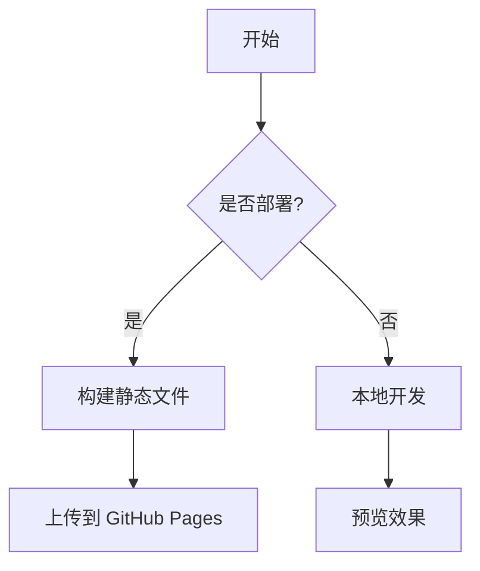

# ⑦ 高级功能

## RSS 订阅

为博客开启 RSS 订阅功能，读者可以使用 RSS 阅读器订阅你的博客更新。

### 配置 RSS

在 `blog-theme.ts` 中配置：

```typescript
const baseUrl = 'https://yangshuyin98.github.io/my-tech-blog'

const RSS = {
  title: 'shuyin的技术博客',
  baseUrl,
  copyright: 'Copyright (c) 2026-present, shuyin',
  description: 'shuyin的技术博客，记录前端学习与实践',
  language: 'zh-cn',
  image: '/logo.png',
  favicon: '/favicon.ico',
}

const blogTheme = getThemeConfig({
  // ... 其他配置
  RSS,
})
```

### 验证 RSS

部署后访问 `https://<你的域名>/rss.xml` 即可看到 RSS feed。

## 全文搜索

sugar-blog 使用 [Pagefind](https://pagefind.app/) 实现离线全文搜索，无需第三方服务。

### 安装 Pagefind

```bash
pnpm add -D pagefind
```

### 配置搜索

```typescript
search: {
  btnPlaceholder: '搜索',
  placeholder: '搜索文章...',
  emptyText: '没有找到相关内容',
  heading: '共 {{searchResult}} 条搜索结果',
}
```

### 搜索功能特性

- ✅ 离线运行，无需网络
- ✅ 全文搜索（搜索文章内容，不仅是标题）
- ✅ 中文分词支持
- ✅ 搜索结果高亮
- ✅ 搜索历史记录

## 评论系统

sugar-blog 集成 [Giscus](https://giscus.app/) 评论系统，基于 GitHub Discussions。

### 启用步骤

**第一步：在 GitHub 仓库启用 Discussions**

进入仓库 → **Settings** → **Check the "Discussions" checkbox** → **Save**

**第二步：安装 Giscus App**

访问 [github.com/apps/giscus](https://github.com/apps/giscus)，点击 **Install** 并授权你的仓库。

**第三步：获取配置**

1. 访问 [giscus.app](https://giscus.app)
2. 填写仓库名：`用户名/仓库名`
3. 获取 `data-repo-id`、`data-category-id` 等配置

**第四步：配置评论**

```typescript
comment: {
  type: 'giscus',
  options: {
    repo: 'yangshuyin98/my-tech-blog',
    repoId: 'R_kgDOSaDZJw',           // 从 giscus.app 获取
    category: 'Announcements',
    categoryId: 'DIC_kwDOSaDZJ84C8xHF', // 从 giscus.app 获取
  }
}
```

### 配置说明

| 参数 | 说明 | 获取方式 |
|------|------|---------|
| `repo` | GitHub 仓库名 | `用户名/仓库名` |
| `repoId` | 仓库 ID | giscus.app 生成 |
| `category` | Discussions 分类 | 仓库 Discussions 设置 |
| `categoryId` | 分类 ID | giscus.app 生成 |

::: tip
配置完成后，每篇文章底部会自动显示评论框，读者可以通过 GitHub 账号登录评论。
:::

## 精选文章

使用精选文章功能在首页突出推荐优质文章。

### 设置精选文章

在文章 frontmatter 中添加 `tag: hot`：

```yaml
---
title: 优质文章
tags:
  - hot    # 标记为精选文章
  - VitePress
---
```

或者使用 `sticky` 字段控制排序：

```yaml
---
title: 置顶文章
sticky: 1        # 数字越大越靠前
top: true         # 置顶显示
---
```

### 精选文章配置

```typescript
hotArticle: {
  title: '🔥 精选文章',
  nextText: '换一组',
  pageSize: 9,
}
```

## 标签系统

### 自动生成标签

sugar-blog 会自动提取所有文章的 `tags` 字段，生成标签云。

### 标签配置

```typescript
homeTags: {
  title: '🏷 标签',
  limit: 20,            // 显示的标签数量
  showCount: true,       // 显示文章数量
  sort: 'desc',          // 按文章数量降序
}
```

### 标签页

点击首页的标签会自动跳转到标签筛选页，展示该标签下的所有文章。

## 推荐阅读

文章底部自动展示相关文章推荐：

```typescript
recommend: {
  title: '📌 推荐阅读',
  nextText: '下一组',
  pageSize: 5,
  style: 'card',        // 'card' | 'sidebar'
}
```

推荐算法基于标签关联度，自动推荐同标签或同分类的文章。

## Mermaid 图表

sugar-blog 支持 Mermaid 图表（默认关闭，因为会增加构建耗时）：

```typescript
mermaid: true,  // 开启 Mermaid 图表支持
```

开启后可以在 Markdown 中嵌入图表：

```markdown

```

## 静态资源处理

### Public 目录

`docs/public/` 目录下的文件会按原样复制到构建输出：

```
docs/public/
├── favicon.ico
├── logo.png
├── robots.txt
├── weixin.png
└── .spa
```

在 Markdown 中引用：`` 或 `[favicon](/favicon.ico)`

::: tip 下一步
查看实际搭建中遇到的问题 👉 [踩坑记录与常见问题](./08-踩坑记录与常见问题)
:::
